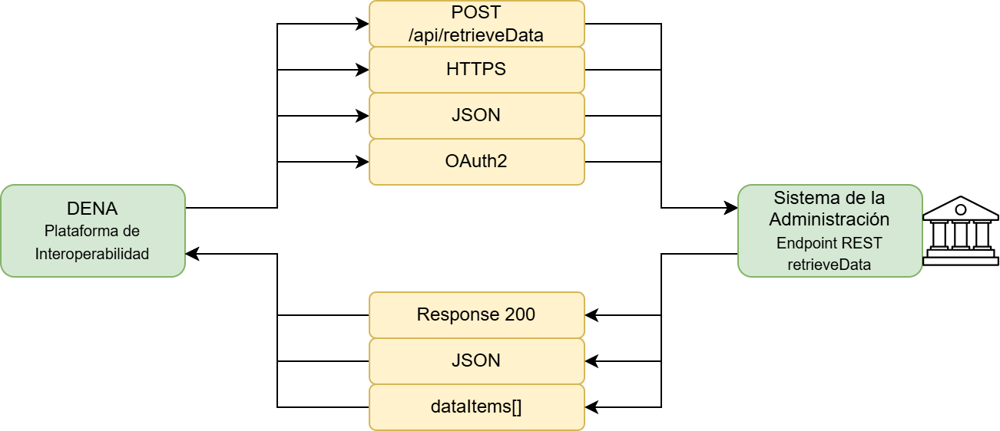
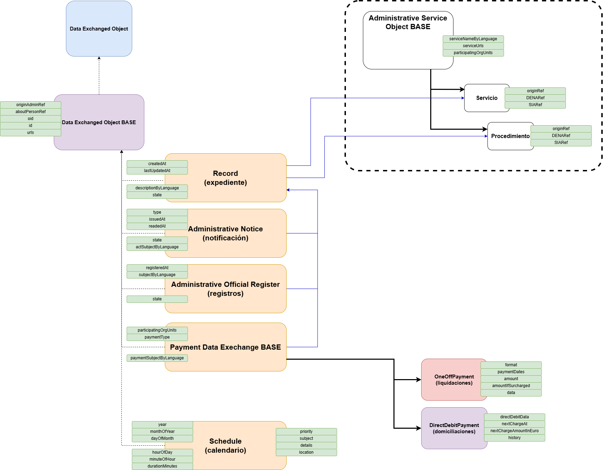
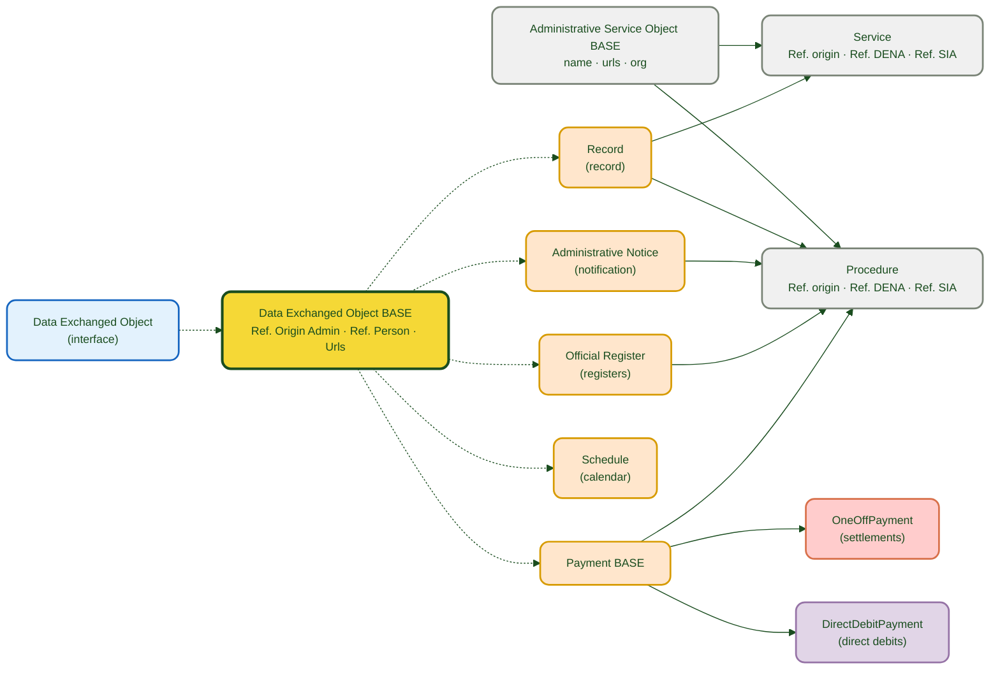
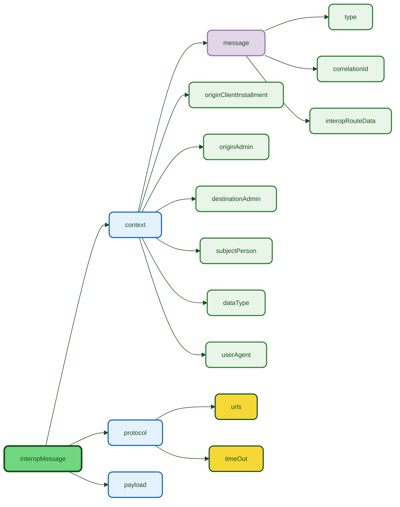
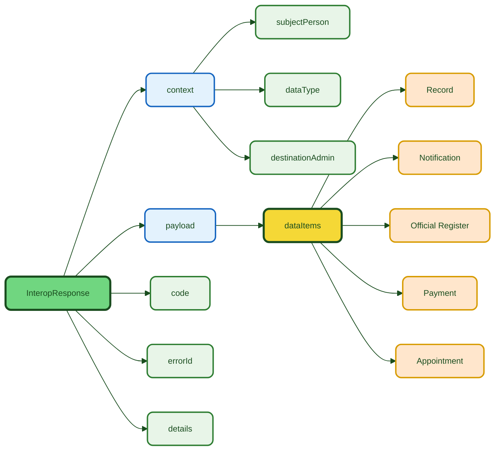

# :material-database-arrow-right: DATA-RETRIEVE

> **Version:** `v{{ dena.version }}` · **Date:** {{ dena.date }}

## What is it?

**Data-Retrieve** is the mechanism through which DENA requests each public administration for a citizen's data. The administration exposes a REST endpoint and returns the data objects in normalized JSON format.

---

## Context diagram



---

## Conceptual Model



---

## Data model



| Color | Meaning |
|-------|-------------|
| 🔵 Light blue | Base interface (contract) |
| 🟣 Violet | Abstract base class |
| 🟠 Orange | Exchanged domain objects |
| 🔴 Light red | One-off payment (OneOffPayment) |
| ⚪ Light gray | Hierarchical context (Service / Procedure) |

| Line | Meaning |
|-------|-------------|
| Dashed | Inheritance ("extends") |
| Solid | Composition / reference |

---

## Documentation

!!! tip "Start here"

    [:octicons-arrow-right-24: **Step-by-step implementation guide**](./guia-implementacion.md) — Everything you need to implement the endpoint in your administration.

### Endpoint

| Document | Content |
|---|---|
| [:octicons-arrow-right-24: Endpoint](./endpoint-data-retrieve.md) | REST contract: request, response, JSON examples and HTTP codes |

### Data objects

??? note "View all data objects"

    | Object | Description | Document |
    |---|---|---|
    | **:material-folder-open: Record** | Administrative record in processing | [expediente.md](./data/expediente.md) |
    | **:material-email-open: Notification** | Official notification or communication | [notificacion.md](./data/notificacion.md) |
    | **:material-book-open-page-variant: Official Register** | Incoming/outgoing register entry | [registro-oficial.md](./data/registro-oficial.md) |
    | **:material-credit-card: Payment** | One-off payment or direct debit | [pago.md](./data/pago.md) |
    | **:material-calendar-clock: Appointment** | Prior appointment or agenda item | [cita.md](./data/cita.md) |
    | **:material-account-circle: Person** | Citizen's data | [persona.md](./data/persona.md) |
    | **:material-cog: Administrative Service** | Service and procedure | [servicio-administrativo.md](./data/servicio-administrativo.md) |
    | **:material-office-building: Organic Unit** | Participating organizational unit | [unidad-organica.md](./data/unidad-organica.md) |

### Complementary guides

| Document | Content |
|---|---|
| [:material-database-outline: Common fields](./data/campos-comunes.md) | Fields inherited by all objects (OID, ID, URLs, refs) |
| [Validations](./validaciones.md) | Validation rules, formats and constraints |
| [Errors and troubleshooting](./errores-troubleshooting.md) | Guide to common errors and their resolution |
| [Code snippets](./snippets-codigo.md) | Implementation in Java, C#, Python, Node.js and PHP |

---

## Flow summary

1. DENA sends `POST /api/retrieveData` with the person's identifier and the data type
2. The administration identifies the person (`context.subjectPerson`)
3. The administration filters by data type (`context.dataType`)
4. The administration returns the objects in `payload.dataItems[]`

### Data types (`dataType.id`)

The `id` of `dataType` corresponds to the marshallTypeId of each object (enum `DN00DataTypeEnum`):

| `dataType.id` | Expected data |
|--------------|-----------------|
| `administrativeServiceProcedureRecord` | Records |
| `administrativeNotice` | Notifications |
| `administrativeOfficialRegisterRecord` | Official registers |
| `oneOffPayment` / `directDebitPayment` | Payments |
| `scheduleItem` | Appointments |
| `personData` | Person data |

> **Note:** See the full list in [DataTypeRef](../semantica-base/modelo/data-type-ref.md).

---

## Request structure



```json
{
  "context": {
    "message": {
      "type": "PERSON_FETCH_DATA",
      "correlationId": "550e8400-e29b-41d4-a716-446655440000",
      "interopRouteData": [
        { "denaComponentId": "DENA_CORE", "timestamp": "2026-06-01T10:00:00.000Z" }
      ]
    },
    "originClientInstallment": "8B5AE78A-7D42-4069-A626-959BB07276C5",
    "destinationAdmin": { "id": "ADMIN-001", "oid": "...", "dir3Id": "EA0000001" },
    "subjectPerson": { "id": "12345678A", "oid": "..." },
    "dataType": { "id": "administrativeServiceProcedureRecord", "oid": "..." },
    "userAgent": "DENA-CORE/2.1.0 person-data/1.0.1 (support@dena.eus)"
  },
  "protocol": {
    "urls": [],
    "timeOut": "30s"
  },
  "payload": {
    "person": "PERSON-OID-001"
  }
}
```

| Field | Required | Description |
|-------|:-----------:|-------------|
| `context.message.type` | ✅ | Message type. See [`DN00InteropMessageType`]({{ repos.common_api_blob }}/denaCommonAPIModelClasses/src/main/java/dena/api/common/interop/context/DN00InteropMessageType.java) |
| `context.message.correlationId` | ✅ | Correlation UUID for traceability. See [`DN00InteropMessageData`]({{ repos.common_api_blob }}/denaCommonAPIModelClasses/src/main/java/dena/api/common/interop/context/DN00InteropMessageData.java) |
| `context.message.interopRouteData` | ❌ | Component trace. See [`DN00IteropRouteDataItem`]({{ repos.common_api_blob }}/denaCommonAPIModelClasses/src/main/java/dena/api/common/interop/context/DN00IteropRouteDataItem.java) |
| `context.dataType` | ❌ | Requested data type. See [`DN00DataTypeEnum`]({{ repos.common_data_api_blob }}/denaCommonDataAPIModelClasses/src/main/java/dena/api/data/model/DN00DataTypeEnum.java) |
| `context.originClientInstallment` | ❌ | OID of the origin client installment. See [`DN00InteropContext`]({{ repos.common_api_blob }}/denaCommonAPIModelClasses/src/main/java/dena/api/common/interop/context/DN00InteropContext.java) |
| `context.originAdmin` | ❌ | Origin administration. See [`DN00InteropContext`]({{ repos.common_api_blob }}/denaCommonAPIModelClasses/src/main/java/dena/api/common/interop/context/DN00InteropContext.java) |
| `context.destinationAdmin` | ❌ | Destination administration. See [`DN00InteropContext`]({{ repos.common_api_blob }}/denaCommonAPIModelClasses/src/main/java/dena/api/common/interop/context/DN00InteropContext.java) |
| `context.subjectPerson` | ❌ | Person for whom data is requested. See [`DN00InteropContext`]({{ repos.common_api_blob }}/denaCommonAPIModelClasses/src/main/java/dena/api/common/interop/context/DN00InteropContext.java) |
| `context.userAgent` | ❌ | User Agent of the origin. See [`DN00InteropContext`]({{ repos.common_api_blob }}/denaCommonAPIModelClasses/src/main/java/dena/api/common/interop/context/DN00InteropContext.java) |
| `protocol.urls` | ❌ | Protocol template URLs. See [`DN00InteropProtocol`]({{ repos.common_api_blob }}/denaCommonAPIModelClasses/src/main/java/dena/api/common/interop/context/DN00InteropProtocol.java) |
| `protocol.timeOut` | ❌ | Operation timeout (e.g.: `"30s"`). See [`DN00InteropProtocol`]({{ repos.common_api_blob }}/denaCommonAPIModelClasses/src/main/java/dena/api/common/interop/context/DN00InteropProtocol.java) |
| `payload` | ✅ | Operation-specific payload |

### Message types (`message.type`)

| Value | Description | Usage in DATA-RETRIEVE |
|-------|-------------|---------------------|
| `PERSON_FETCH_DATA` | Person data request | ✅ Primary |
| `CLIENT_RETRIEVE_REQ` / `CLIENT_RETRIEVE_RESP` | Data retrieval from client | Request/Response |

See the full list of values in [Message Types](../semantica-base/modelo/message-types.md).

### Flow direction (`flowDirection`)

The direction (`REQUEST`/`RESPONSE`) is derived from the message type; it is not a field of the context itself.

### `protocol` block

Metadata of the communication protocol between DENA and the administration.

| Field | Type | Description |
|-------|------|-------------|
| `urls` | `Array` | Template URLs for communication |
| `timeOut` | `TimeLapse` | Operation timeout (format: `"30s"`, `"1m"`, etc.) |

### Route trace (`interopRouteData`)

Each time the message passes through a DENA component, a trace entry is added:

| Field | Type | Description |
|-------|------|-------------|
| `denaComponentId` | `DN00InteropComponent` | Component identifier (`CLIENT_INSTALLMENT`, `DENA_CORE`, `DENA_ADMIN_CONNECTOR`, `ADMIN`) |
| `timestamp` | `String` (ISO 8601) | Moment when the component processed the message |

---

## Response structure



```json
{
  "context": {
    "message": {
      "type": "CLIENT_RETRIEVE_RESP",
      "correlationId": "550e8400-e29b-41d4-a716-446655440000"
    },
    "subjectPerson": { "id": "12345678A", "oid": "..." },
    "dataType": { "id": "administrativeServiceProcedureRecord", "oid": "..." },
    "destinationAdmin": { "id": "ADMIN-001", "oid": "..." }
  },
  "payload": {
    "dataItems": [ ... ]
  },
  "code": "OK",
  "errorId": null,
  "details": null
}
```

| Field | Description |
|-------|-------------|
| `context` | Echo of the received context (the message type indicates the response) |
| `payload.dataItems` | Array of data objects |
| `code` | Response status (`DN00InteropResponseStatus`) |
| `errorId` | Specific error code (optional, only on errors) |
| `details` | Descriptive error message (optional) |

### Status codes (`code`)

| Code | Description |
|--------|-------------|
| `OK` | Message processed correctly |
| `CLIENT_ERR` | Client error (malformed request, invalid data) |
| `SERVER_ERR` | Server error (internal error) |
| `QUEUED` | Message queued for asynchronous processing |

### HTTP codes

| Code | Meaning |
|--------|-------------|
| `200` | Data returned correctly (may be an empty list) |
| `400` | Malformed request |
| `401` | Unauthorized |
| `404` | Person not found |
| `500` | Internal error |

---

## Glossary

| Term | Description |
|---------|-------------|
| OID | Unique technical identifier (assigned by the system) |
| ID | Business identifier (readable, assigned by the administration) |
| DIR3 | Common Directory of Organic Units and Offices of the AGE |
| SIA | Administrative Information System (AGE service catalog) |
| LanguageTexts | Multilanguage object with keys `SPANISH`, `BASQUE`, `ENGLISH` |
| dataItems | Array of domain objects returned by the administration |
| interopRouteData | Trace of DENA components the message has passed through. See [`DN00IteropRouteDataItem`]({{ repos.common_api_blob }}/denaCommonAPIModelClasses/src/main/java/dena/api/common/interop/context/DN00IteropRouteDataItem.java) |
| correlationId | UUID that allows correlating request and response. See [`DN00InteropMessageData`]({{ repos.common_api_blob }}/denaCommonAPIModelClasses/src/main/java/dena/api/common/interop/context/DN00InteropMessageData.java) |


<!-- DENA-DOC-FOOTER -->
---
<sub>DENA Docs v{{ dena.version }} · {{ dena.date }}</sub>
