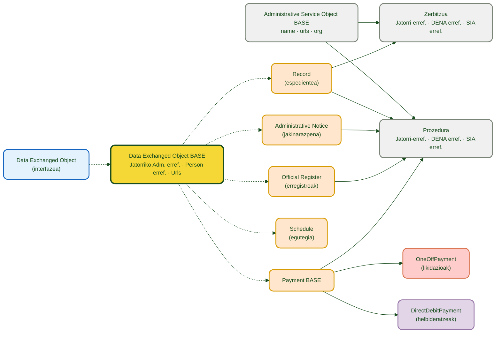
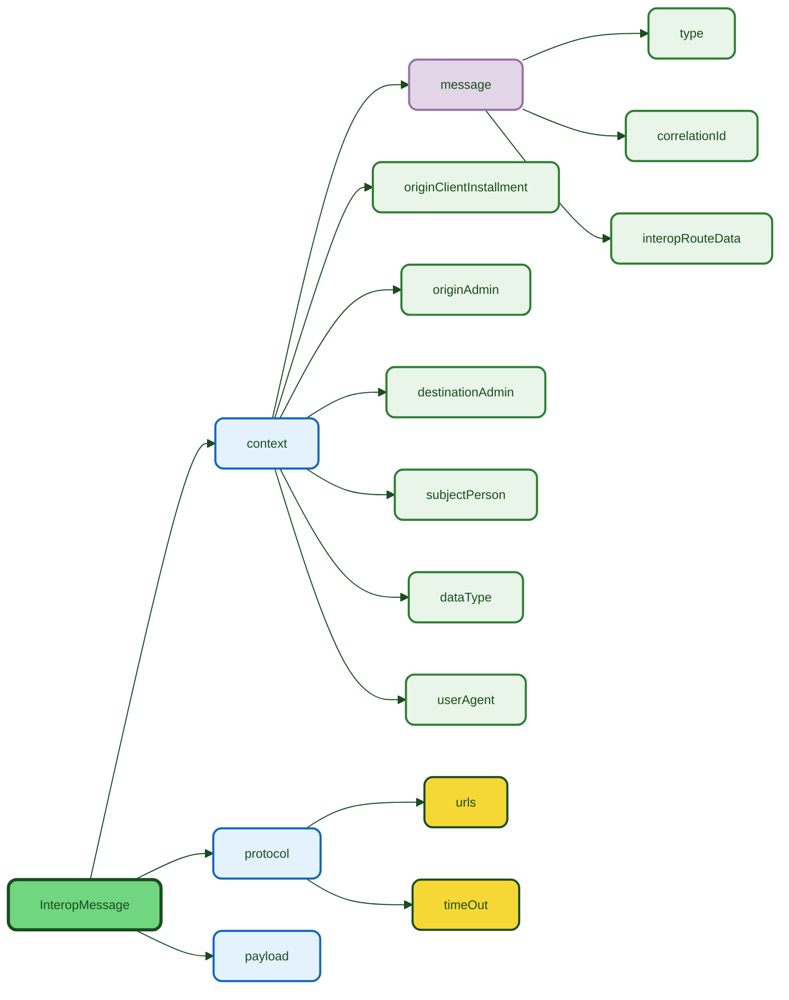
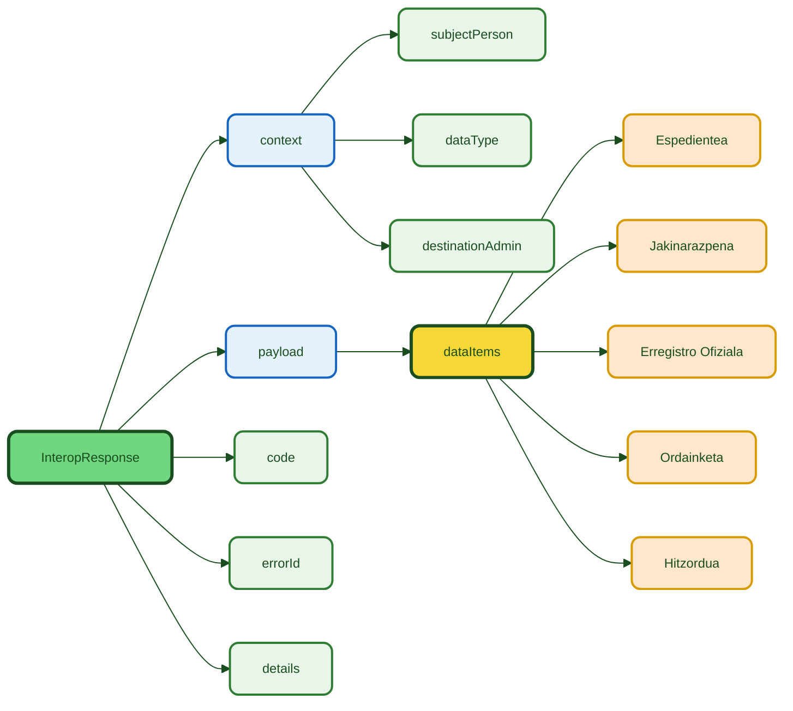

# :material-database-arrow-right: DATA-RETRIEVE

> **Bertsioa:** `v{{ dena.version }}` · **Data:** {{ dena.date }}

## Zer da?

**Data-Retrieve** DENAk administrazio publiko bakoitzari herritar baten datuak eskatzeko erabiltzen duen mekanismoa da. Administrazioak REST endpoint bat eskaintzen du eta datu-objektuak JSON formatu normalizatuan itzultzen ditu.

---

## Testuinguru-diagrama


---

## Eredu Kontzeptuala


---

## Datu-eredua



| Kolorea | Esanahia |
|-------|-------------|
| 🔵 Urdin argia | Oinarrizko interfazea (kontratua) |
| 🟣 Bioleta | Oinarrizko klase abstraktua |
| 🟠 Laranja | Trukatutako domeinu-objektuak |
| 🔴 Gorri argia | Ordainketa bakarra (OneOffPayment) |
| ⚪ Gris argia | Testuinguru hierarkikoa (Zerbitzua / Prozedura) |

| Lerroa | Esanahia |
|-------|-------------|
| Etena | Herentzia ("hedatzen du") |
| Jarraitua | Konposizioa / erreferentzia |

---

## Dokumentazioa

!!! tip "Hasi hemen"

    [:octicons-arrow-right-24: **Urratsez urratseko inplementazio-gida**](./guia-implementacion.md) — Zure administrazioan endpointa inplementatzeko behar duzun guztia.

### Endpoint

| Dokumentua | Edukia |
|---|---|
| [:octicons-arrow-right-24: Endpoint](./endpoint-data-retrieve.md) | REST kontratua: request, response, JSON adibideak eta HTTP kodeak |

### Datu-objektuak

??? note "Ikusi datu-objektu guztiak"

    | Objektua | Deskribapena | Dokumentua |
    |---|---|---|
    | **:material-folder-open: Espedientea** | Izapidetzen ari den administrazio-espedientea | [expediente.md](./data/expediente.md) |
    | **:material-email-open: Jakinarazpena** | Jakinarazpen ofiziala edo komunikazioa | [notificacion.md](./data/notificacion.md) |
    | **:material-book-open-page-variant: Erregistro Ofiziala** | Sarrera/irteera erregistro-idazpena | [registro-oficial.md](./data/registro-oficial.md) |
    | **:material-credit-card: Ordainketa** | Ordainketa bakarra edo banku-helbideratzea | [pago.md](./data/pago.md) |
    | **:material-calendar-clock: Hitzordua** | Aurretiazko hitzordua edo agenda-elementua | [cita.md](./data/cita.md) |
    | **:material-account-circle: Pertsona** | Herritarraren datuak | [persona.md](./data/persona.md) |
    | **:material-cog: Administrazio Zerbitzua** | Zerbitzua eta prozedura | [servicio-administrativo.md](./data/servicio-administrativo.md) |
    | **:material-office-building: Unitate Organikoa** | Parte hartzen duen unitate antolatzailea | [unidad-organica.md](./data/unidad-organica.md) |

### Gida osagarriak

| Dokumentua | Edukia |
|---|---|
| [:material-database-outline: Eremu komunak](./data/campos-comunes.md) | Objektu guztiek heredatutako eremuak (OID, ID, URLak, erref.) |
| [Balidazioak](./validaciones.md) | Balidazio-arauak, formatuak eta murrizketak |
| [Erroreak eta troubleshooting](./errores-troubleshooting.md) | Ohiko erroreen eta konponbidearen gida |
| [Kode-snippetak](./snippets-codigo.md) | Java, C#, Python, Node.js eta PHP inplementazioa |

---

## Fluxuaren laburpena

1. DENAk `POST /api/retrieveData` bidaltzen du pertsonaren identifikatzailearekin eta datu motarekin
2. Administrazioak pertsona identifikatzen du (`context.subjectPerson`)
3. Administrazioak datu motaren arabera iragazten du (`context.dataType`)
4. Administrazioak objektuak `payload.dataItems[]` barruan itzultzen ditu

### Datu motak (`dataType.id`)

`dataType`-ren `id` objektu bakoitzaren marshallTypeId-ari dagokio (`DN00DataTypeEnum` enum-a):

| `dataType.id` | Espero diren datuak |
|--------------|-----------------|
| `administrativeServiceProcedureRecord` | Espedienteak |
| `administrativeNotice` | Jakinarazpenak |
| `administrativeOfficialRegisterRecord` | Erregistro ofizialak |
| `oneOffPayment` / `directDebitPayment` | Ordainketak |
| `scheduleItem` | Hitzorduak |
| `personData` | Pertsonaren datuak |

> **Oharra:** Ikusi zerrenda osoa hemen: [DataTypeRef](../semantica-base/modelo/data-type-ref.md).

---

## Request-aren egitura



```json
{
  "context": {
    "message": {
      "type": "PERSON_FETCH_DATA",
      "correlationId": "550e8400-e29b-41d4-a716-446655440000",
      "interopRouteData": [
        { "denaComponentId": "DENA_CORE", "timestamp": "2026-06-01T10:00:00.000Z" }
      ]
    },
    "originClientInstallment": "8B5AE78A-7D42-4069-A626-959BB07276C5",
    "destinationAdmin": { "id": "ADMIN-001", "oid": "...", "dir3Id": "EA0000001" },
    "subjectPerson": { "id": "12345678A", "oid": "..." },
    "dataType": { "id": "administrativeServiceProcedureRecord", "oid": "..." },
    "userAgent": "DENA-CORE/2.1.0 person-data/1.0.1 (support@dena.eus)"
  },
  "protocol": {
    "urls": [],
    "timeOut": "30s"
  },
  "payload": {
    "person": "PERSON-OID-001"
  }
}
```

| Eremua | Nahitaezkoa | Deskribapena |
|-------|:-----------:|-------------|
| `context.message.type` | ✅ | Mezu mota. Ikusi [`DN00InteropMessageType`]({{ repos.common_api_blob }}/denaCommonAPIModelClasses/src/main/java/dena/api/common/interop/context/DN00InteropMessageType.java) |
| `context.message.correlationId` | ✅ | Trazabilitaterako korrelazio UUIDa. Ikusi [`DN00InteropMessageData`]({{ repos.common_api_blob }}/denaCommonAPIModelClasses/src/main/java/dena/api/common/interop/context/DN00InteropMessageData.java) |
| `context.message.interopRouteData` | ❌ | Osagaien traza. Ikusi [`DN00IteropRouteDataItem`]({{ repos.common_api_blob }}/denaCommonAPIModelClasses/src/main/java/dena/api/common/interop/context/DN00IteropRouteDataItem.java) |
| `context.dataType` | ❌ | Eskatutako datu mota. Ikusi [`DN00DataTypeEnum`]({{ repos.common_data_api_blob }}/denaCommonDataAPIModelClasses/src/main/java/dena/api/data/model/DN00DataTypeEnum.java) |
| `context.originClientInstallment` | ❌ | Jatorriko bezero-instalazioaren OIDa. Ikusi [`DN00InteropContext`]({{ repos.common_api_blob }}/denaCommonAPIModelClasses/src/main/java/dena/api/common/interop/context/DN00InteropContext.java) |
| `context.originAdmin` | ❌ | Jatorriko administrazioa. Ikusi [`DN00InteropContext`]({{ repos.common_api_blob }}/denaCommonAPIModelClasses/src/main/java/dena/api/common/interop/context/DN00InteropContext.java) |
| `context.destinationAdmin` | ❌ | Helmugako administrazioa. Ikusi [`DN00InteropContext`]({{ repos.common_api_blob }}/denaCommonAPIModelClasses/src/main/java/dena/api/common/interop/context/DN00InteropContext.java) |
| `context.subjectPerson` | ❌ | Datuak eskatzen zaizkion pertsona. Ikusi [`DN00InteropContext`]({{ repos.common_api_blob }}/denaCommonAPIModelClasses/src/main/java/dena/api/common/interop/context/DN00InteropContext.java) |
| `context.userAgent` | ❌ | Jatorriaren User Agent-a. Ikusi [`DN00InteropContext`]({{ repos.common_api_blob }}/denaCommonAPIModelClasses/src/main/java/dena/api/common/interop/context/DN00InteropContext.java) |
| `protocol.urls` | ❌ | Protokoloaren txantiloi URLak. Ikusi [`DN00InteropProtocol`]({{ repos.common_api_blob }}/denaCommonAPIModelClasses/src/main/java/dena/api/common/interop/context/DN00InteropProtocol.java) |
| `protocol.timeOut` | ❌ | Eragiketaren timeout-a (adib.: `"30s"`). Ikusi [`DN00InteropProtocol`]({{ repos.common_api_blob }}/denaCommonAPIModelClasses/src/main/java/dena/api/common/interop/context/DN00InteropProtocol.java) |
| `payload` | ✅ | Eragiketaren berariazko payload-a |

### Mezu motak (`message.type`)

| Balioa | Deskribapena | DATA-RETRIEVE-n erabilera |
|-------|-------------|---------------------|
| `PERSON_FETCH_DATA` | Pertsonaren datuen eskaera | ✅ Nagusia |
| `CLIENT_RETRIEVE_REQ` / `CLIENT_RETRIEVE_RESP` | Bezerotik datuak berreskuratzea | Eskaera/Erantzuna |

Ikusi balioen zerrenda osoa hemen: [Mezu Motak](../semantica-base/modelo/message-types.md).

### Fluxuaren norabidea (`flowDirection`)

Norabidea (`REQUEST`/`RESPONSE`) mezu motatik eratortzen da; ez da testuinguruaren beraren eremu bat.

### `protocol` blokea

DENAren eta administrazioaren arteko komunikazio-protokoloaren metadatuak.

| Eremua | Mota | Deskribapena |
|-------|------|-------------|
| `urls` | `Array` | Komunikaziorako txantiloi URLak |
| `timeOut` | `TimeLapse` | Eragiketaren timeout-a (formatua: `"30s"`, `"1m"`, etab.) |

### Ibilbidearen traza (`interopRouteData`)

Mezua DENAren osagai batetik pasatzen den bakoitzean, traza-sarrera bat gehitzen da:

| Eremua | Mota | Deskribapena |
|-------|------|-------------|
| `denaComponentId` | `DN00InteropComponent` | Osagaiaren identifikatzailea (`CLIENT_INSTALLMENT`, `DENA_CORE`, `DENA_ADMIN_CONNECTOR`, `ADMIN`) |
| `timestamp` | `String` (ISO 8601) | Osagaiak mezua prozesatu zuen unea |

---

## Response-aren egitura



```json
{
  "context": {
    "message": {
      "type": "CLIENT_RETRIEVE_RESP",
      "correlationId": "550e8400-e29b-41d4-a716-446655440000"
    },
    "subjectPerson": { "id": "12345678A", "oid": "..." },
    "dataType": { "id": "administrativeServiceProcedureRecord", "oid": "..." },
    "destinationAdmin": { "id": "ADMIN-001", "oid": "..." }
  },
  "payload": {
    "dataItems": [ ... ]
  },
  "code": "OK",
  "errorId": null,
  "details": null
}
```

| Eremua | Deskribapena |
|-------|-------------|
| `context` | Jasotako testuinguruaren oihartzuna (mezu motak erantzuna adierazten du) |
| `payload.dataItems` | Datu-objektuen array-a |
| `code` | Erantzunaren egoera (`DN00InteropResponseStatus`) |
| `errorId` | Errore-kode espezifikoa (aukerakoa, erroreetan soilik) |
| `details` | Errorearen mezu deskribatzailea (aukerakoa) |

### Egoera-kodeak (`code`)

| Kodea | Deskribapena |
|--------|-------------|
| `OK` | Mezua behar bezala prozesatuta |
| `CLIENT_ERR` | Bezeroaren errorea (gaizki eratutako eskaera, datu baliogabeak) |
| `SERVER_ERR` | Zerbitzariaren errorea (barne-errorea) |
| `QUEUED` | Mezua ilaran prozesamendu asinkronorako |

### HTTP kodeak

| Kodea | Esanahia |
|--------|-------------|
| `200` | Datuak behar bezala itzulita (zerrenda hutsa izan daiteke) |
| `400` | Gaizki eratutako eskaera |
| `401` | Baimenik gabe |
| `404` | Pertsona ez da aurkitu |
| `500` | Barne-errorea |

---

## Glosarioa

| Terminoa | Deskribapena |
|---------|-------------|
| OID | Identifikatzaile tekniko bakarra (sistemak esleitua) |
| ID | Negozio-identifikatzailea (irakurgarria, administrazioak esleitua) |
| DIR3 | AGEko Unitate Organikoen eta Bulegoen Direktorio Komuna |
| SIA | Administrazio Informazio Sistema (AGEren zerbitzu-katalogoa) |
| LanguageTexts | Hizkuntza anitzeko objektua, `SPANISH`, `BASQUE`, `ENGLISH` gakoekin |
| dataItems | Administrazioak itzultzen dituen domeinu-objektuen array-a |
| interopRouteData | Mezua igaro den DENAren osagaien traza. Ikusi [`DN00IteropRouteDataItem`]({{ repos.common_api_blob }}/denaCommonAPIModelClasses/src/main/java/dena/api/common/interop/context/DN00IteropRouteDataItem.java) |
| correlationId | Request eta response korrelazionatzeko aukera ematen duen UUIDa. Ikusi [`DN00InteropMessageData`]({{ repos.common_api_blob }}/denaCommonAPIModelClasses/src/main/java/dena/api/common/interop/context/DN00InteropMessageData.java) |


<!-- DENA-DOC-FOOTER -->
---
<sub>DENA Docs v{{ dena.version }} · {{ dena.date }}</sub>
