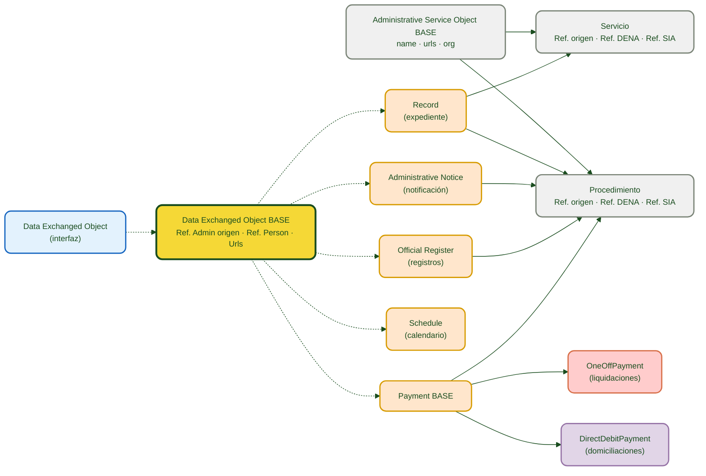
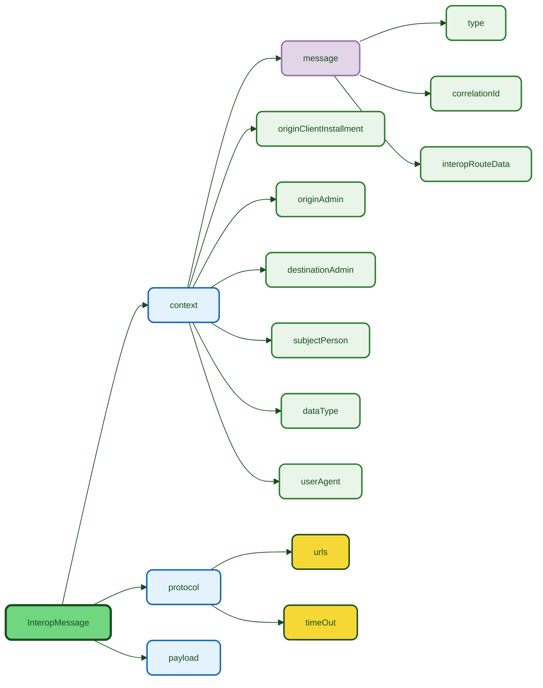
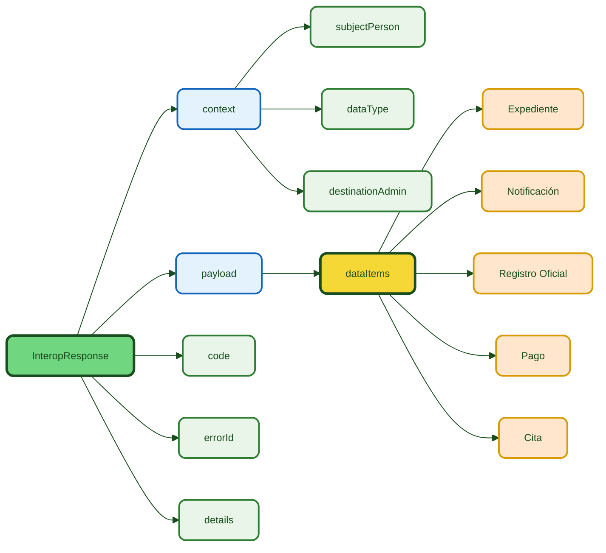

# :material-database-arrow-right: DATA-RETRIEVE

> **Versión:** `v{{ dena.version }}` · **Fecha:** {{ dena.date }}

## ¿Qué es?

**Data-Retrieve** es el mecanismo mediante el cual DENA solicita a cada administración pública los datos de una persona ciudadana. La administración expone un endpoint REST y devuelve los objetos de datos en formato JSON normalizado.

---

## Diagrama de contexto


---

## Modelo Conceptual


---

## Modelo de datos



| Color | Significado |
|-------|-------------|
| 🔵 Azul claro | Interfaz base (contrato) |
| 🟣 Violeta | Clase base abstracta |
| 🟠 Naranja | Objetos de dominio intercambiados |
| 🔴 Rojo claro | Pago único (OneOffPayment) |
| ⚪ Gris claro | Contexto jerárquico (Servicio / Procedimiento) |

| Línea | Significado |
|-------|-------------|
| Discontinua | Herencia ("extiende") |
| Continua | Composición / referencia |

---

## Documentación

!!! tip "Empieza aquí"

    [:octicons-arrow-right-24: **Guía de implementación paso a paso**](./guia-implementacion.md) — Todo lo que necesitas para implementar el endpoint en tu administración.

### Endpoint

| Documento | Contenido |
|---|---|
| [:octicons-arrow-right-24: Endpoint](./endpoint-data-retrieve.md) | Contrato REST: request, response, ejemplos JSON y códigos HTTP |

### Objetos de datos

??? note "Ver todos los objetos de datos"

    | Objeto | Descripción | Documento |
    |---|---|---|
    | **:material-folder-open: Expediente** | Expediente administrativo en tramitación | [expediente.md](./data/expediente.md) |
    | **:material-email-open: Notificación** | Notificación oficial o comunicación | [notificacion.md](./data/notificacion.md) |
    | **:material-book-open-page-variant: Registro Oficial** | Asiento registral de entrada/salida | [registro-oficial.md](./data/registro-oficial.md) |
    | **:material-credit-card: Pago** | Pago único o domiciliación bancaria | [pago.md](./data/pago.md) |
    | **:material-calendar-clock: Cita** | Cita previa o elemento de agenda | [cita.md](./data/cita.md) |
    | **:material-account-circle: Persona** | Datos de la persona ciudadana | [persona.md](./data/persona.md) |
    | **:material-cog: Servicio Administrativo** | Servicio y procedimiento | [servicio-administrativo.md](./data/servicio-administrativo.md) |
    | **:material-office-building: Unidad Orgánica** | Unidad organizativa participante | [unidad-organica.md](./data/unidad-organica.md) |

### Guías complementarias

| Documento | Contenido |
|---|---|
| [:material-database-outline: Campos comunes](./data/campos-comunes.md) | Campos heredados por todos los objetos (OID, ID, URLs, refs) |
| [Validaciones](./validaciones.md) | Reglas de validación, formatos y restricciones |
| [Errores y troubleshooting](./errores-troubleshooting.md) | Guía de errores comunes y resolución |
| [Snippets de código](./snippets-codigo.md) | Implementación en Java, C#, Python, Node.js y PHP |

---

## Resumen del flujo

1. DENA envía `POST /api/retrieveData` con el identificador de la persona y el tipo de dato
2. La administración identifica a la persona (`context.subjectPerson`)
3. La administración filtra por tipo de dato (`context.dataType`)
4. La administración devuelve los objetos en `payload.dataItems[]`

### Tipos de dato (`dataType.id`)

El `id` de `dataType` corresponde al marshallTypeId de cada objeto (enum `DN00DataTypeEnum`):

| `dataType.id` | Datos esperados |
|--------------|-----------------|
| `administrativeServiceProcedureRecord` | Expedientes |
| `administrativeNotice` | Notificaciones |
| `administrativeOfficialRegisterRecord` | Registros oficiales |
| `oneOffPayment` / `directDebitPayment` | Pagos |
| `scheduleItem` | Citas |
| `personData` | Datos de persona |

> **Nota:** Consulta la lista completa en [DataTypeRef](../semantica-base/modelo/data-type-ref.md).

---

## Estructura de la Request



```json
{
  "context": {
    "message": {
      "type": "PERSON_FETCH_DATA",
      "correlationId": "550e8400-e29b-41d4-a716-446655440000",
      "interopRouteData": [
        { "denaComponentId": "DENA_CORE", "timestamp": "2026-06-01T10:00:00.000Z" }
      ]
    },
    "originClientInstallment": "8B5AE78A-7D42-4069-A626-959BB07276C5",
    "destinationAdmin": { "id": "ADMIN-001", "oid": "...", "dir3Id": "EA0000001" },
    "subjectPerson": { "id": "12345678A", "oid": "..." },
    "dataType": { "id": "administrativeServiceProcedureRecord", "oid": "..." },
    "userAgent": "DENA-CORE/2.1.0 person-data/1.0.1 (support@dena.eus)"
  },
  "protocol": {
    "urls": [],
    "timeOut": "30s"
  },
  "payload": {
    "person": "PERSON-OID-001"
  }
}
```

| Campo | Obligatorio | Descripción |
|-------|:-----------:|-------------|
| `context.message.type` | ✅ | Tipo de mensaje. Ver [`DN00InteropMessageType`]({{ repos.common_api_blob }}/denaCommonAPIModelClasses/src/main/java/dena/api/common/interop/context/DN00InteropMessageType.java) |
| `context.message.correlationId` | ✅ | UUID de correlación para trazabilidad. Ver [`DN00InteropMessageData`]({{ repos.common_api_blob }}/denaCommonAPIModelClasses/src/main/java/dena/api/common/interop/context/DN00InteropMessageData.java) |
| `context.message.interopRouteData` | ❌ | Traza de componentes. Ver [`DN00IteropRouteDataItem`]({{ repos.common_api_blob }}/denaCommonAPIModelClasses/src/main/java/dena/api/common/interop/context/DN00IteropRouteDataItem.java) |
| `context.dataType` | ❌ | Tipo de dato solicitado. Ver [`DN00DataTypeEnum`]({{ repos.common_data_api_blob }}/denaCommonDataAPIModelClasses/src/main/java/dena/api/data/model/DN00DataTypeEnum.java) |
| `context.originClientInstallment` | ❌ | OID de la instalación cliente de origen. Ver [`DN00InteropContext`]({{ repos.common_api_blob }}/denaCommonAPIModelClasses/src/main/java/dena/api/common/interop/context/DN00InteropContext.java) |
| `context.originAdmin` | ❌ | Administración de origen. Ver [`DN00InteropContext`]({{ repos.common_api_blob }}/denaCommonAPIModelClasses/src/main/java/dena/api/common/interop/context/DN00InteropContext.java) |
| `context.destinationAdmin` | ❌ | Administración destino. Ver [`DN00InteropContext`]({{ repos.common_api_blob }}/denaCommonAPIModelClasses/src/main/java/dena/api/common/interop/context/DN00InteropContext.java) |
| `context.subjectPerson` | ❌ | Persona sobre la que se solicitan datos. Ver [`DN00InteropContext`]({{ repos.common_api_blob }}/denaCommonAPIModelClasses/src/main/java/dena/api/common/interop/context/DN00InteropContext.java) |
| `context.userAgent` | ❌ | User Agent del origen. Ver [`DN00InteropContext`]({{ repos.common_api_blob }}/denaCommonAPIModelClasses/src/main/java/dena/api/common/interop/context/DN00InteropContext.java) |
| `protocol.urls` | ❌ | URLs de plantilla del protocolo. Ver [`DN00InteropProtocol`]({{ repos.common_api_blob }}/denaCommonAPIModelClasses/src/main/java/dena/api/common/interop/context/DN00InteropProtocol.java) |
| `protocol.timeOut` | ❌ | Timeout de la operación (ej: `"30s"`). Ver [`DN00InteropProtocol`]({{ repos.common_api_blob }}/denaCommonAPIModelClasses/src/main/java/dena/api/common/interop/context/DN00InteropProtocol.java) |
| `payload` | ✅ | Payload específico de la operación |

### Tipos de mensaje (`message.type`)

| Valor | Descripción | Uso en DATA-RETRIEVE |
|-------|-------------|---------------------|
| `PERSON_FETCH_DATA` | Solicitud de datos de persona | ✅ Principal |
| `CLIENT_RETRIEVE_REQ` / `CLIENT_RETRIEVE_RESP` | Recuperación de datos desde cliente | Petición/Respuesta |

Consulta la lista completa de valores en [Tipos de Mensaje](../semantica-base/modelo/message-types.md).

### Dirección del flujo (`flowDirection`)

La dirección (`REQUEST`/`RESPONSE`) se deriva del tipo de mensaje; no es un campo propio del contexto.

### Bloque `protocol`

Metadatos del protocolo de comunicación entre DENA y la administración.

| Campo | Tipo | Descripción |
|-------|------|-------------|
| `urls` | `Array` | URLs de plantilla para la comunicación |
| `timeOut` | `TimeLapse` | Timeout de la operación (formato: `"30s"`, `"1m"`, etc.) |

### Traza de ruta (`interopRouteData`)

Cada vez que el mensaje pasa por un componente DENA, se añade una entrada de traza:

| Campo | Tipo | Descripción |
|-------|------|-------------|
| `denaComponentId` | `DN00InteropComponent` | Identificador del componente (`CLIENT_INSTALLMENT`, `DENA_CORE`, `DENA_ADMIN_CONNECTOR`, `ADMIN`) |
| `timestamp` | `String` (ISO 8601) | Momento en que el componente procesó el mensaje |

---

## Estructura de la Response



```json
{
  "context": {
    "message": {
      "type": "CLIENT_RETRIEVE_RESP",
      "correlationId": "550e8400-e29b-41d4-a716-446655440000"
    },
    "subjectPerson": { "id": "12345678A", "oid": "..." },
    "dataType": { "id": "administrativeServiceProcedureRecord", "oid": "..." },
    "destinationAdmin": { "id": "ADMIN-001", "oid": "..." }
  },
  "payload": {
    "dataItems": [ ... ]
  },
  "code": "OK",
  "errorId": null,
  "details": null
}
```

| Campo | Descripción |
|-------|-------------|
| `context` | Eco del contexto recibido (el tipo de mensaje indica la respuesta) |
| `payload.dataItems` | Array de objetos de datos |
| `code` | Estado de la respuesta (`DN00InteropResponseStatus`) |
| `errorId` | Código de error específico (opcional, solo en errores) |
| `details` | Mensaje descriptivo del error (opcional) |

### Códigos de estado (`code`)

| Código | Descripción |
|--------|-------------|
| `OK` | Mensaje procesado correctamente |
| `CLIENT_ERR` | Error del cliente (petición malformada, datos inválidos) |
| `SERVER_ERR` | Error del servidor (error interno) |
| `QUEUED` | Mensaje encolado para procesamiento asíncrono |

### Códigos HTTP

| Código | Significado |
|--------|-------------|
| `200` | Datos devueltos correctamente (puede ser lista vacía) |
| `400` | Petición malformada |
| `401` | No autorizado |
| `404` | Persona no encontrada |
| `500` | Error interno |

---

## Glosario

| Término | Descripción |
|---------|-------------|
| OID | Identificador técnico único (asignado por el sistema) |
| ID | Identificador de negocio (legible, asignado por la administración) |
| DIR3 | Directorio Común de Unidades Orgánicas y Oficinas de la AGE |
| SIA | Sistema de Información Administrativa (catálogo de servicios AGE) |
| LanguageTexts | Objeto multiidioma con claves `SPANISH`, `BASQUE`, `ENGLISH` |
| dataItems | Array de objetos de dominio devueltos por la administración |
| interopRouteData | Traza de componentes DENA por los que ha pasado el mensaje. Ver [`DN00IteropRouteDataItem`]({{ repos.common_api_blob }}/denaCommonAPIModelClasses/src/main/java/dena/api/common/interop/context/DN00IteropRouteDataItem.java) |
| correlationId | UUID que permite correlacionar request y response. Ver [`DN00InteropMessageData`]({{ repos.common_api_blob }}/denaCommonAPIModelClasses/src/main/java/dena/api/common/interop/context/DN00InteropMessageData.java) |


<!-- DENA-DOC-FOOTER -->
---
<sub>DENA Docs v{{ dena.version }} · {{ dena.date }}</sub>
