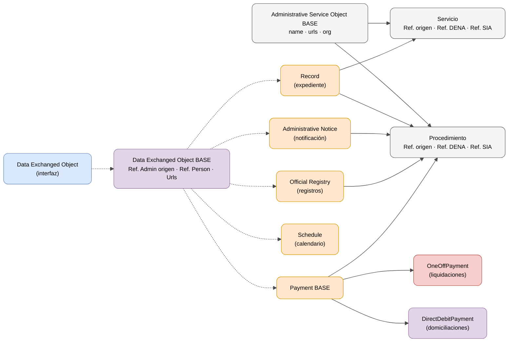
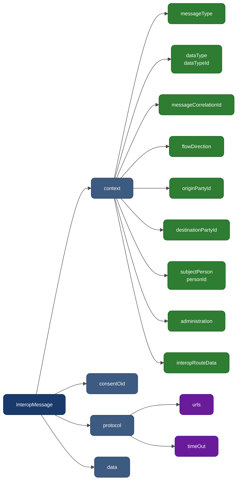
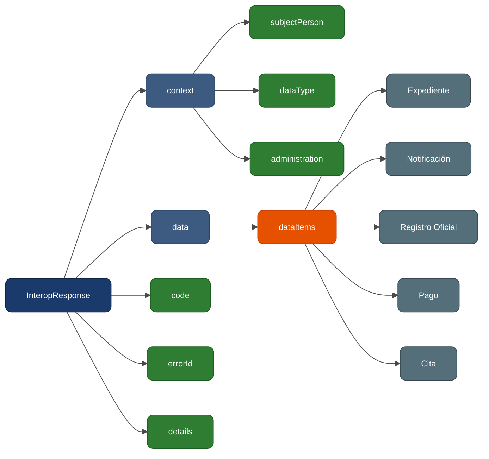

# DATA-RETRIEVE

> - **Versión:** `v0.3.26`
> - **Fecha:** 2026-06-11

## ¿Qué es?

**Data-Retrieve** es el mecanismo mediante el cual DENA solicita a cada administración pública los datos de una persona ciudadana. La administración expone un endpoint REST y devuelve los objetos de datos en formato JSON normalizado.

---

## Diagrama de contexto


---

## Modelo Conceptual


---

## Modelo de datos



| Color | Significado |
|-------|-------------|
| 🔵 Azul claro | Interfaz base (contrato) |
| 🟣 Violeta | Clase base abstracta |
| 🟠 Naranja | Objetos de dominio intercambiados |
| 🔴 Rojo claro | Pago único (OneOffPayment) |
| ⚪ Gris claro | Contexto jerárquico (Servicio / Procedimiento) |

| Línea | Significado |
|-------|-------------|
| Discontinua | Herencia ("extiende") |
| Continua | Composición / referencia |

---

## Documentación

### Guía de implementación

| Documento | Contenido |
|-----------|----------|
| [📖 **guia-implementacion.md**](./guia-implementacion.md) | **Guía paso a paso** para que una administración implemente el endpoint |

### Endpoint

| Documento | Contenido |
|-----------|-----------|
| [endpoint-data-retrieve.md](./endpoint-data-retrieve.md) | Contrato del endpoint: request, response, ejemplos JSON y códigos HTTP |

### Objetos de datos

| Objeto | Descripción | Documento |
|--------|-------------|-----------|
| **Expediente** | Expediente administrativo en tramitación | [expediente.md](./data/expediente.md) |
| **Notificación** | Notificación oficial o comunicación | [notificacion.md](./data/notificacion.md) |
| **Registro Oficial** | Asiento registral de entrada/salida | [registro-oficial.md](./data/registro-oficial.md) |
| **Pago** | Pago único o domiciliación bancaria | [pago.md](./data/pago.md) |
| **Cita** | Cita previa o elemento de agenda | [cita.md](./data/cita.md) |
| **Persona** | Datos de la persona ciudadana (contacto, dirección, bancarios) | [persona.md](./data/persona.md) |
| **Servicio Administrativo** | Servicio y procedimiento | [servicio-administrativo.md](./data/servicio-administrativo.md) |
| **Unidad Orgánica** | Unidad organizativa participante | [unidad-organica.md](./data/unidad-organica.md) |

### Guías complementarias

| Documento | Contenido |
|-----------|-----------|
| [campos-comunes.md](./data/campos-comunes.md) | Campos heredados por todos los objetos (OID, ID, URLs, refs) |
| [validaciones.md](./validaciones.md) | Reglas de validación, formatos y restricciones |
| [errores-troubleshooting.md](./errores-troubleshooting.md) | Guía de errores comunes y resolución |
| [snippets-codigo.md](./snippets-codigo.md) | Snippets de implementación en Java, C#, Python, Node.js y PHP |

---

## Resumen del flujo

1. DENA envía `POST /api/retrieveData` con el identificador de la persona y el tipo de dato
2. La administración identifica a la persona (`context.subjectPerson.personId`)
3. La administración filtra por tipo de dato (`context.dataType.dataTypeId`)
4. La administración devuelve los objetos en `data.dataItems[]`

### Tipos de dato (`dataTypeId`)

| `dataTypeId` | Datos esperados |
|--------------|-----------------|
| `RECORDS` | Expedientes |
| `NOTICES` | Notificaciones |
| `REGISTRY` | Registros oficiales |
| `PAYMENTS` | Pagos |
| `SCHEDULE` | Citas |

> **Nota:** El `dataTypeId` es un identificador de tipo String libre. Los valores de la tabla son los estándar definidos por DENA, pero pueden ampliarse en el futuro.

---

## Estructura de la Request



```json
{
  "context": {
    "messageType": "PERSON_FETCH_DATA",
    "dataType": { "dataTypeId": "RECORDS" },
    "messageCorrelationId": "550e8400-e29b-41d4-a716-446655440000",
    "flowDirection": "REQUEST",
    "originPartyId": "DENA-CORE",
    "destinationPartyId": "ADMIN-001",
    "subjectPerson": { "personId": "12345678A" },
    "administration": { "administrationId": "ADMIN-001", "dir3Code": "EA0000001" },
    "interopRouteData": [
      { "denaComponentId": "apiGateway", "timestamp": "2024-06-01T10:00:00Z" }
    ]
  },
  "consentOid": "CONSENT-OID-2024-001",
  "protocol": {
    "urls": [],
    "timeOut": "30s"
  },
  "data": {
    "person": "PERSON-OID-001"
  }
}
```

| Campo | Obligatorio | Descripción |
|-------|:-----------:|-------------|
| `context.messageType` | ✅ | Tipo de mensaje. Ver [`DN00InteropMessageType`](https://github.com/DENA-Euskadi/dena-common-interop-api/blob/develop/denaCommonInteropAPIModelClasses/src/main/java/dena/api/common/model/interop/context/DN00InteropMessageType.java) |
| `context.dataType.dataTypeId` | ✅ | Tipo de dato solicitado (`RECORDS`, `NOTICES`, etc.). Ver [`DN00DataTypeEnum`](https://github.com/DENA-Euskadi/dena-common-data-api/blob/develop/denaCommonDataAPIModelClasses/src/main/java/dena/api/data/model/DN00DataTypeEnum.java) |
| `context.messageCorrelationId` | ✅ | UUID de correlación para trazabilidad. Ver [`DN00InteropContext`](https://github.com/DENA-Euskadi/dena-common-interop-api/blob/develop/denaCommonInteropAPIModelClasses/src/main/java/dena/api/common/model/interop/context/DN00InteropContext.java) |
| `context.flowDirection` | ✅ | Dirección: `REQUEST` o `RESPONSE`. Ver [`DN00InteropFlowDirection`](https://github.com/DENA-Euskadi/dena-common-interop-api/blob/develop/denaCommonInteropAPIModelClasses/src/main/java/dena/api/common/model/interop/context/DN00InteropFlowDirection.java) |
| `context.originPartyId` | ❌ | Identificador del origen del mensaje. Ver [`DN00InteropContext`](https://github.com/DENA-Euskadi/dena-common-interop-api/blob/develop/denaCommonInteropAPIModelClasses/src/main/java/dena/api/common/model/interop/context/DN00InteropContext.java) |
| `context.destinationPartyId` | ❌ | Identificador del destino del mensaje. Ver [`DN00InteropContext`](https://github.com/DENA-Euskadi/dena-common-interop-api/blob/develop/denaCommonInteropAPIModelClasses/src/main/java/dena/api/common/model/interop/context/DN00InteropContext.java) |
| `context.subjectPerson.personId` | ✅ | DNI/NIE/NIF de la persona. Ver [`DN00InteropContext`](https://github.com/DENA-Euskadi/dena-common-interop-api/blob/develop/denaCommonInteropAPIModelClasses/src/main/java/dena/api/common/model/interop/context/DN00InteropContext.java) |
| `context.administration` | ❌ | Referencia a la administración destino. Ver [`DN00InteropContext`](https://github.com/DENA-Euskadi/dena-common-interop-api/blob/develop/denaCommonInteropAPIModelClasses/src/main/java/dena/api/common/model/interop/context/DN00InteropContext.java) |
| `context.interopRouteData` | ❌ | Traza de componentes. Ver [`DN00IteropRouteDataItem`](https://github.com/DENA-Euskadi/dena-common-interop-api/blob/develop/denaCommonInteropAPIModelClasses/src/main/java/dena/api/common/model/interop/context/DN00IteropRouteDataItem.java) |
| `consentOid` | ❌ | OID del consentimiento otorgado por la persona. Ver [`DN00InteropMessageBase`](https://github.com/DENA-Euskadi/dena-common-interop-api/blob/develop/denaCommonInteropAPIModelClasses/src/main/java/dena/api/common/model/interop/DN00InteropMessageBase.java) |
| `protocol.urls` | ❌ | URLs de plantilla del protocolo. Ver [`DN00InteropProtocol`](https://github.com/DENA-Euskadi/dena-common-interop-api/blob/develop/denaCommonInteropAPIModelClasses/src/main/java/dena/api/common/model/interop/protocol/DN00InteropProtocol.java) |
| `protocol.timeOut` | ❌ | Timeout de la operación (ej: `"30s"`). Ver [`DN00InteropProtocol`](https://github.com/DENA-Euskadi/dena-common-interop-api/blob/develop/denaCommonInteropAPIModelClasses/src/main/java/dena/api/common/model/interop/protocol/DN00InteropProtocol.java) |
| `data` | ✅ | Payload específico de la operación |

### Tipos de mensaje (`messageType`)

| Valor | Descripción | Uso en DATA-RETRIEVE |
|-------|-------------|---------------------|
| `PERSON_FETCH_DATA` | Solicitud de datos de persona | ✅ Principal |
| `CLIENT_RETRIEVE_REQ` | Solicitud de recuperación desde cliente | Alternativo |
| `DENA_SYNC_PULL` | Sincronización pull desde DENA | Sincronización |
| `ADMIN_SYNC_PUSH` | Push de datos desde administración | Sincronización |

### Dirección del flujo (`flowDirection`)

| Valor | Descripción |
|-------|-------------|
| `REQUEST` | Mensaje de petición |
| `RESPONSE` | Mensaje de respuesta |

### Bloque `consentOid`

Referencia al consentimiento otorgado por la persona para la consulta de sus datos. Es un OID (identificador único) que permite trazar el consentimiento en el sistema.

### Bloque `protocol`

Metadatos del protocolo de comunicación entre DENA y la administración.

| Campo | Tipo | Descripción |
|-------|------|-------------|
| `urls` | `Array` | URLs de plantilla para la comunicación |
| `timeOut` | `String` | Timeout de la operación (formato: `"30s"`, `"1m"`, etc.) |

### Traza de ruta (`interopRouteData`)

Cada vez que el mensaje pasa por un componente DENA, se añade una entrada de traza:

| Campo | Tipo | Descripción |
|-------|------|-------------|
| `denaComponentId` | `String` | Identificador del componente (`apiGateway`, `connector`, `orchestrator`, `mobileApp`, `webApp`) |
| `timestamp` | `String` (ISO 8601) | Momento en que el componente procesó el mensaje |

---

## Estructura de la Response



```json
{
  "context": {
    "messageType": "PERSON_FETCH_DATA",
    "dataType": { "dataTypeId": "RECORDS" },
    "messageCorrelationId": "550e8400-e29b-41d4-a716-446655440000",
    "flowDirection": "RESPONSE",
    "subjectPerson": { "personId": "12345678A" },
    "administration": { "administrationId": "ADMIN-001" }
  },
  "data": {
    "dataItems": [ ... ]
  },
  "code": "OK",
  "errorId": null,
  "details": null
}
```

| Campo | Descripción |
|-------|-------------|
| `context` | Eco del contexto recibido (con `flowDirection: "RESPONSE"`) |
| `data.dataItems` | Array de objetos de datos |
| `code` | Estado de la respuesta |
| `errorId` | Código de error específico (opcional, solo en errores) |
| `details.details` | Mensaje descriptivo del error (opcional) |

### Códigos de estado (`code`)

| Código | Descripción |
|--------|-------------|
| `OK` | Mensaje procesado correctamente |
| `CLIENT_ERR` | Error del cliente (petición malformada, datos inválidos) |
| `SERVER_ERR` | Error del servidor (error interno) |
| `QUEUED` | Mensaje encolado para procesamiento asíncrono |

### Códigos HTTP

| Código | Significado |
|--------|-------------|
| `200` | Datos devueltos correctamente (puede ser lista vacía) |
| `400` | Petición malformada |
| `401` | No autorizado |
| `404` | Persona no encontrada |
| `500` | Error interno |

---

## Glosario

| Término | Descripción |
|---------|-------------|
| OID | Identificador técnico único (asignado por el sistema) |
| ID | Identificador de negocio (legible, asignado por la administración) |
| DIR3 | Directorio Común de Unidades Orgánicas y Oficinas de la AGE |
| SIA | Sistema de Información Administrativa (catálogo de servicios AGE) |
| LanguageTexts | Objeto multiidioma con claves `SPANISH`, `BASQUE`, `ENGLISH` |
| dataItems | Array de objetos de dominio devueltos por la administración |
| consentOid | Identificador del consentimiento otorgado por la persona. Ver [`DN00InteropMessageBase`](https://github.com/DENA-Euskadi/dena-common-interop-api/blob/develop/denaCommonInteropAPIModelClasses/src/main/java/dena/api/common/model/interop/DN00InteropMessageBase.java) |
| interopRouteData | Traza de componentes DENA por los que ha pasado el mensaje. Ver [`DN00IteropRouteDataItem`](https://github.com/DENA-Euskadi/dena-common-interop-api/blob/develop/denaCommonInteropAPIModelClasses/src/main/java/dena/api/common/model/interop/context/DN00IteropRouteDataItem.java) |
| messageCorrelationId | UUID que permite correlacionar request y response. Ver [`DN00InteropContext`](https://github.com/DENA-Euskadi/dena-common-interop-api/blob/develop/denaCommonInteropAPIModelClasses/src/main/java/dena/api/common/model/interop/context/DN00InteropContext.java) |


<!-- DENA-DOC-FOOTER -->
---
<sub>DENA Docs v0.3.26 · 2026-06-11</sub>
