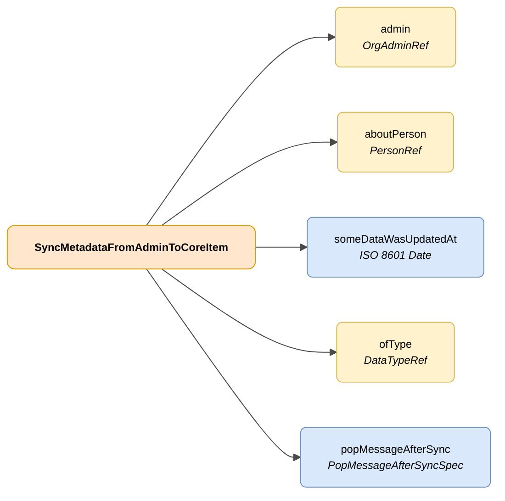

# SyncMetadataFromAdminToCoreItem

## Descripción

Representación de un cambio sobre un dato gestionado por una administración asociado a una persona usuaria de DENA.



| Color | Significado |
|-------|-------------|
| 🟠 Naranja | Objeto principal (SyncMetadataFromAdminToCoreItem) |
| 🟡 Amarillo | Referencia a otro objeto |
| 🔵 Azul claro | Campos de datos |


## Atributos JSON

| Campo    | Tipo     | Obligatorio | Descripción |
|----------|----------|-------------|-------------|
| `admin`  | [OrgAdminRef](../../semantica-base/modelo/org-admin-ref.md) | ✅ | Referencia a la administración donde se ha producido el cambio en el dato |
| `aboutPerson` | [PersonRef](../../semantica-base/modelo/person-ref.md) | ✅ | Referencia a la persona asociada al dato que ha sido modificado |
| `someDataWasUpdatedAt` | `ISO 8601 Date` | ✅ | Fecha y hora a la que se ha producido el cambio en el dato |
| `ofType` | [DataTypeRef](../../semantica-base/modelo/data-type-ref.md) | ✅ | Referencia al tipo de dato sobre el que se ha producido el cambio |
| `popMessageAfterSync` | [PopMessageAfterSyncSpec](./pop-message-after-sync-spec.md) | ❌ | Mensaje a mostrar a la persona usuaria cuando reciba la información del cambio |

## Ejemplo JSON

```json
{
    "admin": {
        "id": "admin-A414"
    },
    "aboutPerson": {
        "id": "12345678A"
    },
    "someDataWasUpdatedAt": "2026-05-11T09:56:10.2237636Z",
    "ofType": {
        "id": "administrativeNotice"
    },
    "popMessageAfterSync": {
        "how": "AT_CLIENT_AFTER_SYNC",
        "messageByLang": {
            "SPANISH": "Nuevo expediente de \"adminId\"",
            "ENGLISH": "New procedure from \"adminId\""
        }
    }
}
```
