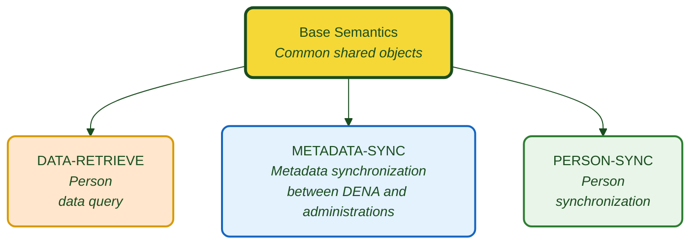

# :material-code-braces: Semantics for Public Administrations

Semantic definition of the objects and services exchanged between **DENA CORE** and **Public Administrations**.

---

## General diagram

| Color | Meaning |
|---|---|
| :yellow_circle: Yellow | Shared base model |
| :orange_circle: Orange | DATA-RETRIEVE (query) |
| :blue_circle: Light blue | METADATA-SYNC (metadata synchronization) |
| :green_circle: Green | PERSON-SYNC (person synchronization) |

---

## Modules

-   :material-database-arrow-right:{ .lg .middle } **DATA-RETRIEVE**

    ---

    DENA requests data about a person from the administration. The administration exposes a standard REST endpoint.

    [:octicons-arrow-right-24: Documentation](./data-retrieve/index.md)

-   :material-sync:{ .lg .middle } **METADATA-SYNC**

    ---

    The administration notifies DENA when there are changes in a person's data.

    [:octicons-arrow-right-24: Documentation](./metadata-sync/index.md)

-   :material-account-sync:{ .lg .middle } **PERSON-SYNC**

    ---

    Synchronization of the registered persons list. Pull and Push mechanisms.

    [:octicons-arrow-right-24: Documentation](./person-sync/index.md)

-   :material-shape:{ .lg .middle } **Base Semantics**

    ---

    Objects and definitions shared by all semantics.

    [:octicons-arrow-right-24: Documentation](./semantica-base/index.md)

---

## Detailed index

### DATA-RETRIEVE

| Document | Description |
|---|---|
| [Overview](./data-retrieve/index.md) | Flow, data model and structure |
| [Endpoint](./data-retrieve/endpoint-data-retrieve.md) | REST contract: request, response, HTTP codes |
| [Implementation guide](./data-retrieve/guia-implementacion.md) | Step by step for the administration |
| [Validations](./data-retrieve/validaciones.md) | Format rules and required fields |
| [Errors and troubleshooting](./data-retrieve/errores-troubleshooting.md) | Common errors guide |
| [Code snippets](./data-retrieve/snippets-codigo.md) | Java, C#, Python, Node.js, PHP |

??? note "Data objects"

    | Object | Document |
    |---|---|
    | Common fields | [campos-comunes.md](./data-retrieve/data/campos-comunes.md) |
    | Record | [expediente.md](./data-retrieve/data/expediente.md) |
    | Notification | [notificacion.md](./data-retrieve/data/notificacion.md) |
    | Official Registry | [registro-oficial.md](./data-retrieve/data/registro-oficial.md) |
    | Payment | [pago.md](./data-retrieve/data/pago.md) |
    | Appointment | [cita.md](./data-retrieve/data/cita.md) |
    | Administrative Service | [servicio-administrativo.md](./data-retrieve/data/servicio-administrativo.md) |
    | Organizational Unit | [unidad-organica.md](./data-retrieve/data/unidad-organica.md) |

### METADATA-SYNC

| Document | Description |
|---|---|
| [Overview](./metadata-sync/index.md) | Change notification flow |
| [Endpoint](./metadata-sync/endpoint-sync-metadata.md) | Endpoint REST contract |

### PERSON-SYNC

| Document | Description |
|---|---|
| [Overview](./person-sync/index.md) | Pull and Push mechanisms |
| [Push](./person-sync/push.md) | DENA → Administration |
| [Pull](./person-sync/pull.md) | Administration → DENA |

---

## Other documentation

- [Complementary documentation](./otra-documentacion.md)

---

!!! question "Technical questions about implementation"
    
    For queries about semantic specifications, data formats or endpoint implementation:
    
    **:material-email:** [admin-digital-data-dena@ejie.eus](mailto:admin-digital-data-dena@ejie.eus)

<!-- DENA-DOC-FOOTER -->
---
DENA Docs v{{ dena.version }} · {{ dena.date }}
