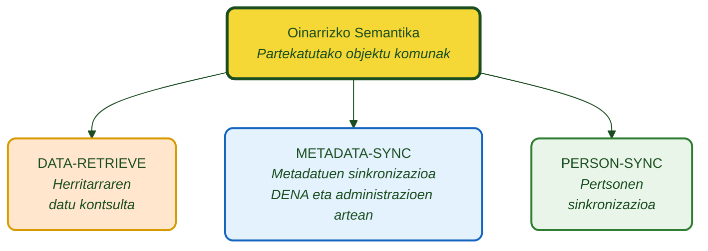

# :material-code-braces: Administrazioentzako Semantika

**DENA CORE** eta **Administrazio Publikoen** artean trukatzen diren objektu eta zerbitzuen definizio semantikoa.

---

## Diagrama orokorra

| Kolorea | Esanahia |
|---|---|
| :purple_circle: Morea | Partekatutako oinarrizko eredua |
| :orange_circle: Laranja | DATA-RETRIEVE (kontsulta) |
| :blue_circle: Urdin argia | METADATA-SYNC (metadatuen sinkronizazioa) |
| :green_circle: Berdea | PERSON-SYNC (pertsonen sinkronizazioa) |

---

## Moduluak

-   :material-database-arrow-right:{ .lg .middle } **DATA-RETRIEVE**

    ---

    DENAk pertsona baten datuak eskatzen dizkio administrazioari. Administrazioak REST endpoint estandar bat erakusten du.

    [:octicons-arrow-right-24: Dokumentazioa](./data-retrieve/index.md)

-   :material-sync:{ .lg .middle } **METADATA-SYNC**

    ---

    Administrazioak DENAri jakinarazten dio pertsona baten datuetan aldaketak daudenean.

    [:octicons-arrow-right-24: Dokumentazioa](./metadata-sync/index.md)

-   :material-account-sync:{ .lg .middle } **PERSON-SYNC**

    ---

    Erregistratutako pertsonen zerrendaren sinkronizazioa. Pull eta Push mekanismoak.

    [:octicons-arrow-right-24: Dokumentazioa](./person-sync/index.md)

-   :material-shape:{ .lg .middle } **Oinarrizko Semantika**

    ---

    Semantika guztiek partekatutako objektuak eta definizioak.

    [:octicons-arrow-right-24: Dokumentazioa](./semantica-base/index.md)

---

## Aurkibide zehatza

### DATA-RETRIEVE

| Dokumentua | Deskribapena |
|---|---|
| [Ikuspegi orokorra](./data-retrieve/index.md) | Fluxua, datu eredua eta egitura |
| [Endpoint-a](./data-retrieve/endpoint-data-retrieve.md) | REST kontratua: request, response, HTTP kodeak |
| [Inplementazio gida](./data-retrieve/guia-implementacion.md) | Administrazioarentzako pausoz pauso |
| [Baliozkotzeak](./data-retrieve/validaciones.md) | Formatu arauak eta derrigorrezko eremuak |
| [Erroreak eta troubleshooting](./data-retrieve/errores-troubleshooting.md) | Errore arrunten gida |
| [Kode zatiak](./data-retrieve/snippets-codigo.md) | Java, C#, Python, Node.js, PHP |

??? note "Datu objektuak"

    | Objektua | Dokumentua |
    |---|---|
    | Eremu komunak | [campos-comunes.md](./data-retrieve/data/campos-comunes.md) |
    | Espedientea | [expediente.md](./data-retrieve/data/expediente.md) |
    | Jakinarazpena | [notificacion.md](./data-retrieve/data/notificacion.md) |
    | Erregistro Ofiziala | [registro-oficial.md](./data-retrieve/data/registro-oficial.md) |
    | Ordainketa | [pago.md](./data-retrieve/data/pago.md) |
    | Hitzordua | [cita.md](./data-retrieve/data/cita.md) |
    | Administrazio Zerbitzua | [servicio-administrativo.md](./data-retrieve/data/servicio-administrativo.md) |
    | Unitate Organikoa | [unidad-organica.md](./data-retrieve/data/unidad-organica.md) |

### METADATA-SYNC

| Dokumentua | Deskribapena |
|---|---|
| [Ikuspegi orokorra](./metadata-sync/index.md) | Aldaketen jakinarazpen fluxua |
| [Endpoint-a](./metadata-sync/endpoint-sync-metadata.md) | Endpoint-aren REST kontratua |

### PERSON-SYNC

| Dokumentua | Deskribapena |
|---|---|
| [Ikuspegi orokorra](./person-sync/index.md) | Pull eta Push mekanismoak |
| [Push](./person-sync/push.md) | DENA → Administrazioa |
| [Pull](./person-sync/pull.md) | Administrazioa → DENA |

---

## bestelako dokumentazioa

- [Dokumentazio osagarria](./otra-documentacion.md)

---

!!! question "Inplementazioari buruzko galdera teknikoak"
    
    Zehaztapen semantikoei, datu formatuei edo endpoint-en inplementazioari buruzko kontsultetarako:
    
    **:material-email:** [admin-digital-data-dena@ejie.eus](mailto:admin-digital-data-dena@ejie.eus)

<!-- DENA-DOC-FOOTER -->
---
DENA Docs v{{ dena.version }} · {{ dena.date }}
