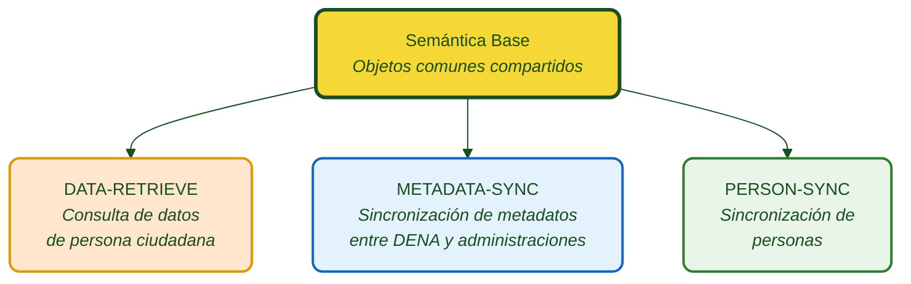

# :material-code-braces: Semántica para las Administraciones

Definición semántica de los objetos y servicios intercambiados entre **CORE DENA** y las **Administraciones Públicas**.

---

## Diagrama general

| Color | Significado |
|---|---|
| :purple_circle: Violeta | Modelo base compartido |
| :orange_circle: Naranja | DATA-RETRIEVE (consulta) |
| :blue_circle: Azul claro | METADATA-SYNC (sincronización de metadatos) |
| :green_circle: Verde | PERSON-SYNC (sincronización de personas) |

---

## Módulos

-   :material-database-arrow-right:{ .lg .middle } **DATA-RETRIEVE**

    ---

    DENA solicita datos de una persona a la administración. La administración expone un endpoint REST estándar.

    [:octicons-arrow-right-24: Documentación](./data-retrieve/index.md)

-   :material-sync:{ .lg .middle } **METADATA-SYNC**

    ---

    La administración notifica a DENA cuando hay cambios en datos de una persona.

    [:octicons-arrow-right-24: Documentación](./metadata-sync/index.md)

-   :material-account-sync:{ .lg .middle } **PERSON-SYNC**

    ---

    Sincronización del listado de personas registradas. Mecanismos Pull y Push.

    [:octicons-arrow-right-24: Documentación](./person-sync/index.md)

-   :material-shape:{ .lg .middle } **Semántica Base**

    ---

    Objetos y definiciones compartidas por todas las semánticas.

    [:octicons-arrow-right-24: Documentación](./semantica-base/index.md)

---

## Índice detallado

### DATA-RETRIEVE

| Documento | Descripción |
|---|---|
| [Visión general](./data-retrieve/index.md) | Flujo, modelo de datos y estructura |
| [Endpoint](./data-retrieve/endpoint-data-retrieve.md) | Contrato REST: request, response, códigos HTTP |
| [Guía de implementación](./data-retrieve/guia-implementacion.md) | Paso a paso para la administración |
| [Validaciones](./data-retrieve/validaciones.md) | Reglas de formato y campos obligatorios |
| [Errores y troubleshooting](./data-retrieve/errores-troubleshooting.md) | Guía de errores comunes |
| [Snippets de código](./data-retrieve/snippets-codigo.md) | Java, C#, Python, Node.js, PHP |

??? note "Objetos de datos"

    | Objeto | Documento |
    |---|---|
    | Campos comunes | [campos-comunes.md](./data-retrieve/data/campos-comunes.md) |
    | Expediente | [expediente.md](./data-retrieve/data/expediente.md) |
    | Notificación | [notificacion.md](./data-retrieve/data/notificacion.md) |
    | Registro Oficial | [registro-oficial.md](./data-retrieve/data/registro-oficial.md) |
    | Pago | [pago.md](./data-retrieve/data/pago.md) |
    | Cita | [cita.md](./data-retrieve/data/cita.md) |
    | Servicio Administrativo | [servicio-administrativo.md](./data-retrieve/data/servicio-administrativo.md) |
    | Unidad Orgánica | [unidad-organica.md](./data-retrieve/data/unidad-organica.md) |

### METADATA-SYNC

| Documento | Descripción |
|---|---|
| [Visión general](./metadata-sync/index.md) | Flujo de notificación de cambios |
| [Endpoint](./metadata-sync/endpoint-sync-metadata.md) | Contrato REST del endpoint |

### PERSON-SYNC

| Documento | Descripción |
|---|---|
| [Visión general](./person-sync/index.md) | Mecanismos Pull y Push |
| [Push](./person-sync/push.md) | DENA → Administración |
| [Pull](./person-sync/pull.md) | Administración → DENA |

---

## Otra documentación

- [Documentación complementaria](./otra-documentacion.md)

<!-- DENA-DOC-FOOTER -->
---
DENA Docs v{{ dena.version }} · {{ dena.date }}
