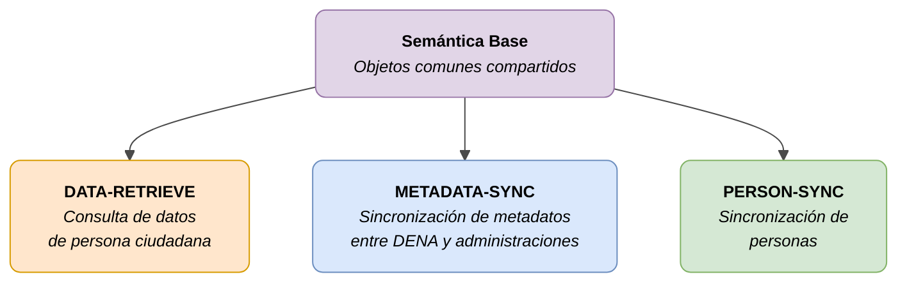

# 📐 Semántica para las Administraciones

Definición semántica de los objetos y servicios intercambiados entre **CORE DENA** y las **Administraciones Públicas**.

---

## Diagrama general

| Color | Significado |
|-------|-------------|
| 🟣 Violeta | Modelo base compartido |
| 🟠 Naranja | DATA-RETRIEVE (consulta) |
| 🔵 Azul claro | METADATA-SYNC (sincronización de metadatos) |
| 🟢 Verde | PERSON-SYNC (sincronización de personas) |

---

## 📑 Contenido

### Semántica Base

Objetos y definiciones compartidas por todas las semánticas.

| Documento | Descripción |
|-----------|-------------|
| [Índice](./semantica-base/index.md) | Modelo base |
| [Modelo](./semantica-base/modelo/index.md) | Definición de objetos base |

---

### DATA-RETRIEVE

Mecanismo mediante el cual DENA solicita datos de una persona ciudadana a la administración.

| Documento | Descripción |
|-----------|-------------|
| [Índice](./data-retrieve/index.md) | Visión general, flujo y modelo de datos |
| [Endpoint](./data-retrieve/endpoint-data-retrieve.md) | Contrato REST: request, response, códigos HTTP |
| [Validaciones](./data-retrieve/validaciones.md) | Reglas de formato, campos obligatorios, coherencia |
| [Errores](./data-retrieve/errores-troubleshooting.md) | Guía de errores comunes y resolución |
| [Snippets](./data-retrieve/snippets-codigo.md) | Implementación en Java, C#, Python, Node.js, PHP |

**Objetos de datos:**

| Documento | Descripción |
|-----------|-------------|
| [Campos comunes](./data-retrieve/data/campos-comunes.md) | Campos heredados (oid, id, urls, refs) |
| [Expediente](./data-retrieve/data/expediente.md) | Expediente administrativo |
| [Notificación](./data-retrieve/data/notificacion.md) | Notificación / comunicación oficial |
| [Registro Oficial](./data-retrieve/data/registro-oficial.md) | Asiento registral |
| [Pago](./data-retrieve/data/pago.md) | Pago único y domiciliación |
| [Cita](./data-retrieve/data/cita.md) | Cita previa / elemento de agenda |
| [Servicio Administrativo](./data-retrieve/data/servicio-administrativo.md) | Servicio y procedimiento |
| [Unidad Orgánica](./data-retrieve/data/unidad-organica.md) | Unidad organizativa |

---

### METADATA-SYNC

Sincronización de datos entre DENA y las administraciones.

| Documento | Descripción |
|-----------|-------------|
| [Índice](./metadata-sync/index.md) | Visión general |
| [Endpoint](./semantica/metadata-sync/endpoint-sync-metadata.md) | Contrato REST del endpoint |

---

### PERSON-SYNC

Sincronización de datos de personas entre DENA y las administraciones.

| Documento | Descripción |
|-----------|-------------|
| [Índice](./person-sync/index.md) | Visión general |
| [Push](./person-sync/modelo/push.md) | Modelo push (DENA → administración) |
| [Pull](./person-sync/modelo/pull.md) | Modelo pull (administración → DENA) |

---

### Otra documentación

| Documento | Descripción |
|-----------|-------------|
| [Otra documentación](./otra-documentacion.md) | Documentación complementaria |

<!-- DENA-DOC-FOOTER -->
---
DENA Docs v0.3.25 · 2026-06-10
