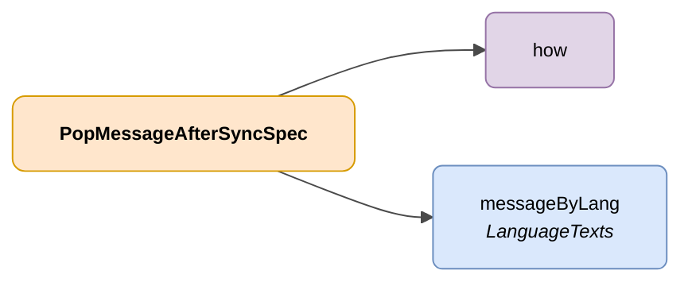

# PopMessageAfterSyncSpec

## Description

Representation of a change on a piece of data managed by an administration associated with a DENA user.



| Colour | Meaning |
|-------|-------------|
| 🟠 Orange | Main object (PopMessageAfterSyncSpec) |
| 🟣 Purple | Enums / defined values |
| 🔵 Light blue | Data fields |

---

## JSON attributes

| Field    | Type     | Mandatory | Description |
|----------|----------|-------------|-------------|
| `how`    | `String` | ✅          | Indication of how the message will be displayed to the user. Possible values: <br> `PUSH_TO_CLIENT_AT_CORE`: The message will be notified via PUSH to the client <br> `AT_CLIENT_AFTER_SYNC`: The message will be displayed after performing a synchronization from the client |
| `messageByLang` | [LanguageTexts](../../semantica-base/modelo/language-texts.md) | ✅ | Key-value map with the message in the different possible languages |

---

## JSON example

```json
{
    "how": "AT_CLIENT_AFTER_SYNC",
    "messageByLang": {
        "SPANISH": "Nuevo expediente de \"adminId\"",
        "ENGLISH": "New procedure from \"adminId\""
    }
}
```

<!-- DENA-DOC-FOOTER -->
---
<sub>DENA Docs v{{ dena.version }} · {{ dena.date }}</sub>
