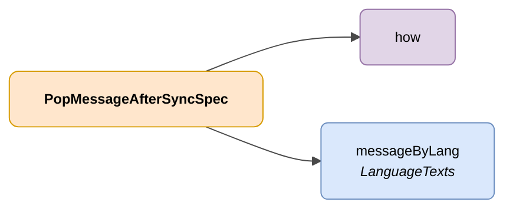

# PopMessageAfterSyncSpec

## Deskribapena

DENA erabiltzaile bati lotutako administrazio batek kudeatutako datu baten aldaketa baten adierazpena.



| Kolorea | Esanahia |
|-------|-------------|
| 🟠 Laranja | Objektu nagusia (PopMessageAfterSyncSpec) |
| 🟣 Morea | Enum-ak / definitutako balioak |
| 🔵 Urdin argia | Datu-eremuak |

---

## JSON atributuak

| Eremua    | Mota     | Nahitaezkoa | Deskribapena |
|----------|----------|-------------|-------------|
| `how`    | `String` | ✅          | Mezua erabiltzaileari nola erakutsiko zaion adierazten du. Balio posibleak: <br> `PUSH_TO_CLIENT_AT_CORE`: Mezua PUSH bidez jakinaraziko zaio bezeroari <br> `AT_CLIENT_AFTER_SYNC`: Mezua bezerotik sinkronizazio bat egin ondoren erakutsiko da |
| `messageByLang` | [LanguageTexts](../../semantica-base/modelo/language-texts.md) | ✅ | Gako-balio mapa mezuarekin hizkuntza posible ezberdinetan |

---

## JSON adibidea

```json
{
    "how": "AT_CLIENT_AFTER_SYNC",
    "messageByLang": {
        "SPANISH": "Nuevo expediente de \"adminId\"",
        "ENGLISH": "New procedure from \"adminId\""
    }
}
```

<!-- DENA-DOC-FOOTER -->
---
<sub>DENA Docs v{{ dena.version }} · {{ dena.date }}</sub>
