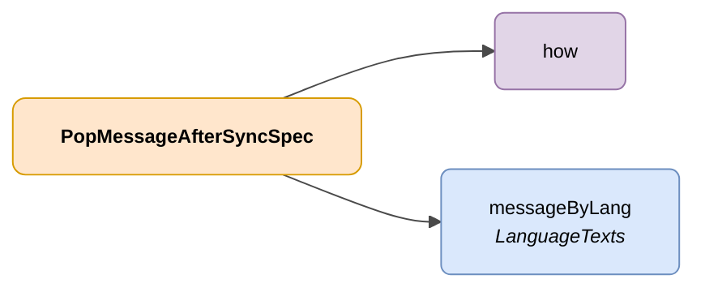

# PopMessageAfterSyncSpec

## Descripción

Representación de un cambio sobre un dato gestionado por una administración asociado a una persona usuaria de DENA.



| Color | Significado |
|-------|-------------|
| 🟠 Naranja | Objeto principal (PopMessageAfterSyncSpec) |
| 🟣 Violeta | Enums / valores definidos |
| 🔵 Azul claro | Campos de datos |

---

## Atributos JSON

| Campo    | Tipo     | Obligatorio | Descripción |
|----------|----------|-------------|-------------|
| `how`    | `String` | ✅          | Indicación de como se mostrará el mensaje a la persona usuaria. Valores posibles: <br> `PUSH_TO_CLIENT_AT_CORE`: El mensaje se notificara por PUSH al cliente <br> `AT_CLIENT_AFTER_SYNC`: El mensaje se mostrara tras realizar una sincronización desde el cliente |
| `messageByLang` | [LanguageTexts](../semantica-base/modelo/language-texts.md) | ✅ | Mapa clave-valor con el mensaje en los distintos idiomas posibles |

---

## Ejemplo JSON

```json
{
    "how": "AT_CLIENT_AFTER_SYNC",
    "messageByLang": {
        "SPANISH": "Nuevo expediente de \"adminId\"",
        "ENGLISH": "New procedure from \"adminId\""
    }
}
```

<!-- DENA-DOC-FOOTER -->
---
<sub>DENA Docs v0.3.25 · 2026-06-10</sub>
