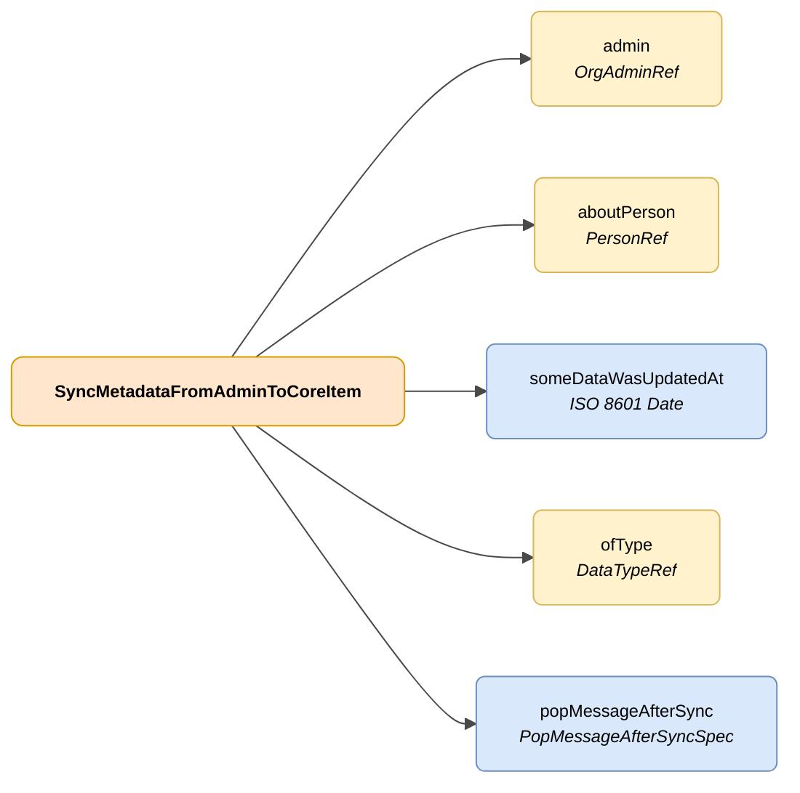

# SyncMetadataFromAdminToCoreItem

## Description

Representation of a change to a piece of data managed by an administration, associated with a DENA user.



| Colour | Meaning |
|--------|---------|
| 🟠 Orange | Main object (SyncMetadataFromAdminToCoreItem) |
| 🟡 Yellow | Reference to another object |
| 🔵 Light blue | Data fields |


## JSON attributes

| Field    | Type     | Mandatory | Description |
|----------|----------|:---------:|-------------|
| `admin`  | [OrgAdminRef](../../semantica-base/modelo/org-admin-ref.md) | ✅ | Reference to the administration where the data change occurred |
| `aboutPerson` | [PersonRef](../../semantica-base/modelo/person-ref.md) | ✅ | Reference to the person associated with the modified data |
| `someDataWasUpdatedAt` | `ISO 8601 Date` | ✅ | Date and time at which the data change occurred |
| `ofType` | [DataTypeRef](../../semantica-base/modelo/data-type-ref.md) | ✅ | Reference to the data type on which the change occurred |
| `popMessageAfterSync` | [PopMessageAfterSyncSpec](./pop-message-after-sync-spec.md) | ❌ | Message to display to the user when they receive the change information |

## JSON example

```json
{
    "admin": {
        "id": "admin-A414"
    },
    "aboutPerson": {
        "id": "12345678A"
    },
    "someDataWasUpdatedAt": "2026-05-11T09:56:10.2237636Z",
    "ofType": {
        "id": "administrativeNotice"
    },
    "popMessageAfterSync": {
        "how": "AT_CLIENT_AFTER_SYNC",
        "messageByLang": {
            "SPANISH": "Nuevo expediente de \"adminId\"",
            "ENGLISH": "New procedure from \"adminId\""
        }
    }
}
```

<!-- DENA-DOC-FOOTER -->
---
<sub>DENA Docs v{{ dena.version }} · {{ dena.date }}</sub>
