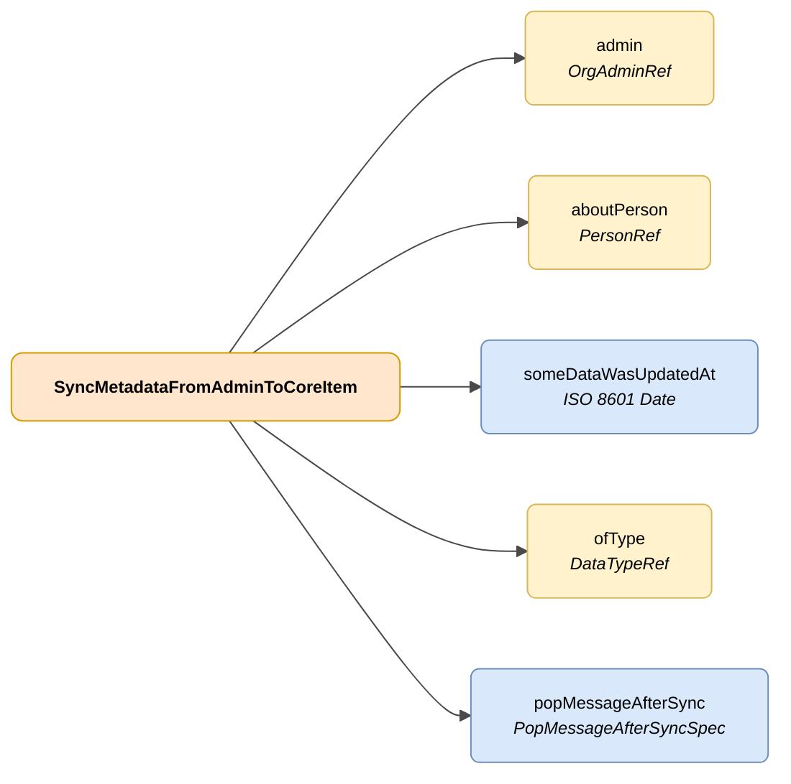

# SyncMetadataFromAdminToCoreItem

## Deskribapena

DENAren erabiltzaile bati lotutako administrazio batek kudeatutako datu batean gertatutako aldaketaren irudikapena.



| Kolorea | Esanahia |
|---------|----------|
| 🟠 Laranja | Objektu nagusia (SyncMetadataFromAdminToCoreItem) |
| 🟡 Hori | Beste objektu baten erreferentzia |
| 🔵 Urdin argia | Datu-eremuak |


## JSON atributuak

| Eremua   | Mota     | Derrigorrez | Deskribapena |
|----------|----------|:-----------:|--------------|
| `admin`  | [OrgAdminRef](../../semantica-base/modelo/org-admin-ref.md) | ✅ | Datu-aldaketa gertatu den administrazioaren erreferentzia |
| `aboutPerson` | [PersonRef](../../semantica-base/modelo/person-ref.md) | ✅ | Aldatutako datuari lotutako pertsonaren erreferentzia |
| `someDataWasUpdatedAt` | `ISO 8601 Date` | ✅ | Datu-aldaketa gertatu den data eta ordua |
| `ofType` | [DataTypeRef](../../semantica-base/modelo/data-type-ref.md) | ✅ | Aldaketa gertatu den datu motaren erreferentzia |
| `popMessageAfterSync` | [PopMessageAfterSyncSpec](./pop-message-after-sync-spec.md) | ❌ | Erabiltzaileari aldaketaren informazioa jasotzen duenean erakusteko mezua |

## JSON adibidea

```json
{
    "admin": {
        "id": "admin-A414"
    },
    "aboutPerson": {
        "id": "12345678A"
    },
    "someDataWasUpdatedAt": "2026-05-11T09:56:10.2237636Z",
    "ofType": {
        "id": "administrativeNotice"
    },
    "popMessageAfterSync": {
        "how": "AT_CLIENT_AFTER_SYNC",
        "messageByLang": {
            "SPANISH": "Nuevo expediente de \"adminId\"",
            "ENGLISH": "New procedure from \"adminId\""
        }
    }
}
```

<!-- DENA-DOC-FOOTER -->
---
<sub>DENA Docs v{{ dena.version }} · {{ dena.date }}</sub>
