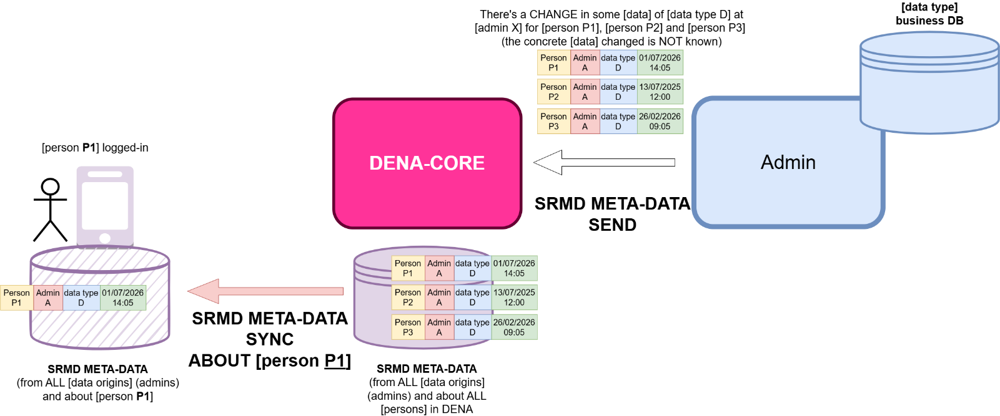

# :material-file-document: DENA Architecture - Complete Documentation

> This document contains the information extracted from `DENA-Architecture.docx` and `DENA-CORE-Services_for_admins.docx` for reference.

---

## 1. DENA Overview

### 1.1 DENA Premises

DENA is an interoperability system between **persons** and **administrations**, not between administrations.

**Fundamental Principles:**

- DENA-APP retrieves data directly from the administration through DENA-CORE acting as a PROXY
- **NO data is stored in DENA-CORE**
- Whenever a person retrieves data from an administration, a consent provided by the person is mandatory
- DENA-APP stores retrieved data in a local cache on the user's device
- DENA-APP must know:
  - **Data Provenance**: which administrations have information about a person
  - **Changes in source data**: allows knowing if the local cache needs updating

### 1.2 DENA Key Concepts

| Concept | Description |
|----------|-------------|
| **[person]** | Individual who registers in DENA (creates a DENA account) |
| **[admins]** | Public entities that expose data to the DENA ecosystem |
| **DENA-APP** | Mobile or web app used by persons to access their data |
| **DENA-CORE** | System providing services for DENA-APP and interoperability |
| **[data origin]** | Data source for a person in an administration |
| **SRMD** | Sync And Retrieve Meta-Data: metadata about data changes |
| **[admin connector]** | DENA-CORE component that intermediates with administrations |
| **[data provider]** | Service exposed by the administration to provide data |

---

## 2. CORE Services for Administrations

DENA-CORE offers the following services for administrations:

### 2.1 SRMD Sync: Sending change information

Mechanism for administrations to send information about data changes to DENA-CORE.


**High-level flow:**

1. The administration queries its business DB for items that have changed since the last cycle
2. For each changed item, creates an SRMD structure:
   ```
   {person} | {data type} | {admin} | {last update instant}
   ```
3. The administration sends ALL SRMD to DENA-CORE via a REST service

**Implementation strategies:**

- **Single data provider** for a single data type in an administration
- **Aggregated data providers** combining data from multiple origins
- **Multiple data providers** for multiple origins in different instances

**When an administration has multiple data origins for the same data type, SRMD includes:**

```
{person} | {admin} | {data type} | {data origin instance} | {last update instant}
```

### 2.2 Data Retrieval: Service Exposure

DENA-CORE acts as an intermediary/proxy for DENA-APP to retrieve data from administrations.


**Retrieval flow:**

1. Client calls DENA-CORE requesting data (data type, admin, person)
2. DENA-CORE translates the message to model objects
3. DENA-CORE determines which connector to use
4. The connector calls the administration's data provider
5. Data is translated to standard format if necessary
6. DENA-CORE determines the "has changed" status
7. Response reaches the client

**The administration can:**
- Implement the data provider using DENA standard semantics
- Implement custom semantics (SOAP, X-509, custom format)

---

## 3. Data Exchange Mechanism

### 3.1 SYNC (Metadata about changes)

DENA-APP uses a local cache where all retrieved data is stored. To keep it updated:

1. Administrations periodically send SRMD to DENA-CORE with changes in data types
2. DENA-APP gets SRMD for the logged-in person and stores it in their local DB
3. By comparing local SRMD with DENA-CORE's, DENA-APP knows what data has changed

**SRMD Structure:**
```
[person] | [admin] | [data type] | [data origin instance] | [last update instant]
```

### 3.2 RETRIEVE (Data retrieval)

Once a change is detected, DENA-APP retrieves the complete data:

1. DENA-APP calls a REST service of DENA-CORE
2. DENA-CORE translates the message to model objects
3. DENA-CORE determines which connector to use
4. The connector calls the administration's data provider
5. Data is translated to standard format if necessary
6. DENA-CORE determines the "has changed" status of each element
7. The response reaches DENA-APP

### 3.3 The COLD-START Problem

When a person registers in DENA, no SRMD exists because administrations DO NOT send SRMD for unregistered persons.

**Solution:**
DENA-CORE inserts SRMD entries as if administrations had sent them for key administrations (EJGV, DFB, DFG, DFA, Bilbao, Gasteiz, Donostia).

---

## 4. Person-Sync Detailed

### 4.1 Data Stored per Person

Each person registered in DENA has:

- **Person OID**: Unique identifier generated by DENA
- **Person ID**: The NIF
- **Full Name**: name, surname1, surname2
- **Contact Data**: address, phone, email...
- **Preferred Themes**: for proactive services or UI customization

### 4.2 Synchronization Mechanisms

#### DENA-PUSH: DENA notifies the administration

DENA sends a message when:
- New person registers
- Person deletes their account
- Person changes basic data (name, contact...)



#### ADMIN-PULL: The administration queries

**Modalities:**

| Modality | Description |
|-----------|-------------|
| **On-line** | REST service for real-time person data queries |
| **Off-line (pre-generated)** | Pre-generated periodic files with person data |
| **Off-line (bespoke)** | Custom files generated on demand |

**Online Pull Example:**

```
POST /persons/search
{
  "orgAdminRef": { "id": "admin1" },
  "personQuery": {
    "personIds": ["40404040H", "12345678Z"]
  }
}
```

**Offline Pull - Pre-generated Example:**

```
POST /pre-generated
{
  "jobType": "ALL_PERSONS",
  "exportType": "DATA",
  "fileFormat": "CSV",
  "hourOfDay": "20"
}
```

**Offline Pull - Bespoke Example:**

```
POST /bespokes
{
  "orgAdminRef": { "id": "admin1" },
  "exportSpec": {
    "personExportSpec": "data",
    "lastUpdateRange": "Instant:[2026-08-24T21:19:41.314878600Z..)",
    "exportContentSpec": {
      "exportDefaultContactData": true,
      "exportOtheContactData": true,
      "exportFinData": true
    },
    "exportFileFormat": "CSV"
  }
}
```

!!! warning "Important difference"

    Person-Sync ≠ Contact Data as a data type:
    - **Person-Sync**: Mechanism for administrations to access person account data in DENA
    - **Contact Data**: Another interoperable data type (similar to records/expedients) that allows persons to view their own contact data across administrations

---

## 5. Service Architecture

### 5.1 Overview

The main architecture blocks are:

- **Client Device UI**: DENA-APP
- **DENA-CORE**:
  - Configuration Module (organizational structure, interoperability config)
  - Persons Module (DENA accounts, synchronization)
  - Sync and Retrieve Module (SRMD)
  - Consents Module
  - Security Module
- **Admin Connectors**: Translation between standard and specific semantics


### 5.2 Connectors

A **connector** translates DENA semantics used internally to the specific semantics of the administration's data provider.


**Two sides of the connector:**
1. **Internal side**: Uses standard DENA semantics (transport, security, format)
2. **External side**: Knows how to interact with the remote provider (URL, headers, authentication, data format)

Connectors are independent modules deployed independently of DENA-CORE to make the system more resilient.

---

## 6. Base Data Types

### 6.1 Fundamental Types

| Type | Description | Example |
|------|-------------|---------|
| **Boolean** | true/false values | `true` |
| **Numbers** | Integers and decimals | `42`, `3.14` |
| **Enums** | Values from a defined set | `LANG: SPANISH \| BASQUE \| ENGLISH` |
| **String** | Text strings | `"Euskadi"` |
| **LanguageTexts** | Multilingual texts | `{ "es": "Hola", "eu": "Kaixo" }` |
| **DateTime** | Temporal instants | `2024-01-15T10:30:00Z` |
| **UID/OID** | Unique identifiers | `urn:uuid:12345678-1234...` |
| **ID** | Business-meaningful identifiers | NIF, IBAN, record number |
| **Money** | Monetary amounts | `{ "base": "CENTS", "currency": "EUR", "amount": 249333 }` |
| **Hash** | SHA-256 digest | `2251f5ac60e4fc24a62914bf92a9adf3af1abbf72d649eceec9ed7c3a2e29b8f` |
| **UserAgent** | Client information | `DenaApp/1.0 (Android 13; Pixel 6 Pro)...` |

### 6.2 Complex Structures

- **Urls**: URL with parsed components
- **WebLink**: Web link with multilingual texts
- **WebLinkCollection**: Collection of WebLinks
- **Ranges**: Value ranges
- **Token**: Security tokens

---

## 7. Data Interchange: JSON Examples

### 7.1 SRMD sent from Admin to DENA-CORE

```json
{
  "admin": { "id": "EJGV" },
  "aboutPerson": { "id": "40404040H" },
  "someDataWasUpdatedAt": "2026-08-17T15:14:07.0369127Z",
  "ofType": { "id": "ADMIN_NOTICE" },
  "fromDataOrigin": "DEFAULT"
}
```

### 7.2 DENA-CORE Response to SRMD

```json
{
  "transactionOid": "20863FFE-0BEB-4079-BFA1-A1EAEEEB58FF",
  "receivedItemsCount": 3,
  "processedOK": [
    {
      "oid": "4F4EF685-BA83-4BAB-80CD-6B01BBE7939C",
      "lastTransactionOid": "20863FFE-0BEB-4079-BFA1-A1EAEEEB58FF",
      "admin": { "id": "EJGV" },
      "dataType": { "id": "ADMIN_NOTICE" },
      "dataOriginInstanceId": "DEFAULT",
      "person": { "id": "40404040H" },
      "dataLastUpdatedAt": "2026-08-17T15:14:07.0324014Z"
    }
  ],
  "processedNOK": []
}
```

---

## 8. Security

### 8.1 Person Authentication

- Login with **GILTZA OAUTH token**
- Subsequent use of **Passkeys** to avoid requiring GILTZA again

### 8.2 DENA-APP Authentication with DENA-CORE

- OAUTH token from **DENA-IdP**

### 8.3 Admin Authentication with DENA-CORE

- OAUTH token from **DENA-IdP**

### 8.4 DENA-CORE Authentication with Admin

- Preferred authentication system of the target administration
- OAUTH, X-509 certificate, user/passwd...

---

## 9. DENA Configuration

### 9.1 Labeling System

Defines the organizational structure of administrations.

### 9.2 Interoperability Configuration

| Element | Description |
|----------|-------------|
| **Data Type** | Data types offered by administrations |
| **Data Origin** | Configuration used by connectors |
| **AppVersion** | Application version history |

---

## 10. Architecture Images

The following images are available in `docs/adjuntos/imagenes/`:

| File | Description |
|---------|-------------|
| `image1.png` | SRMD concepts diagram |
| `image2.png` | General connectors architecture |
| `image3.svg` | Synchronization flow |
| `image5.png` | Data Retrieval overview |
| `image6.svg` | Detailed connectors architecture |
| `image7.png` | DENA Push overview |
| `image9.png` | Data interchange flow |
| `image10.png` | High level architecture |
| `image11.png` | Implementation example |
| `image12.png` | Interchanged data |

---

**Last update:** Extracted from DENA-Architecture.docx and DENA-CORE-Services_for_admins.docx

<!-- DENA-DOC-FOOTER -->
---
<sub>DENA Docs v{{ dena.version }} · {{ dena.date }}</sub>