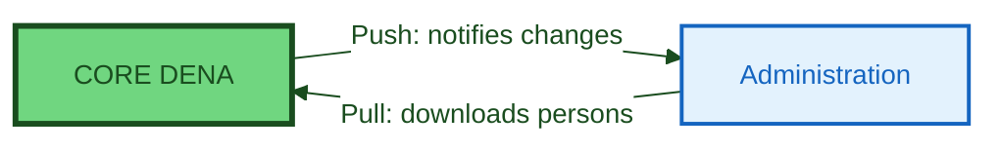

# :material-account-sync: PERSON-SYNC

> **Version:** `v{{ dena.version }}` · **Date:** {{ dena.date }}

---

## What is it?

**Person-Sync** allows administrations to synchronize the persons registered in DENA into their systems, so they can notify DENA of updates to the data associated with those persons.

## Key Concepts

Each person registered in DENA has an account that stores:

- **Person OID**: Unique identifier generated by DENA
- **Person ID**: The NIF (tax ID)
- **Full Name**: name, surname1, surname2
- **Contact Data**: address, phone, email...
- **Preferred Topics**: can be used in proactive services or customize the UI

This basic information is available to all administrations participating in DENA.

!!! note "Do not confuse with Contact Data data type"

    **Person-Sync** is a mechanism for administrations to access person account data in DENA.

    **Contact Data** is another interoperable data type (similar to records) that allows a person to view their own contact data in different administrations.

---

## Purpose

The main purpose of synchronizing persons with administrations is:

1. **Targeted notifications**: Administrations only send SRMD (change notices) for persons who actually have a DENA account
2. **Updated basic data**: Administrations access name, contact and preferences of persons

---

## Mechanisms

DENA offers two complementary mechanisms for synchronizing person data:

### :material-download: Pull (Administration → DENA)

The administration connects to DENA and downloads person data on demand.

| Mode | Description |
|------|-------------|
| **On-line** | Real-time REST query to obtain person data |
| **Off-line (pre-generated)** | Periodic files with person listings |
| **Off-line (bespoke)** | Custom files generated on demand |

### :material-upload: Push (DENA → Administration)

DENA proactively notifies the administration when a change occurs:

- New person registered in DENA
- Person deletes their account
- Person changes basic data (name, contact...)

---

## Architecture Images

### Person-Sync Overview

### Pull Flow (Synchronization from Administration)

---

## Mechanism Comparison

| Situation | Recommendation |
|-----------|---------------|
| You need to know instantly when someone registers | **Push** |
| You have a night batch process that synchronizes | **Pull off-line** |
| You want to query persons on demand | **Pull on-line** |
| You want both (recommended) | **Push** + **Pull off-line** as backup |

!!! tip "Recommendation"
    We recommend implementing **both mechanisms**: Push for real-time notifications and Pull off-line as backup to recover any missed ones.

---

## Endpoints

### Pull

| Document | Content |
|---|---|
| [Fetch Persons Pregen Export Asset](./endpoints/pull/fetch-persons-pregen-export-asset.md) | Download of pre-generated files |
| [Create Pull from Admin Bespoke Job](./endpoints/pull/create-pull-from-admin-bespoke-job.md) | Custom export request |
| [Get Pull from Admin Bespoke Job](./endpoints/pull/get-pull-from-admin-bespoke-job.md) | Request status query |
| [Fetch Persons Bespoke Export Asset](./endpoints/pull/fetch-persons-bespoke-export-asset.md) | Download of custom files |

### Push

| Document | Content |
|---|---|
| [Person Push to Admin](./endpoints/push/endpoint-person-push-to-admin.md) | Reception endpoint contract |

---

## Data Models

| Model | Description |
|-------|-------------|
| [Export Spec](./modelo/pull/export-spec.md) | Export format specification |
| [Person Hashes](./modelo/push/person-hashes.md) | Person hashes for Push mechanism |
| [Architecture Documentation (ref.)](./arquitectura-dena-completa.md) | Complete documentation extracted from DENA-Architecture.docx |

---

!!! tip "Postman"

    Postman collection and environment available at [`docs/adjuntos/postman/`]({{ repos.docs_tree }}/docs/adjuntos/postman).

<!-- DENA-DOC-FOOTER -->
---
DENA Docs v{{ dena.version }} · {{ dena.date }}