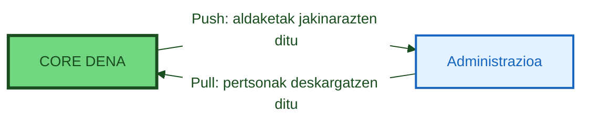

# :material-account-sync: PERSON-SYNC

> **Bertsioa:** `v{{ dena.version }}` · **Data:** {{ dena.date }}

---

## Zer da?

**Person-Sync** administrazioek DENAn erregistratutako pertsonak beren sistemetan sinkronizatzeko aukera ematen die, pertsona horiei lotutako datuetako eguneraketak DENAri jakinarazi ahal izateko.

## Kontzeptu Gakoak

DENAn erregistratutako pertsona bakoitzak kontu bat du, honako hauek gordetzen dituena:

- **Pertsona OID**: DENAk sortutako identifikadore bakarra
- **Pertsona ID**: NAF (zerga-zenbakia)
- **Izen-osoa**: izena, lehen abizena, bigarren abizena
- **Kontaktu-datuak**: helbidea, telefonoa, e-posta...
- **Gai Nahiagoak**: zerbitzu proaktiboetan erabili edo UI pertsonalizatzeko erabil daitezke

Informazio oinarrizko hau DENAren parte diren administrazio guztientzat eskuragarri dago.

!!! note "Ez nahasi Kontaktu-datu datu-motarekin"

    **Person-Sync** administrazioek DENAren pertsona-kontu datuetara sartzeko mekanismoa da.

    **Kontaktu-datuak** beste datu-mota interoperable bat da (expedienteen antzekoa), pertsona bati bere kontaktu-datuak administrazio desberdinetan ikusteko aukera ematen diona.

---

## Helburua

Administrazioekin pertsonak sinkronizatzearen helburu nagusia hau da:

1. **Jakinarazpen zuzenduak**: Administrazioek SRMD (aldaketa-jakinarazpenak) soilik DENAren kontua benetan duten pertsonei bidaltzen dizkiete
2. **Oinarrizko datu eguneratuak**: Administrazioek pertsonen izena, kontaktua eta lehentasunak atzitzen dituzte

---

## Mekanismoak

DENAk bi mekanismo osagarri eskaintzen ditu pertsona-datuak sinkronizatzeko:

### :material-download: Pull (Administrazioa → DENA)

Administrazioak DENArekin konektatzen da eta pertsona-datuak eskatzen ditu eskaintzeko.

| Modalitatea | Deskribapena |
|-------------|--------------|
| **Lineako** | Denbora errealeko REST kontsulta pertsona-datuak lortzeko |
| **Lineaz kanpoko (aurrez sortutako)** | Fitxategi periodikoak pertsonen zerrendekin |
| **Lineaz kanpoko (bespoke)** | Pertsonalizatutako fitxategiak eskaeraren arabera sortuak |

### :material-upload: Push (DENA → Administrazioa)

DENAk modu proaktiboan jakinarazten dio administrazioari aldaketa bat gertatzen denean:

- Pertsona berria erregistratuta DENAren
- Pertsonak bere kontua ezabatu du
- Pertsonak oinarrizko datuak aldatu ditu (izena, kontaktua...)

---

## Arkitektura Irudiak

### Person-Sync Ikuspegi Orokorra

### Pull Fluxua (Administraziotik Sinkronizazioa)

---

## Mekanismoen Konparaketa

| Egoera | Gomendioa |
|--------|-----------|
| Unean-unean jakin behar duzu nor erregistratzen den | **Push** |
| Gauetan sinkronizatzen duen prozesu bat duzu | **Pull lineaz kanpoko** |
| Pertsonak eskaintzeko kontsultatu nahi dituzu | **Pull lineako** |
| Biak nahi dituzu (gomendatua) | **Push** + **Pull lineaz kanpoko** babeskopiatutzat |

!!! tip "Gomendioa"
    **Bi mekanismoak** inplementatzea gomendatzen da: Push denbora errealeko jakinarazpenetarako eta Pull lineaz kanpoko galdu daitezkeenak berreskuratzeko babeskopiatutzat.

---

## Endpoint-ak

### Pull

| Dokumentua | Edukia |
|---|---|
| [Fetch Persons Pregen Export Asset](./endpoints/pull/fetch-persons-pregen-export-asset.md) | Aurrez sortutako fitxategien deskarga |
| [Create Pull from Admin Bespoke Job](./endpoints/pull/create-pull-from-admin-bespoke-job.md) | Neurri-esportazio eskaera |
| [Get Pull from Admin Bespoke Job](./endpoints/pull/get-pull-from-admin-bespoke-job.md) | Eskaeren egoera-kontsulta |
| [Fetch Persons Bespoke Export Asset](./endpoints/pull/fetch-persons-bespoke-export-asset.md) | Neurri-fitxategien deskarga |

### Push

| Dokumentua | Edukia |
|---|---|
| [Person Push to Admin](./endpoints/push/endpoint-person-push-to-admin.md) | Jasotze-endpoint-aren kontratua |

---

## Datu-Modelos

| Modelo | Deskribapena |
|--------|--------------|
| [Export Spec](./modelo/pull/export-spec.md) | Esportazio-formatuaren zehaztapena |
| [Person Hashes](./modelo/push/person-hashes.md) | Push mekanismorako pertsonen hash-ak |
| [Arkitektura Dokumentazioa (ref.)](./arquitectura-dena-completa.md) | DENA-Architecture.docx-tik ateratako dokumentazio osoa |

---

!!! tip "Postman"

    Postman bilduma eta environment-a eskuragarri [`docs/adjuntos/postman/`]({{ repos.docs_tree }}/docs/adjuntos/postman) helbidean.

<!-- DENA-DOC-FOOTER -->
---
DENA Docs v{{ dena.version }} · {{ dena.date }}