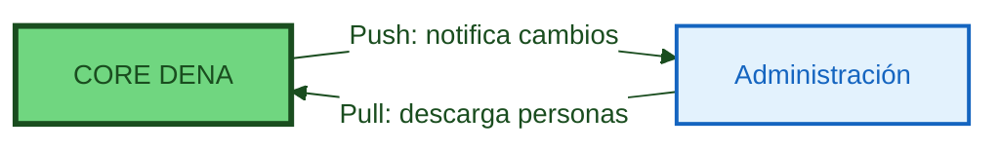

# :material-account-sync: PERSON-SYNC

> **Versión:** `v{{ dena.version }}` · **Fecha:** {{ dena.date }}

---

## ¿Qué es?

**Person-Sync** permite a las administraciones sincronizar las personas registradas en DENA en sus sistemas, para poder notificar a DENA las actualizaciones en los datos asociados a esas personas.

## Conceptos Clave

Cada persona que se registra en DENA tiene una cuenta que almacena:

- **OID de Persona**: Identificador único generado por DENA
- **ID de Persona**: El NIF
- **Nombre Completo**: nombre, apellido1, apellido2
- **Datos de Contacto**: dirección, teléfono, email...
- **Temas Preferidos**: pueden usarse en servicios proactivos o personalizar la UI

Esta información básica está disponible para todas las administraciones participantes en DENA.

!!! note "No confundir con el tipo de dato Contact Data"

    El **Person-Sync** es un mecanismo para que las administraciones accedan a los datos de cuenta de las personas en DENA.

    El **tipo de dato Contact Data** es otro tipo de dato interoperable (similar a expedientes) que permite a una persona ver sus propios datos de contacto en las diferentes administraciones.

---

## Propósito

El propósito principal de sincronizar personas con las administraciones es:

1. **Notificaciones dirigidas**: Las administraciones solo envían SRMD (avisos de cambios) para personas que realmente tienen cuenta en DENA
2. **Datos básicos actualizados**: Las administraciones acceden a nombre, contacto y preferencias de las personas

---

## Mecanismos

DENA ofrece dos mecanismos complementarios para sincronizar datos de personas:

### :material-download: Pull (Administración → DENA)

La administración se conecta a DENA y descarga los datos de personas bajo demanda.

| Modalidad | Descripción |
|-----------|-------------|
| **On-line** | Consulta REST en tiempo real para obtener datos de personas |
| **Off-line (pre-generado)** | Ficheros periódicos con listados de personas |
| **Off-line (bespoke)** | Ficheros personalizados generados bajo demanda |

### :material-upload: Push (DENA → Administración)

DENA notifica proactivamente a la administración cuando se produce un cambio:

- Nueva persona registrada en DENA
- Persona elimina su cuenta
- Persona cambia datos básicos (nombre, contacto...)

---

## Imágenes de Arquitectura

### Vista General de Person-Sync

### Flujo de Pull (Sincronización desde Administración)

---

## Comparativa de Mecanismos

| Situación | Recomendación |
|-----------|---------------|
| Necesitas saber al instante cuando alguien se registra | **Push** |
| Tienes un proceso batch nocturno que sincroniza | **Pull off-line** |
| Quieres consultar personas bajo demanda | **Pull on-line** |
| Quieres ambos (recomendado) | **Push** + **Pull off-line** como respaldo |

!!! tip "Recomendación"
    Se recomienda implementar **ambos mecanismos**: Push para notificaciones en tiempo real y Pull off-line como respaldo para recuperar posibles perdidos.

---

## Endpoints

### Pull

| Documento | Contenido |
|---|---|
| [Fetch Persons Pregen Export Asset](./endpoints/pull/fetch-persons-pregen-export-asset.md) | Descarga de ficheros pregenerados |
| [Create Pull from Admin Bespoke Job](./endpoints/pull/create-pull-from-admin-bespoke-job.md) | Solicitud de exportación a medida |
| [Get Pull from Admin Bespoke Job](./endpoints/pull/get-pull-from-admin-bespoke-job.md) | Consulta de estado de solicitudes |
| [Fetch Persons Bespoke Export Asset](./endpoints/pull/fetch-persons-bespoke-export-asset.md) | Descarga de ficheros a medida |

### Push

| Documento | Contenido |
|---|---|
| [Person Push to Admin](./endpoints/push/endpoint-person-push-to-admin.md) | Contrato del endpoint de recepción |

---

## Modelos de Datos

| Modelo | Descripción |
|--------|-------------|
| [Export Spec](./modelo/pull/export-spec.md) | Especificación del formato de exportación |
| [Person Hashes](./modelo/push/person-hashes.md) | Hashes de personas para el mecanismo Push |
| [Documentación Arquitectura (ref.)](./arquitectura-dena-completa.md) | Documentación completa extraída de DENA-Architecture.docx |

---

!!! tip "Postman"

    Colección y environment Postman disponibles en [`docs/adjuntos/postman/`]({{ repos.docs_tree }}/docs/adjuntos/postman).

<!-- DENA-DOC-FOOTER -->
---
DENA Docs v{{ dena.version }} · {{ dena.date }}
