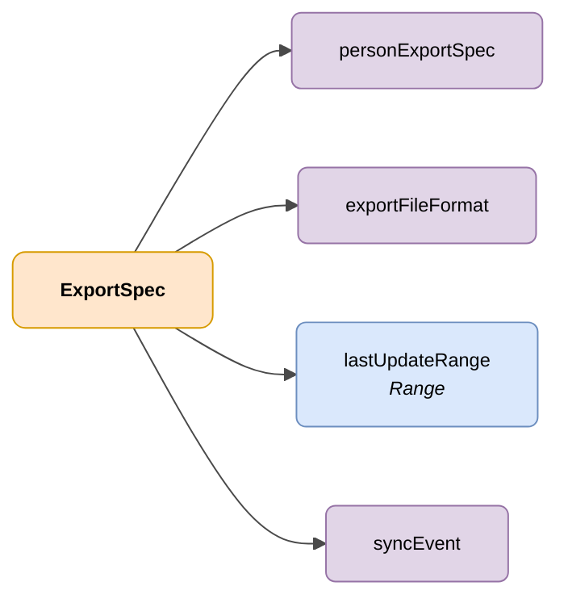

# ExportSpec

## Description

Specification of a DENA user data export request, indicating the data to export, filters to apply and the target format.



| Colour | Meaning |
|--------|---------|
| 🟠 Orange | Main object (ExportSpec) |
| 🟣 Violet | Enums / states |
| 🔵 Light blue | Data fields |

---

## JSON attributes

| Field              | Type     | Mandatory | Description |
|--------------------|----------|:---------:|-------------|
| `personExportSpec` | `String` | ✅        | `data` (Includes all data for each person) <br> `sync` (Includes only creation/update timestamps) |
| `exportFileFormat` | `String` | ✅        | Format to export the data to. Possible values: `SQLITE`, `CSV`, `ZIP_OF_JSON` or `PARQUET` |
| `lastUpdateRange`  | `Range`  | ❌        | Date range to filter only persons created or updated within that range |
| `syncEvent`        | `String` | ❌        | Filter by event type. Possible values: <br> `CREATED`: New persons only <br> `DELETED`: Deleted persons only <br> `UPDATED`: Modified persons only <br> `ID_CHANGED`: Persons whose identifier (NIF, NIE, etc.) has been modified only |

## JSON example

```json
{
    "personExportSpec": "sync",
    "exportFileFormat": "CSV",
    "lastUpdateRange": "Instant:[2023-01-01T00:00:00Z..2027-01-02T00:00:00Z]",
    "syncEvent": "CREATED"
}
```

<!-- DENA-DOC-FOOTER -->
---
<sub>DENA Docs v{{ dena.version }} · {{ dena.date }}</sub>
