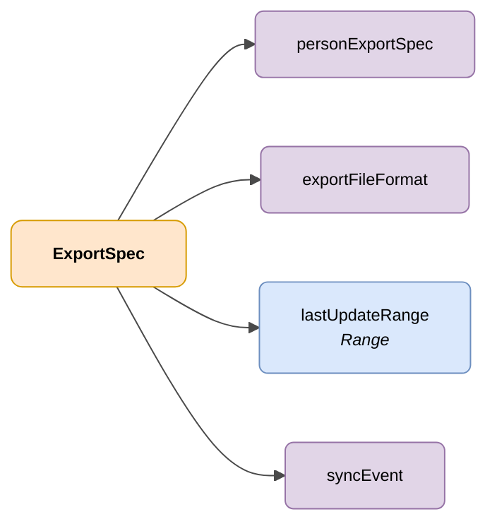

# ExportSpec

## Deskribapena

DENA-ren erabiltzaileen datu-esportazio eskaeraren zehaztapena, esportatu beharreko datuak, aplikatu beharreko iragazkiak eta helburu-formatua adieraziz.



| Kolorea | Esanahia |
|---------|----------|
| 🟠 Laranja | Objektu nagusia (ExportSpec) |
| 🟣 More | Enumak / egoerak |
| 🔵 Urdin argia | Datu-eremuak |

---

## JSON atributuak

| Eremua             | Mota     | Derrigorrez | Deskribapena |
|--------------------|----------|:-----------:|--------------|
| `personExportSpec` | `String` | ✅          | `data` (Pertsona bakoitzaren datu guztiak barne hartzen ditu) <br> `sync` (Sorrera/eguneratze denbora-zigiluak soilik barne hartzen ditu) |
| `exportFileFormat` | `String` | ✅          | Datuak esportatzeko formatua. Balio posibleak: `SQLITE`, `CSV`, `ZIP_OF_JSON` edo `PARQUET` |
| `lastUpdateRange`  | `Range`  | ❌          | Data-tartea tarte horretan sortutako edo eguneratutako pertsonak soilik iragazteko |
| `syncEvent`        | `String` | ❌          | Gertaera motaren arabera iragazteko. Balio posibleak: <br> `CREATED`: Pertsona berriak soilik <br> `DELETED`: Ezabatutako pertsonak soilik <br> `UPDATED`: Aldatutako pertsonak soilik <br> `ID_CHANGED`: Identifikatzailea (NIF, NIE, etab.) aldatu zaien pertsonak soilik |

## JSON adibidea

```json
{
    "personExportSpec": "sync",
    "exportFileFormat": "CSV",
    "lastUpdateRange": "Instant:[2023-01-01T00:00:00Z..2027-01-02T00:00:00Z]",
    "syncEvent": "CREATED"
}
```

<!-- DENA-DOC-FOOTER -->
---
<sub>DENA Docs v{{ dena.version }} · {{ dena.date }}</sub>
