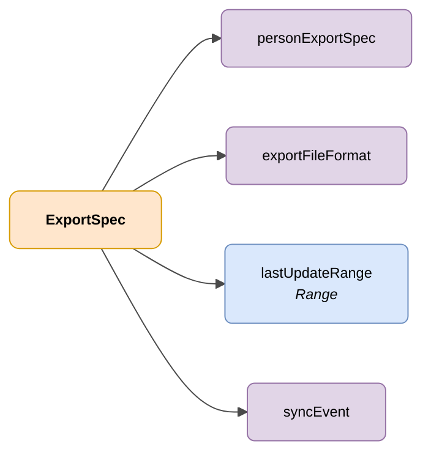

# ExportSpec

## Descripción

Especificación de una solicitud de exportación de datos de personas usuarias de DENA, indicando los datos a exportar, filtros a aplicar y formato de destino.



| Color | Significado |
|-------|-------------|
| 🟠 Naranja | Objeto principal (ExportSpec) |
| 🟣 Violeta | Enums / estados |
| 🔵 Azul claro | Campos de datos |

---

## Atributos JSON

| Campo              | Tipo     | Obligatorio | Descripción |
|--------------------|----------|-------------|-------------|
| `personExportSpec` | `String` | ✅          | `data` (Incluye todos los datos de cada persona) <br> `sync` (Solo incluye timestamps de creación/actualización) |
| `exportFileFormat` | `String` | ✅          | Formato al que exportar los datos. Valores posibles: `SQLITE`, `CSV`, `ZIP_OF_JSON` o `PARQUET` |
| `lastUpdateRange`  | `Range`  | ❌          | Rango de fechas para filtrar solo las personas creadas o actualizadas en dicho rango |
| `syncEvent`        | `String` | ❌          | Filtrar por tipo de evento. Valores posibles: <br> `CREATED`: Solo personas nuevas <br> `DELETED`: Solo personas borradas <br> `UPDATED`: Solo personas modificadas <br> `ID_CHANGED`: Solo personas cuyo identificador (NIF, NIE, etc) haya sido modificado |

## Ejemplo JSON

```json
{
    "personExportSpec": "sync",
    "exportFileFormat": "CSV",
    "lastUpdateRange": "Instant:[2023-01-01T00:00:00Z..2027-01-02T00:00:00Z]",
    "syncEvent": "CREATED"
}
```

<!-- DENA-DOC-FOOTER -->
---
<sub>DENA Docs v{{ dena.version }} · {{ dena.date }}</sub>
