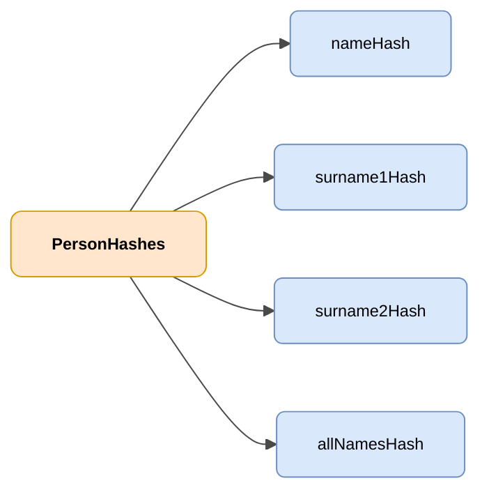

# PersonHashes

## Description

Object containing name and surname hashes of a person for their unambiguous identification.



| Colour | Meaning |
|-------|-------------|
| 🟠 Orange | Main object (PersonHashes) |
| 🔵 Light blue | Data fields |

---

## JSON attributes

| Field              | Type     | Mandatory | Description |
|--------------------|----------|-------------|-------------|
| `nameHash`         | `String` | ✅          | Hash of the person's name |
| `surname1Hash`     | `String` | ✅          | Hash of the first surname |
| `surname2Hash`     | `String` | ❌          | Hash of the second surname |
| `allNamesHash`     | `String` | ✅          | Hash of the concatenation of name and surnames |

## JSON example

```json
{
    "nameHash": "abcde",
    "surname1Hash": "abcde",
    "surname2Hash": "abcde",
    "allNamesHash": "abcde"
}
```

<!-- DENA-DOC-FOOTER -->
---
<sub>DENA Docs v{{ dena.version }} · {{ dena.date }}</sub>
