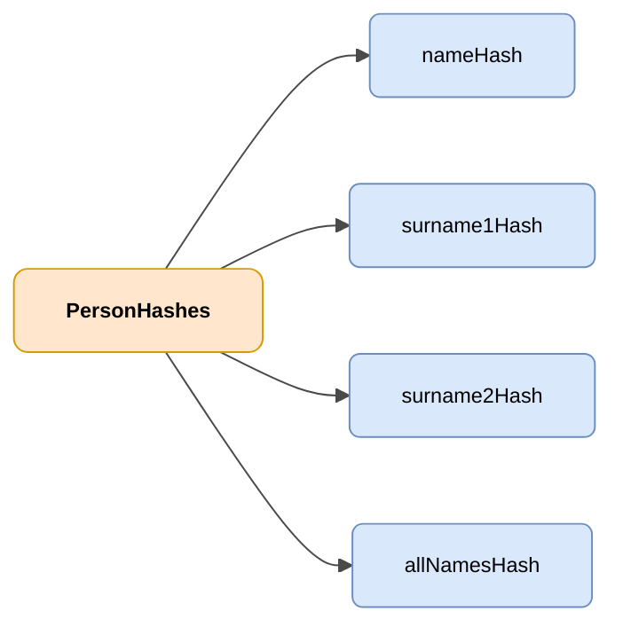

# PersonHashes

## Deskribapena

Pertsona baten izen eta abizenen hash-ak dituen objektua, modu zalantzarik gabean identifikatzeko.



| Kolorea | Esanahia |
|-------|-------------|
| 🟠 Laranja | Objektu nagusia (PersonHashes) |
| 🔵 Urdin argia | Datu-eremuak |

---

## JSON atributuak

| Eremua             | Mota     | Nahitaezkoa | Deskribapena |
|--------------------|----------|-------------|-------------|
| `nameHash`         | `String` | ✅          | Pertsonaren izenaren hash-a |
| `surname1Hash`     | `String` | ✅          | Lehen abizenaren hash-a |
| `surname2Hash`     | `String` | ❌          | Bigarren abizenaren hash-a |
| `allNamesHash`     | `String` | ✅          | Izen eta abizenen kateaketaren hash-a |

## JSON adibidea

```json
{
    "nameHash": "abcde",
    "surname1Hash": "abcde",
    "surname2Hash": "abcde",
    "allNamesHash": "abcde"
}
```

<!-- DENA-DOC-FOOTER -->
---
<sub>DENA Docs v{{ dena.version }} · {{ dena.date }}</sub>
