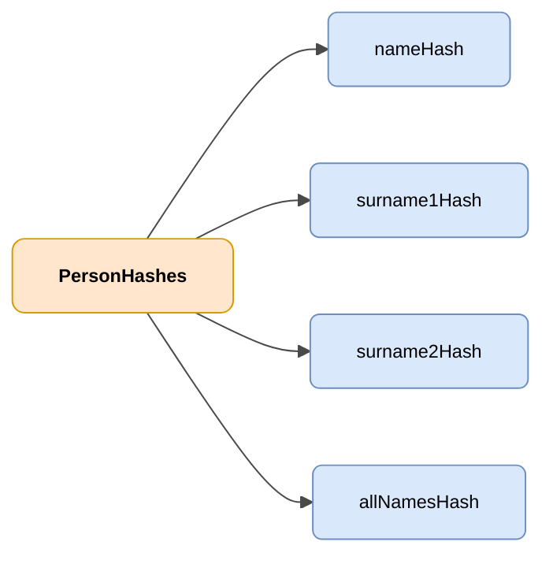

# PersonHashes

## Descripción

Objeto que contiene hashes de nombre y apellidos de de una persona para su identificación inequivoca.



| Color | Significado |
|-------|-------------|
| 🟠 Naranja | Objeto principal (PersonHashes) |
| 🔵 Azul claro | Campos de datos |

---

## Atributos JSON

| Campo              | Tipo     | Obligatorio | Descripción |
|--------------------|----------|-------------|-------------|
| `nameHash`         | `String` | ✅          | Hash del nombre de la persona |
| `surname1Hash`     | `String` | ✅          | Hash del primer apellido |
| `surname2Hash`     | `String` | ❌          | Hash del segundo apellido |
| `allNamesHash`     | `String` | ✅          | Hash de la concatenación de nombre y apellidos |

## Ejemplo JSON

```json
{
    "nameHash": "abcde",
    "surname1Hash": "abcde",
    "surname2Hash": "abcde",
    "allNamesHash": "abcde"
}
```

<!-- DENA-DOC-FOOTER -->
---
<sub>DENA Docs v{{ dena.version }} · {{ dena.date }}</sub>
