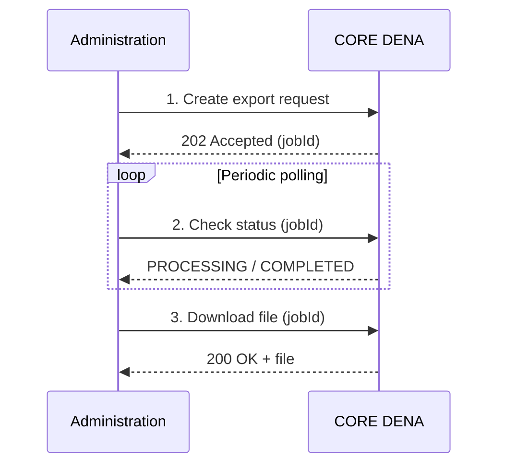

# :material-download: PERSON-SYNC — PULL

The administration connects to DENA and downloads the data of registered persons.

---

## Pre-generated files (hourly)

Every hour, exports are generated with new or modified users, downloadable via:

[:octicons-arrow-right-24: Fetch Persons Pregen Export Asset](./endpoints/pull/fetch-persons-pregen-export-asset.md)

---

## Custom exports (on demand)

For specific needs, it is possible to request personalised exports that are processed asynchronously.

---

## Steps

### 1. Create export request

Specify the filters to apply (time horizon, change type, etc.).

[:octicons-arrow-right-24: Create Pull From Admin Bespoke Job](./endpoints/pull/create-pull-from-admin-bespoke-job.md)

### 2. Check status

Periodic check until the status is `COMPLETED`.

[:octicons-arrow-right-24: Get Pull From Admin Bespoke Job](./endpoints/pull/get-pull-from-admin-bespoke-job.md)

### 3. Download file

Once completed, download the file with the exported data.

[:octicons-arrow-right-24: Fetch Persons Bespoke Export Asset](./endpoints/pull/fetch-persons-bespoke-export-asset.md)

---

!!! tip "Recommendation"

    For most cases, **pre-generated files** (daily/hourly) are sufficient.
    Use custom exports only if you need a specific time horizon or advanced filters.

<!-- DENA-DOC-FOOTER -->
---
DENA Docs v{{ dena.version }} · {{ dena.date }}
