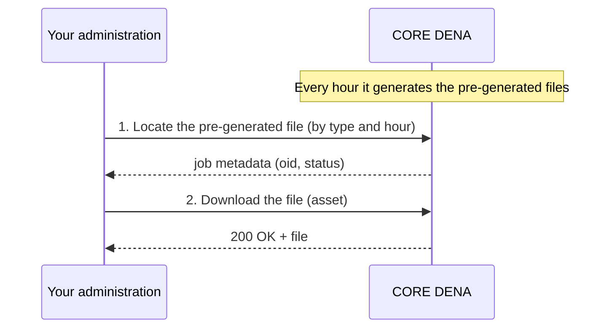
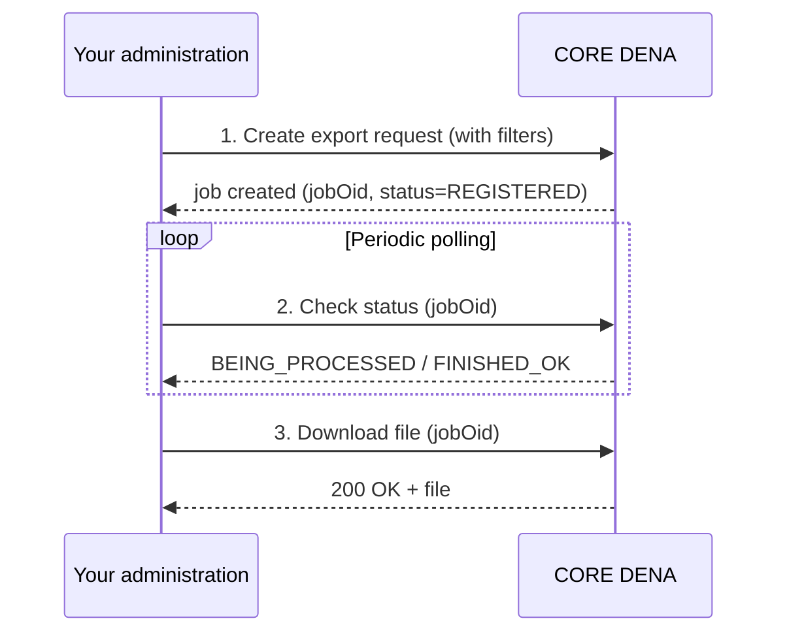
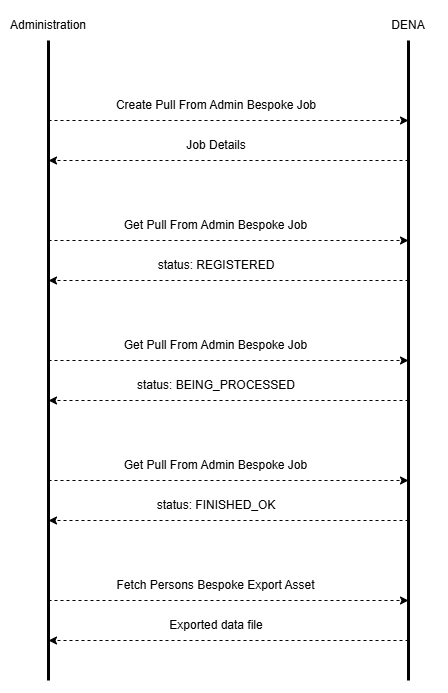

# :material-download: PERSON-SYNC — PULL

With the **Pull** mechanism, **your administration takes the initiative**: it connects to DENA when needed and downloads the data of registered people. It complements [Push](./push.md) and is typically used as a batch process (for example, a nightly sync) or as a fallback to recover changes that may have been missed.

---

## Two Pull modalities

| Modality | Who generates the file | When to use it |
|----------|------------------------|----------------|
| **Pre-generated** | DENA generates it automatically **every hour** | Common case: periodic sync. You download the file for the hour you need |
| **Bespoke (on demand)** | DENA generates it **on demand**, with your filters | Only if you need a specific time horizon or advanced filters (date range, event type...) |

!!! tip "Start with the pre-generated files"

    For most cases, the **pre-generated files** (hourly) are enough and don't require waiting for DENA to process anything. Use bespoke exports only when the pre-generated ones don't cover your need.

---

## Modality 1 — Pre-generated files (hourly)

Every hour, DENA generates exports with the people created or modified in that hour. Your administration does not request them: it only has to **locate and download** them.

### Flow

``` mermaid
sequenceDiagram
    participant Admin as Your administration
    participant DENA as CORE DENA

    Note over DENA: Every hour it generates the pre-generated files
    Admin->>DENA: 1. Locate the pre-generated file (by type and hour)
    DENA-->>Admin: job metadata (oid, status)
    Admin->>DENA: 2. Download the file (asset)
    DENA-->>Admin: 200 OK + file
```

### Steps

1. **Locate the pre-generated file** you want, indicating type and hour.
   [:octicons-arrow-right-24: Get Pull from Admin Pregen Job (by type and hour)](./endpoints/pull/get-pull-from-admin-pregen-job-by-type-hour.md)
   If you already know the job OID, you can query it directly: [Get Pull from Admin Pregen Job (by OID)](./endpoints/pull/get-pull-from-admin-pregen-job.md)

2. **Download the file** once the job is `FINISHED_OK`.
   [:octicons-arrow-right-24: Fetch Persons Pregen Export Asset](./endpoints/pull/fetch-persons-pregen-export-asset.md)

!!! note "Pre-generated types"

    - `ALL_PERSONS`: all people from that hour.
    - `UPDATED_PERSONS_SINCE_LAST_SUCCESSFUL_JOB`: only the people updated since your last successfully processed job (useful for incremental sync without duplicating work).

---

## Modality 2 — Bespoke exports (on demand)

When you need a file with specific filters, your administration requests a custom export that DENA processes **asynchronously** (it is not ready instantly).

### Flow

``` mermaid
sequenceDiagram
    participant Admin as Your administration
    participant DENA as CORE DENA

    Admin->>DENA: 1. Create export request (with filters)
    DENA-->>Admin: job created (jobOid, status=REGISTERED)

    loop Periodic polling
        Admin->>DENA: 2. Check status (jobOid)
        DENA-->>Admin: BEING_PROCESSED / FINISHED_OK
    end

    Admin->>DENA: 3. Download file (jobOid)
    DENA-->>Admin: 200 OK + file
```

### Steps

#### 1. Create the export request

Indicate the filters to apply: time horizon (`lastUpdateRange`), event type (`syncEvent`), file format (`exportFileFormat`) and whether you want all data (`data`) or just sync metadata (`sync`). You get a `jobOid`.

[:octicons-arrow-right-24: Create Pull From Admin Bespoke Job](./endpoints/pull/create-pull-from-admin-bespoke-job.md)

#### 2. Check the status

Poll periodically until the status is `FINISHED_OK`. Meanwhile it will be `REGISTERED` or `BEING_PROCESSED`.

[:octicons-arrow-right-24: Get Pull From Admin Bespoke Job](./endpoints/pull/get-pull-from-admin-bespoke-job.md)

#### 3. Download the file

Once completed, download the file with the exported data.

[:octicons-arrow-right-24: Fetch Persons Bespoke Export Asset](./endpoints/pull/fetch-persons-bespoke-export-asset.md)

!!! warning "Download only when the status is `FINISHED_OK`"

    Do not try to download the file before the job has finished. Check the status first (step 2).

---

## Available file formats

Both for pre-generated and bespoke, the file can be obtained in several formats (`exportFileFormat` / `fileFormat` field):

| Format | Extension | Typical use |
|--------|-----------|-------------|
| `CSV` | `.csv` | Simple import into spreadsheets or bulk loads |
| `SQLITE` | `.sqlitedb` | Embedded database, directly queryable |
| `ZIP_OF_JSON` | `.zip` | One JSON per person, packed |
| `PARQUET` | `.parquet` | Analytics / big data |

---

## What does the file contain? `data` vs `sync`

| Export type | Content |
|-------------|---------|
| `data` | **All data** of each person (NIF, name, surnames, contact...) |
| `sync` | **Only metadata** for synchronization (identifier and creation/update timestamps). It also allows filtering by `syncEvent` |

See the full model in [ExportSpec](./modelo/pull/export-spec.md).

<!-- DENA-DOC-FOOTER -->
---
DENA Docs v{{ dena.version }} · {{ dena.date }}
