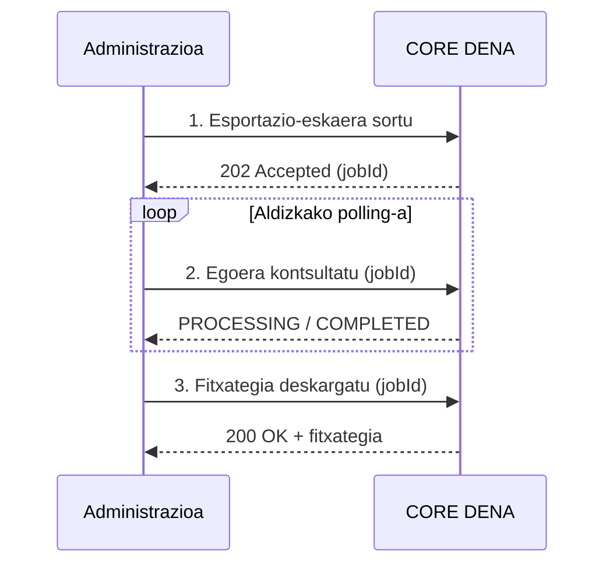
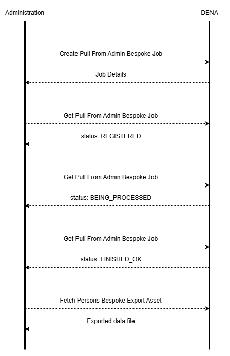

# :material-download: PERSON-SYNC — PULL

Administrazioa DENA-ra konektatzen da eta erregistratutako pertsonen datuak deskargatzen ditu.

---

## Aurresortutako fitxategiak (ordukoak)

Ordu bakoitzean erabiltzaile berri edo aldatuekin esportazioak sortzen dira, honela deskargagarriak:

[:octicons-arrow-right-24: Fetch Persons Pregen Export Asset](./endpoints/pull/fetch-persons-pregen-export-asset.md)

---

## Esportazio pertsonalizatuak (eskaeran)

Behar espezifikoetarako, modu asinkronoan prozesatzen diren esportazio pertsonalizatuak eskatzea posible da.

---

## Urratsak

### 1. Esportazio-eskaera sortu

Aplikatu beharreko iragazkiak zehaztu (denbora-horizontea, aldaketa mota, etab.).

[:octicons-arrow-right-24: Create Pull From Admin Bespoke Job](./endpoints/pull/create-pull-from-admin-bespoke-job.md)

### 2. Egoera kontsultatu

Aldizkako egiaztapena egoera `COMPLETED` izan arte.

[:octicons-arrow-right-24: Get Pull From Admin Bespoke Job](./endpoints/pull/get-pull-from-admin-bespoke-job.md)

### 3. Fitxategia deskargatu

Osatu ondoren, esportatutako datuekin fitxategia deskargatu.

[:octicons-arrow-right-24: Fetch Persons Bespoke Export Asset](./endpoints/pull/fetch-persons-bespoke-export-asset.md)

---

!!! tip "Gomendioa"

    Kasu gehienetarako, **aurresortutako fitxategiak** (egunekoak/ordukoak) nahikoak dira.
    Erabili esportazio pertsonalizatuak denbora-horizonte espezifiko bat edo iragazki aurreratuak behar badituzu soilik.

<!-- DENA-DOC-FOOTER -->
---
DENA Docs v{{ dena.version }} · {{ dena.date }}
