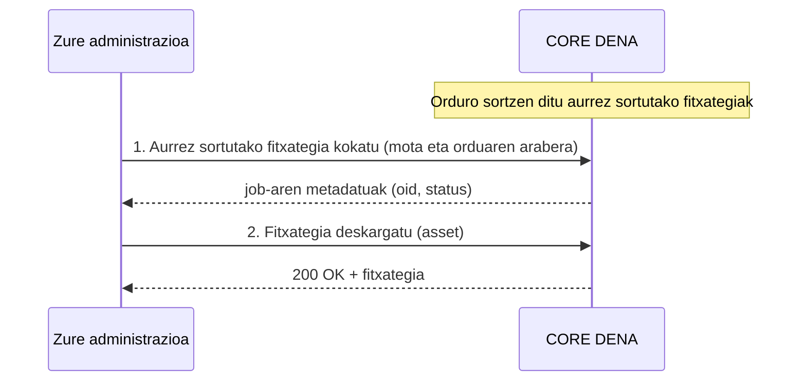
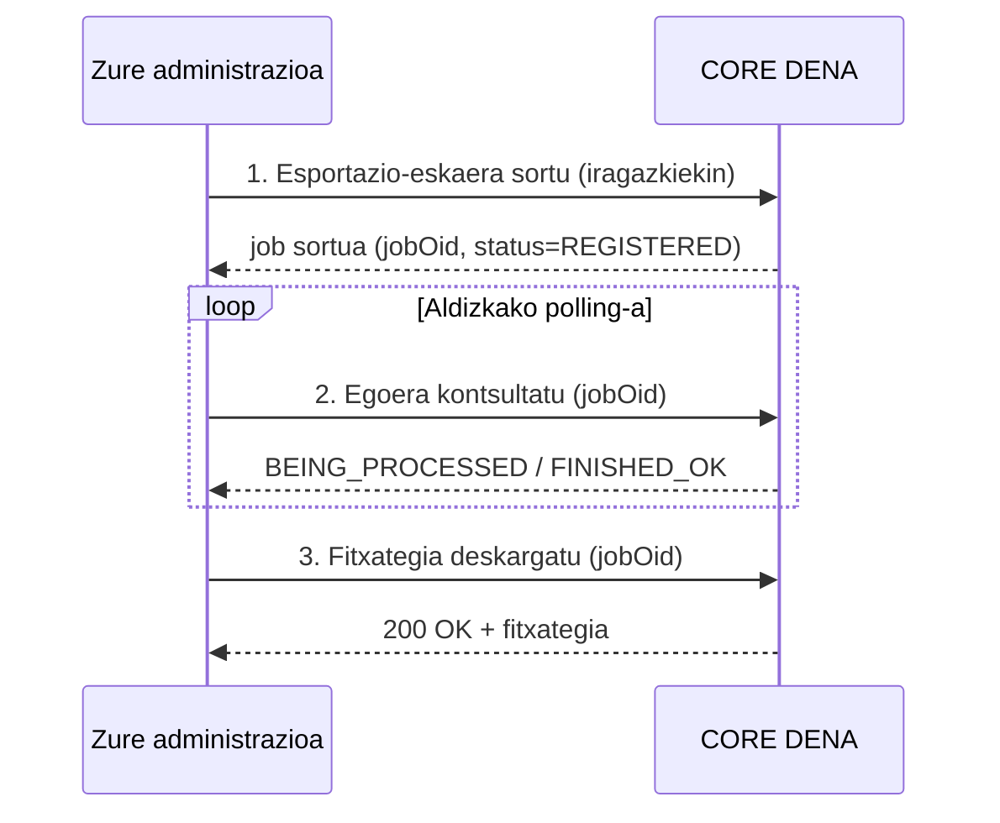

# :material-download: PERSON-SYNC — PULL

**Pull** mekanismoarekin, **zure administrazioak hartzen du ekimena**: DENArekin konektatzen da behar duenean eta erregistratutako pertsonen datuak deskargatzen ditu. [Push](./push.md)-en osagarria da eta normalean batch prozesu gisa erabiltzen da (adibidez, gaueko sinkronizazioa) edo galdu diren aldaketak berreskuratzeko babes gisa.

---

## Pull-en bi modalitate

| Modalitatea | Nork sortzen du fitxategia | Noiz erabili |
|-------------|----------------------------|--------------|
| **Aurrez sortua** | DENAk automatikoki sortzen du **orduro** | Ohiko kasua: aldizkako sinkronizazioa. Behar duzun orduko fitxategia deskargatzen duzu |
| **Neurrira (bespoke)** | DENAk **eskaeraren arabera** sortzen du, zure iragazkiekin | Denbora-horizonte zehatz bat edo iragazki aurreratuak behar dituzunean soilik (data-tartea, gertaera-mota...) |

!!! tip "Hasi aurrez sortutako fitxategiekin"

    Kasu gehienetan, **aurrez sortutako fitxategiak** (orduro) nahikoak dira eta ez dute DENAk ezer prozesatzeko itxaron beharrik. Erabili neurrirako esportazioak aurrez sortutakoek zure beharra estaltzen ez dutenean soilik.

---

## 1. modalitatea — Aurrez sortutako fitxategiak (orduro)

Orduro, DENAk ordu horretan sortu edo aldatu diren pertsonen esportazioak sortzen ditu. Zure administrazioak ez ditu eskatzen: **kokatu eta deskargatu** baino ez ditu egin behar.

### Fluxua

``` mermaid
sequenceDiagram
    participant Admin as Zure administrazioa
    participant DENA as CORE DENA

    Note over DENA: Orduro sortzen ditu aurrez sortutako fitxategiak
    Admin->>DENA: 1. Aurrez sortutako fitxategia kokatu (mota eta orduaren arabera)
    DENA-->>Admin: job-aren metadatuak (oid, status)
    Admin->>DENA: 2. Fitxategia deskargatu (asset)
    DENA-->>Admin: 200 OK + fitxategia
```

### Urratsak

1. **Nahi duzun aurrez sortutako fitxategia kokatu**, mota eta ordua adieraziz.
   [:octicons-arrow-right-24: Get Pull from Admin Pregen Job (mota eta orduaren arabera)](./endpoints/pull/get-pull-from-admin-pregen-job-by-type-hour.md)
   Job-aren OIDa jada ezagutzen baduzu, zuzenean kontsulta dezakezu: [Get Pull from Admin Pregen Job (OIDaren arabera)](./endpoints/pull/get-pull-from-admin-pregen-job.md)

2. **Fitxategia deskargatu** job-a `FINISHED_OK` dagoenean.
   [:octicons-arrow-right-24: Fetch Persons Pregen Export Asset](./endpoints/pull/fetch-persons-pregen-export-asset.md)

!!! note "Aurrez sortutako motak"

    - `ALL_PERSONS`: ordu horretako pertsona guztiak.
    - `UPDATED_PERSONS_SINCE_LAST_SUCCESSFUL_JOB`: arrakastaz prozesatutako azken job-etik eguneratu diren pertsonak soilik (sinkronizazio inkrementalerako erabilgarria, lana bikoiztu gabe).

---

## 2. modalitatea — Neurrirako esportazioak (eskaeraren arabera)

Iragazki zehatzak dituen fitxategi bat behar duzunean, zure administrazioak esportazio pertsonalizatu bat eskatzen du eta DENAk **asinkronoki** prozesatzen du (ez dago berehala prest).

### Fluxua

``` mermaid
sequenceDiagram
    participant Admin as Zure administrazioa
    participant DENA as CORE DENA

    Admin->>DENA: 1. Esportazio-eskaera sortu (iragazkiekin)
    DENA-->>Admin: job sortua (jobOid, status=REGISTERED)

    loop Aldizkako polling-a
        Admin->>DENA: 2. Egoera kontsultatu (jobOid)
        DENA-->>Admin: BEING_PROCESSED / FINISHED_OK
    end

    Admin->>DENA: 3. Fitxategia deskargatu (jobOid)
    DENA-->>Admin: 200 OK + fitxategia
```

### Urratsak

#### 1. Esportazio-eskaera sortu

Aplikatu beharreko iragazkiak adierazi: denbora-horizontea (`lastUpdateRange`), gertaera-mota (`syncEvent`), fitxategi-formatua (`exportFileFormat`) eta datu guztiak (`data`) edo sinkronizazio-metadatuak (`sync`) bakarrik nahi dituzun. `jobOid` bat lortzen duzu.

[:octicons-arrow-right-24: Create Pull From Admin Bespoke Job](./endpoints/pull/create-pull-from-admin-bespoke-job.md)

#### 2. Egoera kontsultatu

Kontsultatu aldizka (*polling*) egoera `FINISHED_OK` izan arte. Bitartean `REGISTERED` edo `BEING_PROCESSED` egongo da.

[:octicons-arrow-right-24: Get Pull From Admin Bespoke Job](./endpoints/pull/get-pull-from-admin-bespoke-job.md)

#### 3. Fitxategia deskargatu

Behin osatuta, deskargatu esportatutako datuak dituen fitxategia.

[:octicons-arrow-right-24: Fetch Persons Bespoke Export Asset](./endpoints/pull/fetch-persons-bespoke-export-asset.md)

!!! warning "Deskargatu egoera `FINISHED_OK` denean soilik"

    Ez saiatu fitxategia deskargatzen job-a amaitu baino lehen. Egiaztatu egoera lehenik (2. urratsa).

---

## Fitxategi-formatu erabilgarriak

Bai aurrez sortutakoetan bai neurrirakoetan, fitxategia hainbat formatutan lor daiteke (`exportFileFormat` / `fileFormat` eremua):

| Formatua | Luzapena | Ohiko erabilera |
|----------|----------|-----------------|
| `CSV` | `.csv` | Kalkulu-orrietan inportazio sinplea edo karga masiboak |
| `SQLITE` | `.sqlitedb` | Datu-base txertatua, zuzenean kontsultagarria |
| `ZIP_OF_JSON` | `.zip` | JSON bat pertsonako, paketatuta |
| `PARQUET` | `.parquet` | Analitika / big data |

---

## Zer dauka fitxategiak? `data` vs `sync`

| Esportazio-mota | Edukia |
|-----------------|--------|
| `data` | Pertsona bakoitzaren **datu guztiak** (NAN, izena, abizenak, kontaktua...) |
| `sync` | Sinkronizaziorako **metadatuak soilik** (identifikatzailea eta sortze/eguneratze denbora-markak). Gainera `syncEvent`-aren arabera iragaztea ahalbidetzen du |

Ikus eredu osoa [ExportSpec](./modelo/pull/export-spec.md)-en.

<!-- DENA-DOC-FOOTER -->
---
DENA Docs v{{ dena.version }} · {{ dena.date }}
