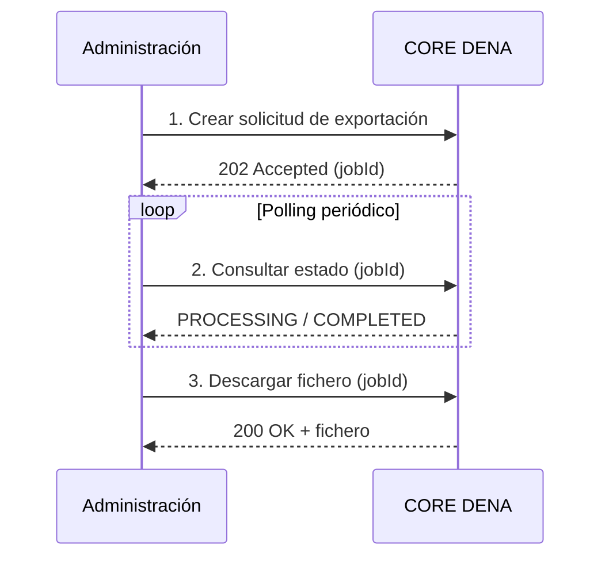

# :material-download: PERSON-SYNC — PULL

La administración se conecta a DENA y descarga los datos de personas registradas.

---

## Ficheros pregenerados (diarios)

Cada hora se generan exportaciones con los usuarios nuevos o modificados, descargables mediante:

[:octicons-arrow-right-24: Fetch Persons Pregen Export Asset](./endpoints/pull/fetch-persons-pregen-export-asset.md)

---

## Exportaciones a medida (bajo demanda)

Para necesidades específicas, es posible solicitar exportaciones personalizadas que se procesan de forma asíncrona.

---

## Pasos

### 1. Crear solicitud de exportación

Indica los filtros a aplicar (horizonte temporal, tipo de cambio, etc.).

[:octicons-arrow-right-24: Create Pull From Admin Bespoke Job](./endpoints/pull/create-pull-from-admin-bespoke-job.md)

### 2. Consultar estado

Comprobación periódica hasta que el estado sea `COMPLETED`.

[:octicons-arrow-right-24: Get Pull From Admin Bespoke Job](./endpoints/pull/get-pull-from-admin-bespoke-job.md)

### 3. Descargar fichero

Una vez completado, se descarga el fichero con los datos exportados.

[:octicons-arrow-right-24: Fetch Persons Bespoke Export Asset](./endpoints/pull/fetch-persons-bespoke-export-asset.md)

---

!!! tip "Recomendación"

    Para la mayoría de casos, los **ficheros pregenerados** (diarios/horarios) son suficientes.
    Usa las exportaciones a medida solo si necesitas un horizonte temporal específico o filtros avanzados.

<!-- DENA-DOC-FOOTER -->
---
DENA Docs v{{ dena.version }} · {{ dena.date }}
