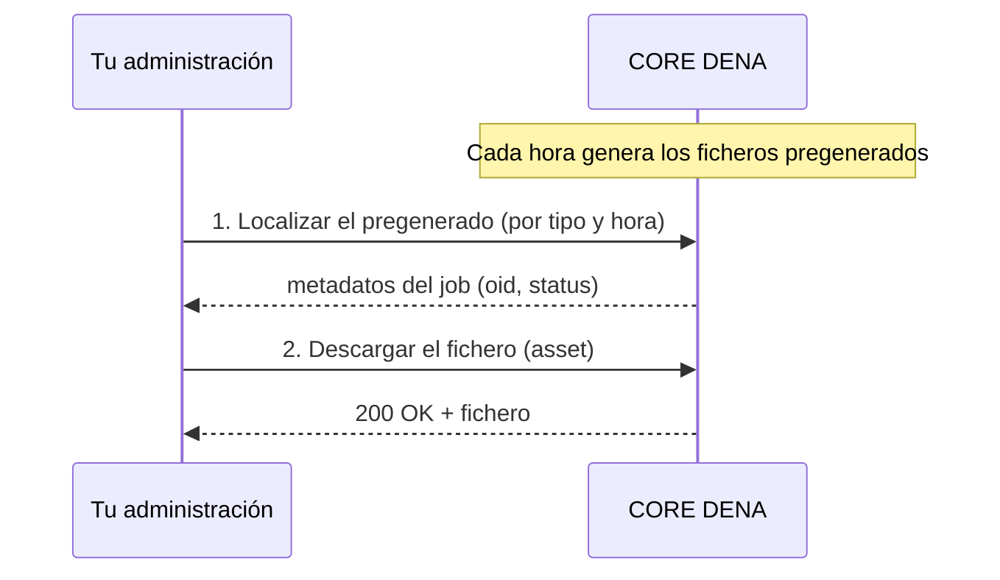
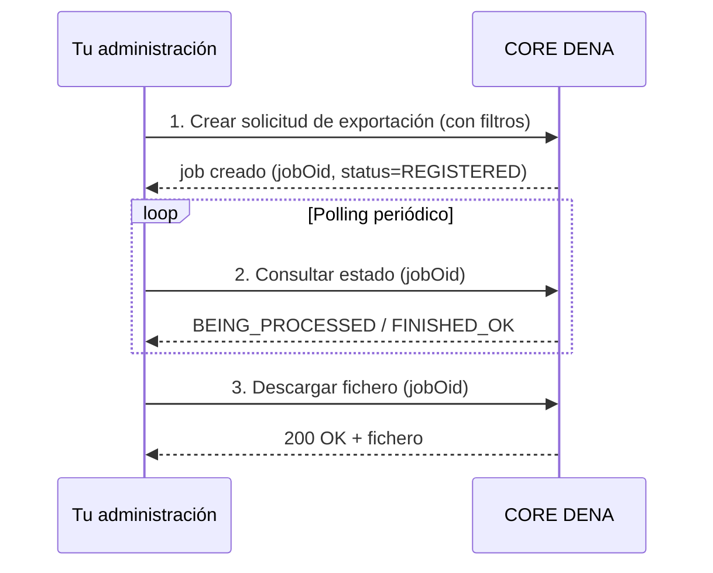

# :material-download: PERSON-SYNC — PULL

En el mecanismo **Pull**, es **tu administración quien toma la iniciativa**: se conecta a DENA cuando lo necesita y descarga los datos de las personas registradas. Es el complemento del [Push](./push.md) y se usa típicamente como proceso batch (por ejemplo, una sincronización nocturna) o como respaldo para recuperar cambios que se hubieran perdido.

---

## Dos modalidades de Pull

| Modalidad | Quién genera el fichero | Cuándo usarla |
|-----------|-------------------------|---------------|
| **Pregenerado** | DENA lo genera automáticamente **cada hora** | Caso habitual: sincronización periódica. Descargas el fichero de la hora que te interese |
| **A medida (bespoke)** | DENA lo genera **bajo demanda**, con tus filtros | Solo si necesitas un horizonte temporal específico o filtros avanzados (rango de fechas, tipo de evento...) |

!!! tip "Empieza por los pregenerados"

    Para la mayoría de casos, los **ficheros pregenerados** (horarios) son suficientes y no requieren esperar a que DENA procese nada. Usa las exportaciones a medida solo cuando los pregenerados no cubran tu necesidad.

---

## Modalidad 1 — Ficheros pregenerados (horarios)

Cada hora, DENA genera exportaciones con las personas nuevas o modificadas en esa hora. Tu administración no las solicita: solo tiene que **localizarlas y descargarlas**.

### Flujo

``` mermaid
sequenceDiagram
    participant Admin as Tu administración
    participant DENA as CORE DENA

    Note over DENA: Cada hora genera los ficheros pregenerados
    Admin->>DENA: 1. Localizar el pregenerado (por tipo y hora)
    DENA-->>Admin: metadatos del job (oid, status)
    Admin->>DENA: 2. Descargar el fichero (asset)
    DENA-->>Admin: 200 OK + fichero
```

### Pasos

1. **Localizar el pregenerado** que quieres, indicando tipo y hora.
   [:octicons-arrow-right-24: Get Pull from Admin Pregen Job (por tipo y hora)](./endpoints/pull/get-pull-from-admin-pregen-job-by-type-hour.md)
   Si ya conoces el OID del job, puedes consultarlo directamente: [Get Pull from Admin Pregen Job (por OID)](./endpoints/pull/get-pull-from-admin-pregen-job.md)

2. **Descargar el fichero** una vez el job está `FINISHED_OK`.
   [:octicons-arrow-right-24: Fetch Persons Pregen Export Asset](./endpoints/pull/fetch-persons-pregen-export-asset.md)

!!! note "Tipos de pregenerado"

    - `ALL_PERSONS`: todas las personas de esa hora.
    - `UPDATED_PERSONS_SINCE_LAST_SUCCESSFUL_JOB`: solo las personas actualizadas desde tu último job procesado con éxito (útil para sincronización incremental sin duplicar trabajo).

---

## Modalidad 2 — Exportaciones a medida (bajo demanda)

Cuando necesitas un fichero con filtros específicos, tu administración solicita una exportación personalizada que DENA procesa de forma **asíncrona** (no está lista al instante).

### Flujo

``` mermaid
sequenceDiagram
    participant Admin as Tu administración
    participant DENA as CORE DENA

    Admin->>DENA: 1. Crear solicitud de exportación (con filtros)
    DENA-->>Admin: job creado (jobOid, status=REGISTERED)

    loop Polling periódico
        Admin->>DENA: 2. Consultar estado (jobOid)
        DENA-->>Admin: BEING_PROCESSED / FINISHED_OK
    end

    Admin->>DENA: 3. Descargar fichero (jobOid)
    DENA-->>Admin: 200 OK + fichero
```

### Pasos

#### 1. Crear la solicitud de exportación

Indica los filtros a aplicar: horizonte temporal (`lastUpdateRange`), tipo de evento (`syncEvent`), formato del fichero (`exportFileFormat`) y si quieres todos los datos (`data`) o solo metadatos de sincronización (`sync`). Obtienes un `jobOid`.

[:octicons-arrow-right-24: Create Pull From Admin Bespoke Job](./endpoints/pull/create-pull-from-admin-bespoke-job.md)

#### 2. Consultar el estado

Consulta periódicamente (*polling*) hasta que el estado sea `FINISHED_OK`. Mientras tanto estará en `REGISTERED` o `BEING_PROCESSED`.

[:octicons-arrow-right-24: Get Pull From Admin Bespoke Job](./endpoints/pull/get-pull-from-admin-bespoke-job.md)

#### 3. Descargar el fichero

Una vez completado, descarga el fichero con los datos exportados.

[:octicons-arrow-right-24: Fetch Persons Bespoke Export Asset](./endpoints/pull/fetch-persons-bespoke-export-asset.md)

!!! warning "Descarga solo cuando el estado sea `FINISHED_OK`"

    No intentes descargar el fichero antes de que el job haya terminado. Comprueba primero el estado (paso 2).

---

## Formatos de fichero disponibles

Tanto en pregenerados como a medida, el fichero se puede obtener en varios formatos (campo `exportFileFormat` / `fileFormat`):

| Formato | Extensión | Uso típico |
|---------|-----------|------------|
| `CSV` | `.csv` | Importación sencilla en hojas de cálculo o cargas masivas |
| `SQLITE` | `.sqlitedb` | Base de datos embebida, consultable directamente |
| `ZIP_OF_JSON` | `.zip` | Un JSON por persona, empaquetados |
| `PARQUET` | `.parquet` | Analítica / big data |

---

## ¿Qué contiene el fichero? `data` vs `sync`

| Tipo de exportación | Contenido |
|---------------------|-----------|
| `data` | **Todos los datos** de cada persona (NIF, nombre, apellidos, contacto...) |
| `sync` | **Solo metadatos** de sincronización (identificador y timestamps de creación/actualización). Permite además filtrar por `syncEvent` |

Consulta el modelo completo en [ExportSpec](./modelo/pull/export-spec.md).

<!-- DENA-DOC-FOOTER -->
---
DENA Docs v{{ dena.version }} · {{ dena.date }}
