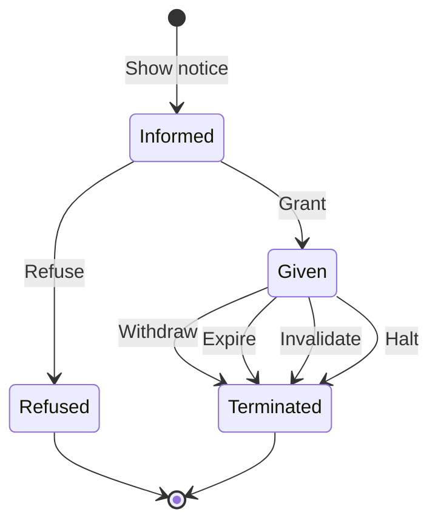

# :material-shield-account: Consents

!!! warning "In progress"
    Consents are an area that still requires in-depth work. What is described here is preliminary and subject to change.

---

## Operating principles

All invocations to interoperability services must be backed by a **legal basis** that authorizes DENA to query data and administrations to provide it.

### Regulatory framework

The transfer of personal data between administrations is governed by:

- **Organic Law 3/2018** (Personal Data Protection and guarantee of digital rights)
- **General Data Protection Regulation** (GDPR) - [EU 2016/679](https://eur-lex.europa.eu/legal-content/EN/TXT/?uri=CELEX%3A32016R0679)

Communication of data between administrations must be based on one of the following **lawfulness criteria**:

1. Explicit consent of the data subject
2. Compliance with a legal obligation
3. Performance of a task carried out in the public interest

### Types of legal basis

| Type | Description |
|---|---|
| **Normative authorization** | A regulation enables an administration to transfer data through interoperability mechanisms without explicit consent |
| **Explicit and informed consent** | The data subject explicitly authorizes the exchange of their data |

---

## Consent requirements (GDPR)

Consent must be:

- **Informed**: the person knows what data is collected, by whom and for what purpose
- Given **freely**
- **Explicit**
- Based on **unambiguous proof** of the authorization
- **Demonstrable**: easily accessible
- **Revocable**

---

## Operational principles in DENA

| # | Principle |
|---|---|
| **1** | DENA is responsible for obtaining consent from the person before querying data at an administration |
| **2** | Normative authorizations and consents are stored in a **common repository** accessible by the administration for verification |
| **3** | The system initiating the request (DENA) ensures a legal basis exists **before** making the request. If there is no legal basis, the request is NOT made |
| **4** | All requests to interoperability services include information about the legal basis so the administration can verify it |
| **5** | When a consent is used, the repository stores a **usage record** as evidence |

### When consent is collected in DENA

| Moment | Description |
|---|---|
| At **enrollment** | The first time the person enters the system and creates their profile |
| At **query time** | When a data type is queried at an administration and consent had not been previously given |

---

## Consent lifecycle

| Transition | Description |
|---|---|
| **Inform** (show notice) | Mandatory prerequisite before collecting consent |
| **Grant** (give) | The person authorizes the exchange |
| **Refuse** | The person does not authorize |
| **Withdraw** | The person revokes consent |
| **Expire** | The validity period ended |
| **Invalidate** | The informative basis (notice) is no longer valid |
| **Halt** | Temporarily suspended |

---

## Contents of a consent

At a high level, a consent contains:

| Element | Description |
|---|---|
| **Who** (data-subject) | The person granting the consent |
| **For whom** (data-controller) | The administration for which it is valid |
| **For what** (purpose) | The service it will be used for (e.g. query records) |
| **Information** (notice) | Informative/regulatory text presented to the person |
| **How it was collected** | Medium used (form, push notification, email, etc.) |
| **When** | Date of issuance |
| **How long** | Validity/expiration date |
| **Where it resides** | Common repository (data) + document repository (verifiable proof, signature) |

---

## Common consent repository API

### Consent format

The structure requires at least:

- A reference to the granting **person**
- A reference to the **organization** controlling the data (data controller)
- A reference to the **purpose of use** (administrative service)
- The **information** (notice) provided to the person

!!! info "Required repositories"
    The above references require:

    - **Persons** repository
    - **Organizations** repository (organizational structure)
    - **Services** catalogue
    - **CMS** (Content Management System) for informative content

### Query API

!!! abstract "Pending definition"
    The detailed specification of the consent repository query API is pending definition.

---

## References

- **Data Privacy Vocabulary**: [https://w3c.github.io/dpv/guides/consent-27560](https://w3c.github.io/dpv/guides/consent-27560)
- **ISO 27560**: [https://www.iso.org/standard/80392.html](https://www.iso.org/standard/80392.html)

<!-- DENA-DOC-FOOTER -->
---
DENA Docs v{{ dena.version }} · {{ dena.date }}
