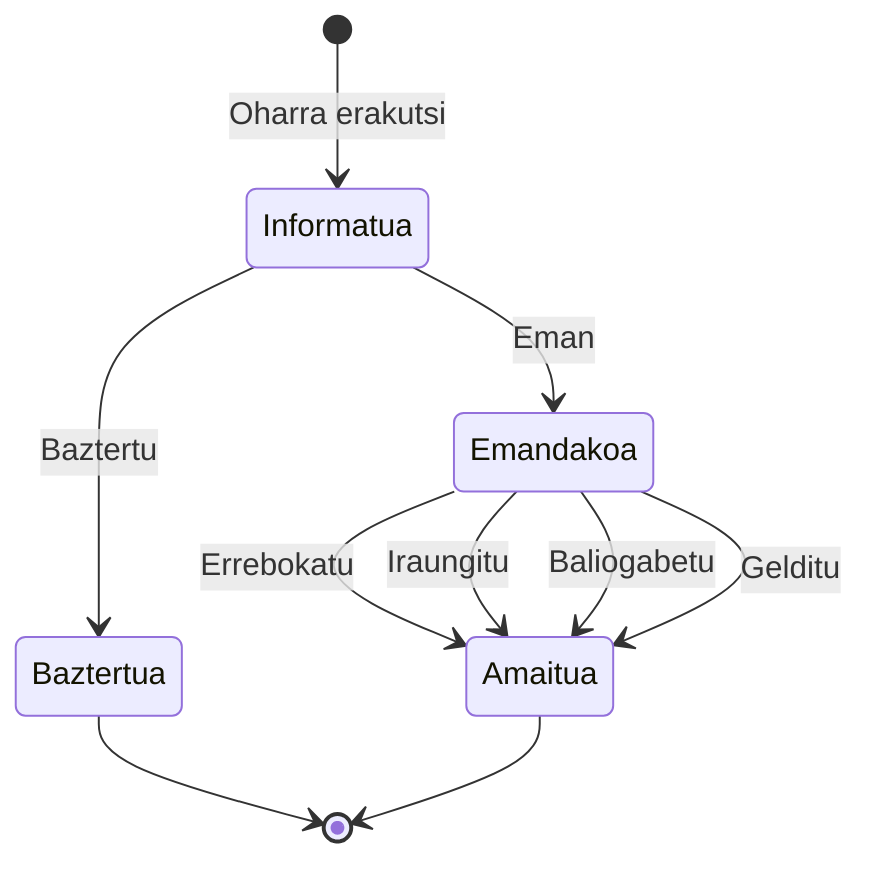

# :material-shield-account: Baimenak

!!! warning "Abian"
    Baimenak sakonean landu beharreko eremu bat dira oraindik. Hemen jasotakoa aurretiazko informazioa da eta aldatzen jarrai dezake.

---

## Funtzionamendu-printzipioak

Elkarreragingarritasun-zerbitzuetarako dei guztiek **oinarri gaitzaile** bat izan behar dute atzetik, DENAri datuak kontsultatzeko eta administrazioei haiek emateko baimena ematen diena.

### Arau-esparrua

Administrazioen arteko datu pertsonalen lagapena hauek arautzen dute:

- **3/2018 Lege Organikoa** (Datu Pertsonalen Babesa eta eskubide digitalen bermea)
- **Datuak Babesteko Erregelamendu Orokorra** (DBEO) - [EU 2016/679](https://eur-lex.europa.eu/legal-content/EU/TXT/?uri=CELEX%3A32016R0679)

Administrazioen arteko datu-komunikazioa honako **zilegi-irizpide** batean oinarritu behar da:

1. Titularraren adostasun esplizitua
2. Lege-betebehar baten betetzea
3. Interes publikoko eginkizun baten betetzea

### Oinarri gaitzaile motak

| Mota | Deskribapena |
|---|---|
| **Gaitzapen normatiboa** | Araudi batek administrazio bati datuak elkarreragingarritasun-mekanismoen bidez lagatzeko gaitasuna ematen dio, adostasun espliziaturik gabe |
| **Adostasun esplizitu eta informatua** | Pertsona interesdunak bere datuen trukea esplizituki baimendu du |

---

## Adostasun-baldintzak (DBEO)

Adostasuna honela izan behar da:

- **Informatua**: pertsonak jakin behar du zein datu biltzen diren, nork eta zertarako
- **Askatasunez** emandakoa
- **Esplizitua**
- Baimenaren **froga ez-anbiguoan** oinarritua
- **Erakusgarria**: erraz eskuragarria
- **Errebokgarria**

---

## DENAko printzipio operatiboak

| # | Printzipioa |
|---|---|
| **1** | DENA da pertsonaren adostasuna lortzeko ardura duena, administrazio batean datuak kontsultatu aurretik |
| **2** | Gaitzapen normatiboak eta adostasun pertsonalak **biltegi komun** batean gordetzen dira, administrazioak egiaztatzeko eskuragarri |
| **3** | Eskaera abiarazten duen sistemak (DENA) oinarri gaitzailea existitzen dela ziurtatzen du eskaera egin **aurretik**. Oinarri gaitzailerik ez badago, EZ da eskaera egiten |
| **4** | Elkarreragingarritasun-zerbitzuetarako eskaera guztiek oinarri gaitzaileari buruzko informazioa dute, administrazioak egiaztatu ahal izateko |
| **5** | Adostasun bat erabiltzen denean, biltegiak **erabilera-erregistro** bat gordetzen du ebidentzia gisa |

### Noiz biltzen da adostasuna DENAn

| Unea | Deskribapena |
|---|---|
| **Izena ematean** | Pertsonak sisteman lehen aldiz sartzen denean eta bere profila sortzen duenean |
| **Kontsulta unean** | Administrazio batean datu mota bat kontsultatzen denean eta aldez aurretik adostasunik eman ez bada |

---

## Adostasunaren bizi-zikloa

| Trantsizioa | Deskribapena |
|---|---|
| **Informatu** (oharra erakutsi) | Adostasuna bildu aurretik derrigorrezko aurrebaldintza |
| **Eman** (give) | Pertsonak trukea baimendu du |
| **Baztertu** (refuse) | Pertsonak ez du baimenik eman |
| **Errebokatu** (withdraw) | Pertsonak adostasuna kendu du |
| **Iraungitu** (expire) | Baliozkotasun-epea amaitu da |
| **Baliogabetu** (invalidate) | Oinarri informatiboa (oharra) ez da gehiago baliozkoa |
| **Gelditu** (halt) | Aldi baterako etenda |

---

## Adostasun baten edukia

Maila altuan, adostasun batek honako hauek ditu:

| Elementua | Deskribapena |
|---|---|
| **Nork** (data-subject) | Adostasuna ematen duen pertsona |
| **Norentzat** (data-controller) | Baliozkoa den administrazioa |
| **Zertarako** (purpose) | Erabiliko den zerbitzua (adib: espedienteak kontsultatu) |
| **Informazioa** (notice) | Pertsonari aurkeztutako testu informatiboa/normatiboa |
| **Nola bildu den** | Erabilitako bitartekoa (formularioa, push jakinarazpena, emaila, etab.) |
| **Noiz** | Jaulkipen-data |
| **Zenbat denborarako** | Baliozkotasun/iraungitze-data |
| **Non gordetzen den** | Biltegi komuna (datuak) + dokumentu-biltegia (froga egiaztagarriak, sinadura) |

---

## Adostasun-biltegi komunaren APIa

### Adostasunaren formatua

Egiturak gutxienez behar ditu:

- Adostasuna ematen duen **pertsonaren** erreferentzia bat
- Datuak kontrolatzen dituen **erakundearen** erreferentzia bat (data controller)
- **Erabilera-helburuaren** erreferentzia bat (administrazio-zerbitzua)
- Pertsonari emandako **informazioa** (oharra)

!!! info "Beharrezko biltegiak"
    Aurreko erreferentzietarako, hauek behar dira:

    - **Pertsonak** biltegia
    - **Erakundeak** biltegia (egitura organikoa)
    - **Zerbitzuen** katalogoa
    - **CMS** (Eduki-kudeaketa Sistema) eduki informatiboetarako

### Kontsulta APIa

!!! abstract "Definitzeke"
    Adostasun-biltegiaren kontsulta APIaren zehaztapen xehatua definitzeke dago.

---

## Erreferentziak

- **Data Privacy Vocabulary**: [https://w3c.github.io/dpv/guides/consent-27560](https://w3c.github.io/dpv/guides/consent-27560)
- **ISO 27560**: [https://www.iso.org/standard/80392.html](https://www.iso.org/standard/80392.html)

<!-- DENA-DOC-FOOTER -->
---
DENA Docs v{{ dena.version }} · {{ dena.date }}
