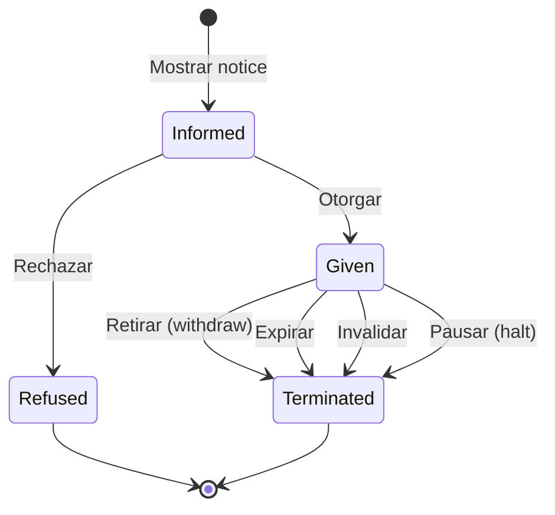

# :material-shield-account: Consentimientos

!!! warning "En progreso"
    Los consentimientos son un área sobre la que aún es necesario un trabajo en profundidad. Lo recogido en este punto es preliminar y sujeto a cambios.

---

## Principios de funcionamiento

Todas las invocaciones a servicios de interoperabilidad deben estar respaldadas por una **base habilitante** que autoriza a DENA a consultar datos y a las administraciones a facilitarlos.

### Marco normativo

La cesión de datos personales entre administraciones se regula por:

- **Ley Orgánica 3/2018** (Protección de Datos Personales y garantía de los derechos digitales)
- **Reglamento General de Protección de Datos** (RGPD) - [EU 2016/679](https://eur-lex.europa.eu/legal-content/ES/TXT/?uri=CELEX%3A32016R0679)

La comunicación de datos entre administraciones debe basarse en alguno de los siguientes **criterios de licitud**:

1. Consentimiento expreso del titular
2. Cumplimiento de una obligación legal
3. Cumplimiento de una misión en interés público

### Tipos de base habilitante

| Tipo | Descripción |
|---|---|
| **Habilitación normativa** | Alguna normativa habilita a una administración a ceder datos a través de mecanismos de interoperabilidad sin consentimiento expreso |
| **Consentimiento expreso e informado** | La persona interesada autoriza explícitamente el intercambio de sus datos |

---

## Requisitos del consentimiento (RGPD)

El consentimiento debe:

- Ser **informado**: la persona sabe qué datos se recopilan, por quién y para qué
- Ser otorgado con **libertad**
- Ser **explícito**
- Basarse en una **prueba no ambigua** de la autorización
- Ser **demostrable**: accesible fácilmente
- Ser **revocable**

---

## Principios operativos en DENA

| # | Principio |
|---|---|
| **1** | DENA es responsable de recabar el consentimiento de la persona antes de consultar datos en una administración |
| **2** | Las habilitaciones normativas y consentimientos se almacenan en un **repositorio común** accesible por la administración para verificación |
| **3** | El sistema que inicia la solicitud (DENA) se asegura de que existe base habilitante **antes** de hacer la petición. Si no hay base habilitante, NO se hace la petición |
| **4** | Todas las peticiones a servicios de interoperabilidad incluyen información sobre la base habilitante para que la administración pueda comprobarla |
| **5** | Cuando se usa un consentimiento, el repositorio almacena un **registro de uso** como evidencia |

### Momentos de recabación del consentimiento en DENA

| Momento | Descripción |
|---|---|
| En el **enrolamiento** | La primera vez que la persona entra en el sistema y crea su perfil |
| En la **consulta** | Cuando se consulta un tipo de dato en una administración y no se había otorgado previamente el consentimiento |

---

## Ciclo de vida del consentimiento

| Transición | Descripción |
|---|---|
| **Informar** (show notice) | Requisito previo obligatorio antes de recabar el consentimiento |
| **Otorgar** (give) | La persona autoriza el intercambio |
| **Rechazar** (refuse) | La persona no autoriza |
| **Retirar** (withdraw) | La persona revoca el consentimiento |
| **Expirar** | El periodo de validez finalizó |
| **Invalidar** | La base informativa (notice) dejó de ser válida |
| **Pausar** (halt) | Se detiene temporalmente |

---

## Contenido de un consentimiento

A alto nivel, un consentimiento contiene:

| Elemento | Descripción |
|---|---|
| **Quién** (data-subject) | La persona que otorga el consentimiento |
| **Para quién** (data-controller) | La administración para la que es válido |
| **Para qué** (purpose) | El servicio en el que se utilizará (ej: consultar expedientes) |
| **Información** (notice) | Texto informativo/normativo presentado a la persona |
| **Cómo se recabó** | Medio utilizado (formulario, notificación push, email, etc.) |
| **Cuándo** | Fecha de emisión |
| **Durante cuánto tiempo** | Fecha de validez / expiración |
| **Dónde reside** | Repositorio común (datos) + repositorio documental (pruebas verificables, firma) |

---

## API del repositorio común de consentimientos

### Formato de un consentimiento

La estructura requiere al menos:

- Una referencia de la **persona** otorgante
- Una referencia a la **organización** que controla los datos (data controller)
- Una referencia al **propósito de uso** (servicio administrativo)
- La **información** (notice) suministrada a la persona

!!! info "Repositorios necesarios"
    Para las referencias anteriores, se necesitan:

    - Repositorio de **Personas**
    - Repositorio de **Organizaciones** (estructura orgánica)
    - Catálogo de **Servicios**
    - **CMS** (Content Management System) para los contenidos informativos

### API de consulta

!!! abstract "Pendiente de definición"
    La especificación detallada del API de consulta del repositorio de consentimientos está pendiente de definición.

---

## Referencias

- **Data Privacy Vocabulary**: [https://w3c.github.io/dpv/guides/consent-27560](https://w3c.github.io/dpv/guides/consent-27560)
- **ISO 27560**: [https://www.iso.org/standard/80392.html](https://www.iso.org/standard/80392.html)

<!-- DENA-DOC-FOOTER -->
---
DENA Docs v{{ dena.version }} · {{ dena.date }}
