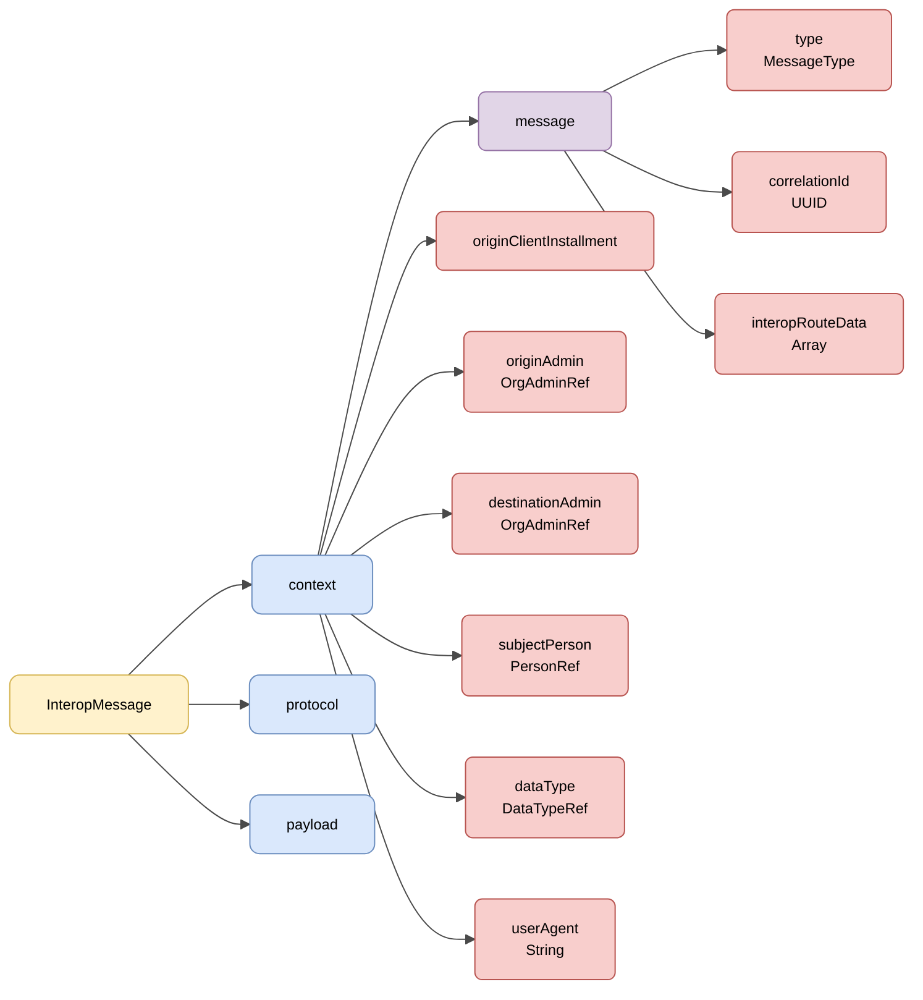

# :material-shape: Base Semantics

> **Version:** `v{{ dena.version }}` · **Date:** {{ dena.date }}

---

## Interop message structure

All requests and responses share the **interop message** structure (`DN00InteropMessageBase`), made up of three blocks: **context**, **protocol** and **payload**.



| Colour | Meaning |
|---|---|
| :yellow_circle: Yellow | Root structure (InteropMessage) |
| :blue_circle: Light blue | Main blocks (context, protocol, payload) |
| :purple_circle: Violet | Nested `message` object |
| :red_circle: Light red | Fields and references |

---

## JSON example

!!! example "Base structure of a request"

    ```json
    {
      "context": {
        "message": {
          "type": "CLIENT_RETRIEVE_REQ",
          "correlationId": "59d5b0b0-5662-4152-b2ed-131aa0fb2608",
          "interopRouteData": [
            {
              "denaComponentId": "CLIENT_INSTALLMENT",
              "timestamp": "2026-08-18T11:28:47.523Z"
            }
          ]
        },
        "originClientInstallment": "8B5AE78A-7D42-4069-A626-959BB07276C5",
        "destinationAdmin": { "id": "admin-id", "oid": "..." },
        "subjectPerson": { "id": "12345678A", "oid": "..." },
        "dataType": { "id": "administrativeServiceProcedureRecord", "oid": "..." },
        "userAgent": "Mozilla/5.0 ..."
      },
      "protocol": { ... },
      "payload": {
        ...
      }
    }
    ```

---

## Message fields

| Field | Type | Mandatory | Description |
|---|---|:---:|---|
| `context` | [Context](#context) | :material-check: | Message context object (`DN00InteropContext`) |
| `protocol` | [DENAProtocol](./modelo/protocol.md) | :material-close: | Protocol information (URLs, timeout) |
| `payload` | `Object` | :material-check: | Request payload or response data |

!!! note "The payload is generic"
    In `DN00InteropMessageBase` the payload is generic (`<P>`) and is marshalled as `payload`. The concrete content depends on each operation.

---

## Context

The context (`DN00InteropContext`) groups the message metadata. The message-type data is nested in the `message` object (`DN00InteropMessageData`).

| Field | Type | Mandatory | Description |
|---|---|:---:|---|
| `message.type` | `DN00InteropMessageType` | :material-check: | Operation type (see [Message Types](./modelo/message-types.md)) |
| `message.correlationId` | `UUID` | :material-check: | Correlation ID to associate all calls derived from a request |
| `message.interopRouteData` | `Array` | :material-close: | Components the message has passed through, with their timestamp |
| `originClientInstallment` | `OID` | :material-close: | Origin client installment (DENA-APP) |
| `originAdmin` | [OrgAdminRef](./modelo/org-admin-ref.md) | :material-close: | Origin administration |
| `destinationAdmin` | [OrgAdminRef](./modelo/org-admin-ref.md) | :material-close: | Destination administration |
| `subjectPerson` | [PersonRef](./modelo/person-ref.md) | :material-close: | Person whose data is being requested |
| `dataType` | [DataTypeRef](./modelo/data-type-ref.md) | :material-close: | Semantic data type requested |
| `userAgent` | `String` | :material-close: | User Agent of the origin |

!!! info "`flowDirection` is derived"
    The flow direction (`REQUEST`/`RESPONSE`) is not a stored field of the context: it is derived from `message.type`.

---

## Full message structure

An interop message has the following structure:

```json
{
  "context": { ... },       // Context metadata (mandatory)
  "protocol": { ... },      // Protocol information (optional)
  "payload": { ... }        // Payload (mandatory)
}
```

| Block | Presence | Description |
|---|---|---|
| `context` | Always | Identification, correlation, operation type, origin/destination |
| `protocol` | When needed | URLs, timeout |
| `payload` | Always | Request or response data |

!!! note "Responses"
    In response messages the processing status is represented with the `code`, `errorId` and `details` fields. See [Status](./modelo/status.md).

---

## HTTP Headers

All HTTP calls include standard and custom headers for security, traceability and versioning.

[:octicons-arrow-right-24: View HTTP Headers](./http-headers.md)

---

## Protocol (DENAProtocol)

Protocol information: callback URLs, timeouts, hashes.

[:octicons-arrow-right-24: View DENAProtocol](./modelo/protocol.md)

---

## Consent (consentOid)

In requests, the consent backing the operation is referenced by its OID (`consentOid`). See the details on the consent page.

[:octicons-arrow-right-24: View consentOid](./modelo/consent.md)

---

## Status (Response)

Information about the processing result in response messages.

[:octicons-arrow-right-24: View Status](./modelo/status.md)

---

## Consents

Principles, lifecycle and API for DENA's consent system.

[:octicons-arrow-right-24: View Consents](./consentimientos.md)

---

## Common models

!!! info "Foundational data types"
    For the basic data types used throughout DENA (Boolean, Numbers, Dates, Ranges, UIDs, URLs, LanguageTexts, Money, Hash, UserAgent...) see [:octicons-arrow-right-24: Base Data Model](../../arquitectura/tipos-dato-base.md)

<div class="grid cards" markdown>

-   :material-cube-outline:{ .lg .middle } **DenaObjectRef**

    ---

    Base type: OID (and the ID in the specialization) of any DENA object.

    [:octicons-arrow-right-24: View model](./modelo/object-ref.md)

-   :material-tag:{ .lg .middle } **DataTypeRef**

    ---

    Reference to a data type managed by DENA.

    [:octicons-arrow-right-24: View model](./modelo/data-type-ref.md)

-   :material-domain:{ .lg .middle } **OrgAdminRef**

    ---

    Reference to an administration (`oid`, `id`, `dir3Id`).

    [:octicons-arrow-right-24: View model](./modelo/org-admin-ref.md)

-   :material-account:{ .lg .middle } **PersonRef**

    ---

    Reference to a registered person (`oid`, `id`).

    [:octicons-arrow-right-24: View model](./modelo/person-ref.md)

-   :material-translate:{ .lg .middle } **LanguageTexts**

    ---

    Texts in multiple languages (Spanish, Basque, English).

    [:octicons-arrow-right-24: View model](./modelo/language-texts.md)

-   :material-message-text:{ .lg .middle } **Message Types**

    ---

    FlowDirection, MessageType, RouteDataItem.

    [:octicons-arrow-right-24: View model](./modelo/message-types.md)

-   :material-cellphone-link:{ .lg .middle } **UserAgent**

    ---

    User-Agent format by message origin.

    [:octicons-arrow-right-24: View model](./modelo/user-agent.md)

</div>

<!-- DENA-DOC-FOOTER -->
---
<sub>DENA Docs v{{ dena.version }} · {{ dena.date }}</sub>
