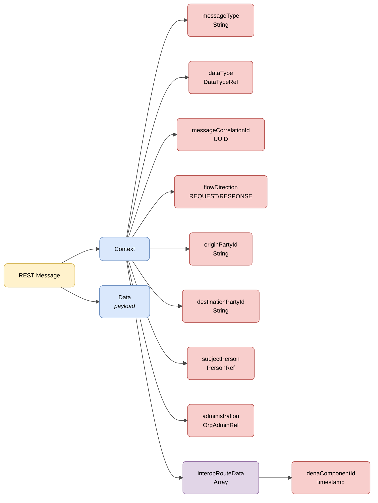

# :material-shape: Base Semantics

> **Version:** `v{{ dena.version }}` · **Date:** {{ dena.date }}

---

## REST service structure

All requests and responses of the REST services share a base structure with **context** and **data** information:



| Colour | Meaning |
|---|---|
| :yellow_circle: Yellow | Root structure (REST Message) |
| :blue_circle: Light blue | Main objects (Context and Data) |
| :red_circle: Light red | Primitive fields and references |
| :purple_circle: Violet | Arrays |

---

## JSON example

!!! example "Base structure of a request"

    ```json
    {
      "context": {
        "interopRouteData": [
          {
            "denaComponentId": "DENA_POSTMAN",
            "denaTS": 1779382284684
          }
        ],
        "messageCorrelationId": "59d5b0b0-5662-4152-b2ed-131aa0fb2608",
        "messageType": "CLIENT_LOGIN",
        "flowDirection": "REQUEST",
        "userAgent": "Mozilla/5.0 ...",
        "originPartyId": "DENA_POSTMAN",
        "destinationPartyId": "DENA_INTEROP",
        "clientDeviceOid": "59d5b0b0-5662-4152-b2ed-131aa0fb2608",
        "dataType": { "dataTypeId": "RECORDS" },
        "subjectPerson": { "personId": "12345678A" },
        "administration": { "administrationId": "ADMIN-001", "dir3Code": "EA0000001" }
      },
      "data": {
        ...
      }
    }
    ```

---

## Message fields

| Field | Type | Mandatory | Description |
|---|---|:---:|---|
| `context` | [Context](#context) | :material-check: | Request context object |
| `data` | `Object` | :material-check: | Request payload or response data |

---

## Context

| Field | Type | Mandatory | Description |
|---|---|:---:|---|
| `interopRouteData` | `Array` | :material-check: | List of components the request has passed through, with their timestamp |
| `messageCorrelationId` | `String(UUID)` | :material-check: | Correlation ID to associate all calls derived from a request |
| `messageType` | `String` | :material-check: | Type of message sent in the `data` object |
| `flowDirection` | `String` | :material-check: | Indicates whether it is a request (`REQUEST`) or a response (`RESPONSE`) |
| `userAgent` | `String` | :material-check: | User Agent of the originating device |
| `originPartyId` | `String` | :material-check: | Identifier of the origin (e.g. `DENA_WEBAPP`) |
| `destinationPartyId` | `String` | :material-check: | Identifier of the destination (e.g. `DENA_INTEROP`) |
| `clientDeviceOid` | `String` | :material-close: | OID of the originating device |
| `dataType` | [DataTypeRef](./modelo/data-type-ref.md) | :material-close: | Semantic data type requested |
| `subjectPerson` | [PersonRef](./modelo/person-ref.md) | :material-close: | Person whose data is being requested |
| `administration` | [OrgAdminRef](./modelo/org-admin-ref.md) | :material-close: | Target administration |

---

## Common models

<div class="grid cards" markdown>

-   :material-tag:{ .lg .middle } **DataTypeRef**

    ---

    Reference to a data type managed by DENA.

    [:octicons-arrow-right-24: View model](./modelo/data-type-ref.md)

-   :material-domain:{ .lg .middle } **OrgAdminRef**

    ---

    Reference to an administration.

    [:octicons-arrow-right-24: View model](./modelo/org-admin-ref.md)

-   :material-account:{ .lg .middle } **PersonRef**

    ---

    Reference to a registered person.

    [:octicons-arrow-right-24: View model](./modelo/person-ref.md)

-   :material-translate:{ .lg .middle } **LanguageTexts**

    ---

    Texts in multiple languages (Spanish, Basque, English).

    [:octicons-arrow-right-24: View model](./modelo/language-texts.md)

</div>

<!-- DENA-DOC-FOOTER -->
---
<sub>DENA Docs v{{ dena.version }} · {{ dena.date }}</sub>
