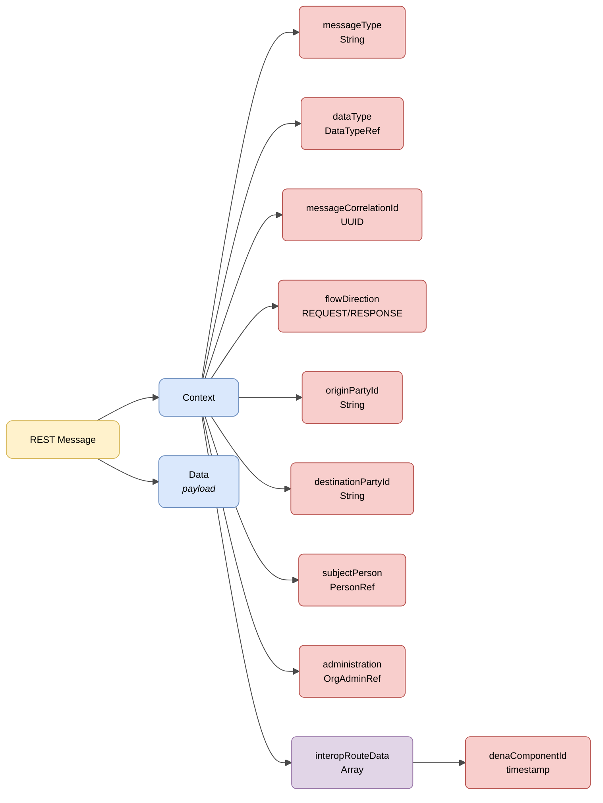

# :material-shape: Base Semantics

> **Version:** `v{{ dena.version }}` · **Date:** {{ dena.date }}

---

## REST service structure

All requests and responses of the REST services share a base structure with **context** and **data** information:



| Colour | Meaning |
|---|---|
| :yellow_circle: Yellow | Root structure (REST Message) |
| :blue_circle: Light blue | Main objects (Context and Data) |
| :red_circle: Light red | Primitive fields and references |
| :purple_circle: Violet | Arrays |

---

## JSON example

!!! example "Base structure of a request"

    ```json
    {
      "context": {
        "interopRouteData": [
          {
            "denaComponentId": "DENA_POSTMAN",
            "denaTS": 1779382284684
          }
        ],
        "messageCorrelationId": "59d5b0b0-5662-4152-b2ed-131aa0fb2608",
        "messageType": "CLIENT_LOGIN",
        "flowDirection": "REQUEST",
        "userAgent": "Mozilla/5.0 ...",
        "originPartyId": "DENA_POSTMAN",
        "destinationPartyId": "DENA_INTEROP",
        "clientDeviceOid": "59d5b0b0-5662-4152-b2ed-131aa0fb2608",
        "dataType": { "dataTypeId": "RECORDS" },
        "subjectPerson": { "personId": "12345678A" },
        "administration": { "administrationId": "ADMIN-001", "dir3Code": "EA0000001" }
      },
      "data": {
        ...
      }
    }
    ```

---

## Message fields

| Field | Type | Mandatory | Description |
|---|---|:---:|---|
| `context` | [Context](#context) | :material-check: | Request context object |
| `data` | `Object` | :material-check: | Request payload or response data |

---

## Context

| Field | Type | Mandatory | Description |
|---|---|:---:|---|
| `interopRouteData` | `Array` | :material-check: | List of components the request has passed through, with their timestamp |
| `messageCorrelationId` | `String(UUID)` | :material-check: | Correlation ID to associate all calls derived from a request |
| `messageType` | `String` | :material-check: | Type of message sent in the `data` object |
| `flowDirection` | `String` | :material-check: | Indicates whether it is a request (`REQUEST`) or a response (`RESPONSE`) |
| `userAgent` | `String` | :material-check: | User Agent of the originating device |
| `originPartyId` | `String` | :material-check: | Identifier of the origin (e.g. `DENA_WEBAPP`) |
| `destinationPartyId` | `String` | :material-check: | Identifier of the destination (e.g. `DENA_INTEROP`) |
| `clientDeviceOid` | `String` | :material-close: | OID of the originating device |
| `dataType` | [DataTypeRef](./modelo/data-type-ref.md) | :material-close: | Semantic data type requested |
| `subjectPerson` | [PersonRef](./modelo/person-ref.md) | :material-close: | Person whose data is being requested |
| `administration` | [OrgAdminRef](./modelo/org-admin-ref.md) | :material-close: | Target administration |

---

## Full message structure

A DENA message has the following general structure:

```json
{
  "context": { ... },       // Context metadata (mandatory)
  "protocol": { ... },      // Protocol information (optional)
  "consent": { ... },       // Legal basis (Data-Retrieve only)
  "status": { ... },        // Response status (responses only)
  "data": { ... }           // Payload (mandatory)
}
```

| Block | Presence | Description |
|---|---|---|
| `context` | Always | Identification, correlation, operation type |
| `protocol` | When needed | URLs, timeouts, hashes, tokens |
| `consent` | Data-Retrieve only | Reference to consent/legal authorization |
| `status` | Responses only | Processing result |
| `data` | Always | Request or response data |

---

## HTTP Headers

All HTTP calls include standard and custom headers for security, traceability and versioning.

[:octicons-arrow-right-24: View HTTP Headers](./http-headers.md)

---

## Protocol (DENAProtocol)

Protocol information: callback URLs, timeouts, hashes.

[:octicons-arrow-right-24: View DENAProtocol](./modelo/protocol.md)

---

## Consent (DENAConsent)

Reference to the legal basis (consent/normative authorization) backing a Data-Retrieve request.

[:octicons-arrow-right-24: View DENAConsent](./modelo/consent.md)

---

## Status (Response)

Information about the processing result in response messages.

[:octicons-arrow-right-24: View Status](./modelo/status.md)

---

## Consents

Principles, lifecycle and API for DENA's consent system.

[:octicons-arrow-right-24: View Consents](./consentimientos.md)

---

## Common models

!!! info "Foundational data types"
    For the basic data types used throughout DENA (Boolean, Numbers, Dates, Ranges, UIDs, URLs, LanguageTexts, Money, Hash, UserAgent...) see [:octicons-arrow-right-24: Base Data Model](../../arquitectura/tipos-dato-base.md)

<div class="grid cards" markdown>

-   :material-cube-outline:{ .lg .middle } **DenaObjectRef**

    ---

    Base type: OID, timestamps, URL for any DENA object.

    [:octicons-arrow-right-24: View model](./modelo/object-ref.md)

-   :material-tag:{ .lg .middle } **DataTypeRef**

    ---

    Reference to a data type managed by DENA.

    [:octicons-arrow-right-24: View model](./modelo/data-type-ref.md)

-   :material-domain:{ .lg .middle } **OrgAdminRef**

    ---

    Reference to an administration (orgId, DIR3, OID...).

    [:octicons-arrow-right-24: View model](./modelo/org-admin-ref.md)

-   :material-account:{ .lg .middle } **PersonRef**

    ---

    Reference to a registered person (personId, OID...).

    [:octicons-arrow-right-24: View model](./modelo/person-ref.md)

-   :material-translate:{ .lg .middle } **LanguageTexts**

    ---

    Texts in multiple languages (Spanish, Basque, English).

    [:octicons-arrow-right-24: View model](./modelo/language-texts.md)

-   :material-message-text:{ .lg .middle } **Message Types**

    ---

    FlowDirection, MessageType, RouteDataItem, PersonAndConsentGiven.

    [:octicons-arrow-right-24: View model](./modelo/message-types.md)

-   :material-cellphone-link:{ .lg .middle } **UserAgent**

    ---

    User-Agent format by message origin.

    [:octicons-arrow-right-24: View model](./modelo/user-agent.md)

</div>

<!-- DENA-DOC-FOOTER -->
---
<sub>DENA Docs v{{ dena.version }} · {{ dena.date }}</sub>
