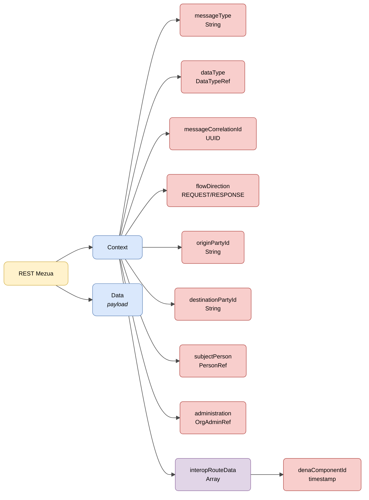

# :material-shape: Oinarrizko Semantika

> **Bertsioa:** `v{{ dena.version }}` · **Data:** {{ dena.date }}

---

## REST zerbitzuen egitura

REST zerbitzuen eskaera eta erantzun guztiek **testuinguru** eta **datu** informazioarekin oinarrizko egitura partekatzen dute:



| Kolorea | Esanahia |
|---|---|
| :yellow_circle: Horia | Sustraia (REST Mezua) |
| :blue_circle: Urdin argia | Objektu nagusiak (Context eta Data) |
| :red_circle: Gorri argia | Eremu primitiboak eta erreferentziak |
| :purple_circle: Morea | Arrayak |

---

## JSON adibidea

!!! example "Eskaera baten oinarrizko egitura"

    ```json
    {
      "context": {
        "interopRouteData": [
          {
            "denaComponentId": "DENA_POSTMAN",
            "denaTS": 1779382284684
          }
        ],
        "messageCorrelationId": "59d5b0b0-5662-4152-b2ed-131aa0fb2608",
        "messageType": "CLIENT_LOGIN",
        "flowDirection": "REQUEST",
        "userAgent": "Mozilla/5.0 ...",
        "originPartyId": "DENA_POSTMAN",
        "destinationPartyId": "DENA_INTEROP",
        "clientDeviceOid": "59d5b0b0-5662-4152-b2ed-131aa0fb2608",
        "dataType": { "dataTypeId": "RECORDS" },
        "subjectPerson": { "personId": "12345678A" },
        "administration": { "administrationId": "ADMIN-001", "dir3Code": "EA0000001" }
      },
      "data": {
        ...
      }
    }
    ```

---

## Mezuaren eremuak

| Eremua | Mota | Derrigorrezkoa | Deskribapena |
|---|---|:---:|---|
| `context` | [Context](#context) | :material-check: | Eskaeraren testuinguru-objektua |
| `data` | `Objektua` | :material-check: | Eskaeraren payload-a edo erantzunaren datuak |

---

## Context

| Eremua | Mota | Derrigorrezkoa | Deskribapena |
|---|---|:---:|---|
| `interopRouteData` | `Array` | :material-check: | Eskaerak igaro dituen osagaien zerrenda, timestamp-arekin |
| `messageCorrelationId` | `String(UUID)` | :material-check: | Eskaera batetik eratorritako dei guztiak lotzeko korrelazioa ID-a |
| `messageType` | `String` | :material-check: | `data` objektuan bidalitako mezu mota |
| `flowDirection` | `String` | :material-check: | Eskaera (`REQUEST`) ala erantzuna (`RESPONSE`) den adierazten du |
| `userAgent` | `String` | :material-check: | Jatorriko gailuaren User Agent-a |
| `originPartyId` | `String` | :material-check: | Jatorriaren identifikatzailea (adib: `DENA_WEBAPP`) |
| `destinationPartyId` | `String` | :material-check: | Helmugaren identifikatzailea (adib: `DENA_INTEROP`) |
| `clientDeviceOid` | `String` | :material-close: | Jatorriko gailuaren OID-a |
| `dataType` | [DataTypeRef](./modelo/data-type-ref.md) | :material-close: | Eskatutako datu mota semantikoa |
| `subjectPerson` | [PersonRef](./modelo/person-ref.md) | :material-close: | Datuak eskatzen diren pertsona |
| `administration` | [OrgAdminRef](./modelo/org-admin-ref.md) | :material-close: | Helmugako administrazioa |

---

## Mezuaren egitura osoa

DENA mezu batek honako egitura orokorra du:

```json
{
  "context": { ... },       // Testuinguru metadatuak (derrigorrezkoa)
  "protocol": { ... },      // Protokoloaren informazioa (aukerakoa)
  "consent": { ... },       // Oinarri gaitzailea (Data-Retrieve soilik)
  "status": { ... },        // Erantzunaren egoera (erantzunetan soilik)
  "data": { ... }           // Payload-a (derrigorrezkoa)
}
```

| Blokea | Presentzia | Deskribapena |
|---|---|---|
| `context` | Beti | Identifikazioa, korrelazioa, operazio mota |
| `protocol` | Behar denean | URLak, timeout-ak, hash-ak, token-ak |
| `consent` | Data-Retrieve soilik | Baimen/gaitzapen normatiboaren erreferentzia |
| `status` | Erantzunetan soilik | Prozesamenduaren emaitza |
| `data` | Beti | Eskaera edo erantzuneko datuak |

---

## HTTP Goiburuak

HTTP dei guztiek goiburu estandarrak eta pertsonalizatuak dituzte segurtasunerako, trazabilitaterako eta bertsio-kontrolerako.

[:octicons-arrow-right-24: HTTP Goiburuak ikusi](./http-headers.md)

---

## Protocol (DENAProtocol)

Protokoloaren informazioa: callback URLak, timeout-ak, hash-ak.

[:octicons-arrow-right-24: DENAProtocol ikusi](./modelo/protocol.md)

---

## Consent (DENAConsent)

Data-Retrieve eskaera bat babesten duen oinarri gaitzailearen (baimena/gaitzapen normatiboa) erreferentzia.

[:octicons-arrow-right-24: DENAConsent ikusi](./modelo/consent.md)

---

## Status (Erantzuna)

Erantzun mezuetako prozesamenduaren emaitzari buruzko informazioa.

[:octicons-arrow-right-24: Status ikusi](./modelo/status.md)

---

## Baimenak

DENAren baimen-sistemaren printzipioak, bizi-zikloa eta APIa.

[:octicons-arrow-right-24: Baimenak ikusi](./consentimientos.md)

---

## Eredu komunak

!!! info "Oinarrizko datu motak"
    DENA osoan erabiltzen diren oinarrizko datu motetarako (Boolean, Numbers, Dates, Ranges, UIDs, URLs, LanguageTexts, Money, Hash, UserAgent...) ikusi [:octicons-arrow-right-24: Oinarrizko Datu Eredua](../../arquitectura/tipos-dato-base.md)

<div class="grid cards" markdown>

-   :material-cube-outline:{ .lg .middle } **DenaObjectRef**

    ---

    Oinarrizko mota: OID, timestamp-ak, edozein DENA objekturen URLa.

    [:octicons-arrow-right-24: Eredua ikusi](./modelo/object-ref.md)

-   :material-tag:{ .lg .middle } **DataTypeRef**

    ---

    DENAk kudeatutako datu mota baten erreferentzia.

    [:octicons-arrow-right-24: Eredua ikusi](./modelo/data-type-ref.md)

-   :material-domain:{ .lg .middle } **OrgAdminRef**

    ---

    Administrazio baten erreferentzia (orgId, DIR3, OID...).

    [:octicons-arrow-right-24: Eredua ikusi](./modelo/org-admin-ref.md)

-   :material-account:{ .lg .middle } **PersonRef**

    ---

    Erregistratutako pertsona baten erreferentzia (personId, OID...).

    [:octicons-arrow-right-24: Eredua ikusi](./modelo/person-ref.md)

-   :material-translate:{ .lg .middle } **LanguageTexts**

    ---

    Hizkuntza anitzetan testuak (gaztelania, euskara, ingelesa).

    [:octicons-arrow-right-24: Eredua ikusi](./modelo/language-texts.md)

-   :material-message-text:{ .lg .middle } **Mezu Motak**

    ---

    FlowDirection, MessageType, RouteDataItem, PersonAndConsentGiven.

    [:octicons-arrow-right-24: Eredua ikusi](./modelo/message-types.md)

-   :material-cellphone-link:{ .lg .middle } **UserAgent**

    ---

    User-Agent formatua mezuaren jatorriaren arabera.

    [:octicons-arrow-right-24: Eredua ikusi](./modelo/user-agent.md)

</div>

<!-- DENA-DOC-FOOTER -->
---
<sub>DENA Docs v{{ dena.version }} · {{ dena.date }}</sub>
