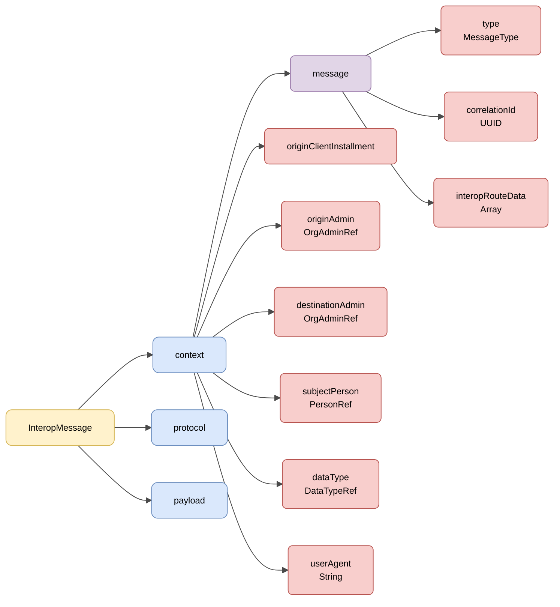

# :material-shape: Oinarrizko Semantika

> **Bertsioa:** `v{{ dena.version }}` · **Data:** {{ dena.date }}

---

## Interop message-aren egitura

Eskaera eta erantzun guztiek **interop message**-aren egitura partekatzen dute (`DN00InteropMessageBase`), hiru blokek osatzen dutena: **context**, **protocol** eta **payload**.



| Kolorea | Esanahia |
|---|---|
| :yellow_circle: Horia | Sustraia (InteropMessage) |
| :blue_circle: Urdin argia | Bloke nagusiak (context, protocol, payload) |
| :purple_circle: Morea | Habiaratutako `message` objektua |
| :red_circle: Gorri argia | Eremuak eta erreferentziak |

---

## JSON adibidea

!!! example "Eskaera baten oinarrizko egitura"

    ```json
    {
      "context": {
        "message": {
          "type": "CLIENT_RETRIEVE_REQ",
          "correlationId": "59d5b0b0-5662-4152-b2ed-131aa0fb2608",
          "interopRouteData": [
            {
              "denaComponentId": "CLIENT_INSTALLMENT",
              "timestamp": "2026-08-18T11:28:47.523Z"
            }
          ]
        },
        "originClientInstallment": "8B5AE78A-7D42-4069-A626-959BB07276C5",
        "destinationAdmin": { "id": "admin-id", "oid": "..." },
        "subjectPerson": { "id": "12345678A", "oid": "..." },
        "dataType": { "id": "administrativeServiceProcedureRecord", "oid": "..." },
        "userAgent": "Mozilla/5.0 ..."
      },
      "protocol": { ... },
      "payload": {
        ...
      }
    }
    ```

---

## Mezuaren eremuak

| Eremua | Mota | Derrigorrezkoa | Deskribapena |
|---|---|:---:|---|
| `context` | [Context](#context) | :material-check: | Mezuaren testuinguru-objektua (`DN00InteropContext`) |
| `protocol` | [DENAProtocol](./modelo/protocol.md) | :material-close: | Protokoloaren informazioa (URLak, timeout) |
| `payload` | `Objektua` | :material-check: | Eskaeraren payload-a edo erantzunaren datuak |

!!! note "Payload-a generikoa da"
    `DN00InteropMessageBase`-n payload-a generikoa da (`<P>`) eta `payload` gisa marshalizatzen da. Eduki zehatza operazio bakoitzaren araberakoa da.

---

## Context

Testuinguruak (`DN00InteropContext`) mezuaren metadatuak biltzen ditu. Mezu motaren datuak `message` objektuan habiaratzen dira (`DN00InteropMessageData`).

| Eremua | Mota | Derrigorrezkoa | Deskribapena |
|---|---|:---:|---|
| `message.type` | `DN00InteropMessageType` | :material-check: | Operazio mota (ikus [Mezu Motak](./modelo/message-types.md)) |
| `message.correlationId` | `UUID` | :material-check: | Eskaera batetik eratorritako dei guztiak lotzeko korrelazio ID-a |
| `message.interopRouteData` | `Array` | :material-close: | Mezuak igaro dituen osagaiak, beren timestamp-arekin |
| `originClientInstallment` | `OID` | :material-close: | Jatorriko bezero-instalazioa (DENA-APP) |
| `originAdmin` | [OrgAdminRef](./modelo/org-admin-ref.md) | :material-close: | Jatorriko administrazioa |
| `destinationAdmin` | [OrgAdminRef](./modelo/org-admin-ref.md) | :material-close: | Helmugako administrazioa |
| `subjectPerson` | [PersonRef](./modelo/person-ref.md) | :material-close: | Datuak eskatzen diren pertsona |
| `dataType` | [DataTypeRef](./modelo/data-type-ref.md) | :material-close: | Eskatutako datu mota semantikoa |
| `userAgent` | `String` | :material-close: | Jatorriaren User Agent-a |

!!! info "`flowDirection` eratorria da"
    Fluxuaren norabidea (`REQUEST`/`RESPONSE`) ez da testuinguruaren eremu gordea: `message.type`-tik eratortzen da.

---

## Mezuaren egitura osoa

Interop message batek honako egitura du:

```json
{
  "context": { ... },       // Testuinguru metadatuak (derrigorrezkoa)
  "protocol": { ... },      // Protokoloaren informazioa (aukerakoa)
  "payload": { ... }        // Payload-a (derrigorrezkoa)
}
```

| Blokea | Presentzia | Deskribapena |
|---|---|---|
| `context` | Beti | Identifikazioa, korrelazioa, operazio mota, jatorria/helmuga |
| `protocol` | Behar denean | URLak, timeout |
| `payload` | Beti | Eskaera edo erantzuneko datuak |

!!! note "Erantzunak"
    Erantzun mezuetan prozesamenduaren egoera `code`, `errorId` eta `details` eremuekin adierazten da. Ikus [Status](./modelo/status.md).

---

## HTTP Goiburuak

HTTP dei guztiek goiburu estandarrak eta pertsonalizatuak dituzte segurtasunerako, trazabilitaterako eta bertsio-kontrolerako.

[:octicons-arrow-right-24: HTTP Goiburuak ikusi](./http-headers.md)

---

## Protocol (DENAProtocol)

Protokoloaren informazioa: callback URLak, timeout-ak, hash-ak.

[:octicons-arrow-right-24: DENAProtocol ikusi](./modelo/protocol.md)

---

## Baimena (consentOid)

Eskaeretan, operazioa babesten duen baimena bere OID-aren bidez erreferentziatzen da (`consentOid`). Ikus xehetasunak baimenaren orrian.

[:octicons-arrow-right-24: consentOid ikusi](./modelo/consent.md)

---

## Status (Erantzuna)

Erantzun mezuetako prozesamenduaren emaitzari buruzko informazioa.

[:octicons-arrow-right-24: Status ikusi](./modelo/status.md)

---

## Baimenak

DENAren baimen-sistemaren printzipioak, bizi-zikloa eta APIa.

[:octicons-arrow-right-24: Baimenak ikusi](./consentimientos.md)

---

## Eredu komunak

!!! info "Oinarrizko datu motak"
    DENA osoan erabiltzen diren oinarrizko datu motetarako (Boolean, Numbers, Dates, Ranges, UIDs, URLs, LanguageTexts, Money, Hash, UserAgent...) ikusi [:octicons-arrow-right-24: Oinarrizko Datu Eredua](../../arquitectura/tipos-dato-base.md)

<div class="grid cards" markdown>

-   :material-cube-outline:{ .lg .middle } **DenaObjectRef**

    ---

    Oinarrizko mota: edozein DENA objekturen OID-a (eta espezializazioan ID-a).

    [:octicons-arrow-right-24: Eredua ikusi](./modelo/object-ref.md)

-   :material-tag:{ .lg .middle } **DataTypeRef**

    ---

    DENAk kudeatutako datu mota baten erreferentzia.

    [:octicons-arrow-right-24: Eredua ikusi](./modelo/data-type-ref.md)

-   :material-domain:{ .lg .middle } **OrgAdminRef**

    ---

    Administrazio baten erreferentzia (`oid`, `id`, `dir3Id`).

    [:octicons-arrow-right-24: Eredua ikusi](./modelo/org-admin-ref.md)

-   :material-account:{ .lg .middle } **PersonRef**

    ---

    Erregistratutako pertsona baten erreferentzia (`oid`, `id`).

    [:octicons-arrow-right-24: Eredua ikusi](./modelo/person-ref.md)

-   :material-translate:{ .lg .middle } **LanguageTexts**

    ---

    Hizkuntza anitzetan testuak (gaztelania, euskara, ingelesa).

    [:octicons-arrow-right-24: Eredua ikusi](./modelo/language-texts.md)

-   :material-message-text:{ .lg .middle } **Mezu Motak**

    ---

    FlowDirection, MessageType, RouteDataItem.

    [:octicons-arrow-right-24: Eredua ikusi](./modelo/message-types.md)

-   :material-cellphone-link:{ .lg .middle } **UserAgent**

    ---

    User-Agent formatua mezuaren jatorriaren arabera.

    [:octicons-arrow-right-24: Eredua ikusi](./modelo/user-agent.md)

</div>

<!-- DENA-DOC-FOOTER -->
---
<sub>DENA Docs v{{ dena.version }} · {{ dena.date }}</sub>
