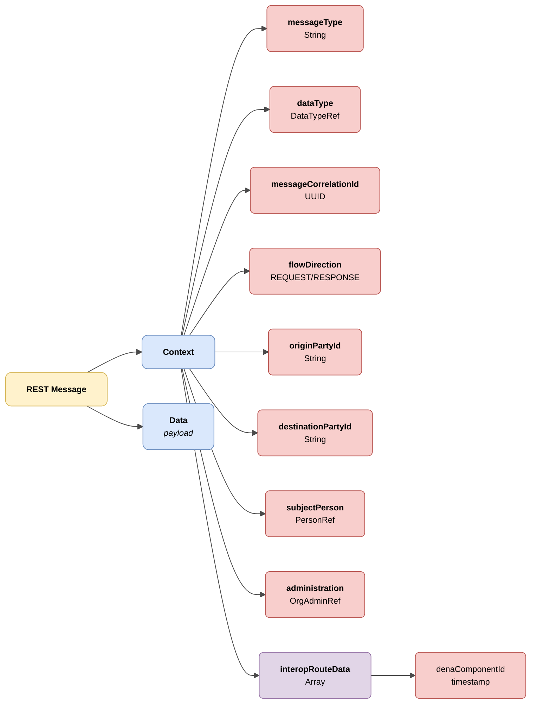

# Semántica Base

## Semantica servicios REST

Todas las peticiones y respuestas de los servicios REST se realizaran con una estructura base igual, que contendra información de contexto, así como los datos concretos de dicha petición o respuesta. La estructura es la siguiente:



| Color | Significado |
|-------|-------------|
| 🟡 Amarillo | Estructura raíz (REST Message) |
| 🔵 Azul claro | Objetos principales (Context y Data) |
| 🔴 Rojo claro | Campos primitivos y referencias |
| 🟣 Violeta | Arrays |

## Ejemplo JSON

```json
{
  "context": {
    "interopRouteData": [
        {
            "denaComponentId": "DENA_POSTMAN",
            "denaTS": 1779382284684
        }
    ],
    "messageCorrelationId": "59d5b0b0-5662-4152-b2ed-131aa0fb2608",
    "messageType": "CLIENT_LOGIN",
    "flowDirection": "REQUEST",
    "userAgent": "Mozilla/5.0 (Windows NT 10.0; Win64; x64) AppleWebKit/537.36 (KHTML, like Gecko) Chrome/143.0.0.0 Safari/537.36",
    "originPartyId": "DENA_POSTMAN",
    "destinationPartyId": "DENA_INTEROP",
    "clientDeviceOid": "59d5b0b0-5662-4152-b2ed-131aa0fb2608",
    "dataType": { "dataTypeId": "RECORDS" },
    "subjectPerson": { "personId": "12345678A" },
    "administration": { "administrationId": "ADMIN-001", "dir3Code": "EA0000001" }
  },
  "data": {
    <payload>
  }
}
```

| Campo     | Tipo                | Obligatorio | Descripción |
|-----------|---------------------|-------------|-------------|
| `context` | [Context](#context) | ✅          | Objeto de contexto de la petición |
| `data`    | `Objeto`            | ✅          | Payload de la petición o datos de la respuesta |

## Context

| Campo                  | Tipo           | Obligatorio | Descripción |
|------------------------|----------------|-------------|-------------|
| `interopRouteData`     | `Objeto`       | ✅          | Listado con los ids de cada componente por los que ha pasado la petición, y el timestamp que indica en que momento del tiempo llego a cada componente la llamada |
| `messageCorrelationId` | `String(UUID)` | ✅          | Id de correlación para asociar todas las llamadas que se realicen debido a una petición, en formato UUID |
| `messageType`          | `String`       | ✅          | Tipo de mensaje enviado en el objecto "data" |
| `flowDirection`        | `String`       | ✅          | Indica si el mensaje es una petición (REQUEST) o respuesta (RESPONSE) |
| `userAgent`            | `String`       | ✅          | User Agent del dispositivo en el que se origina la petición |
| `originPartyId`        | `String`       | ✅          | Identificador del origen de la petición. Ej: DENA_WEBAPP |
| `destinationPartyId`   | `String`       | ✅          | Identificador del destino de la petición. Ej: DENA_INTEROP |
| `clientDeviceOid`      | `String`       | ❌          | Oid del dispositivo desde el que se inicia la petición |
| `dataType`             | [DataTypeRef](./modelo/data-type-ref.md) | ❌          | Tipo de dato semantico que solicita o envía la petición, cuando sea aplicable |
| `subjectPerson`        | [PersonRef](./modelo/person-ref.md) | ❌          | Referencia a la persona sobre la que se solicitan o envían datos, cuando sea aplicable |
| `administration`       | [OrgAdminRef](./modelo/org-admin-ref.md) | ❌          | Referencia a la administración a la que se solicitan datos, cuando sea aplicable |

---

## Modelos comunes

A continuación se detallan los modelos comunes utilizados en varios servicios REST:

| Modelo | Descripción |
|--------|-------------|
| [DataTypeRef](./modelo/data-type-ref.md) | Referencia a un tipo de dato |
| [OrgAdminRef](./modelo/org-admin-ref.md) | Referencia a una administración |
| [PersonRef](./modelo/person-ref.md) | Referencia a una persona |
| [LanguageTexts](./modelo/language-texts.md) | Mensajes o textos en multiples idiomas |

<!-- DENA-DOC-FOOTER -->
---
<sub>DENA Docs v0.3.25 · 2026-06-10</sub>
