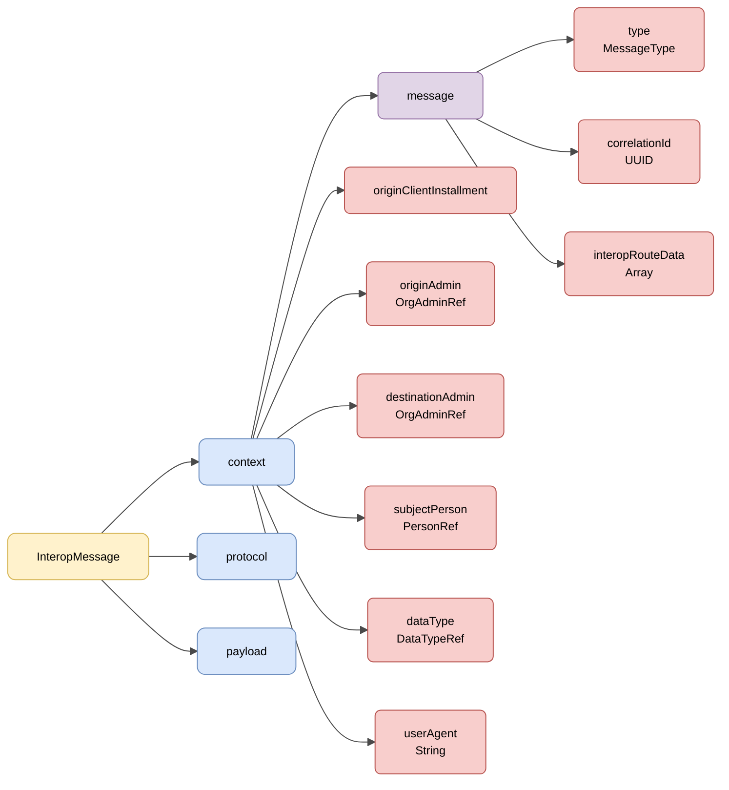

# :material-shape: Semántica Base

> **Versión:** `v{{ dena.version }}` · **Fecha:** {{ dena.date }}

---

## Estructura del interop message

Todas las peticiones y respuestas comparten la estructura del **interop message** (`DN00InteropMessageBase`), compuesta por tres bloques: **context**, **protocol** y **payload**.



| Color | Significado |
|---|---|
| :yellow_circle: Amarillo | Estructura raíz (InteropMessage) |
| :blue_circle: Azul claro | Bloques principales (context, protocol, payload) |
| :purple_circle: Violeta | Objeto `message` anidado |
| :red_circle: Rojo claro | Campos y referencias |

---

## Ejemplo JSON

!!! example "Estructura base de una petición"

    ```json
    {
      "context": {
        "message": {
          "type": "CLIENT_RETRIEVE_REQ",
          "correlationId": "59d5b0b0-5662-4152-b2ed-131aa0fb2608",
          "interopRouteData": [
            {
              "denaComponentId": "CLIENT_INSTALLMENT",
              "timestamp": "2026-08-18T11:28:47.523Z"
            }
          ]
        },
        "originClientInstallment": "8B5AE78A-7D42-4069-A626-959BB07276C5",
        "destinationAdmin": { "id": "admin-id", "oid": "..." },
        "subjectPerson": { "id": "12345678A", "oid": "..." },
        "dataType": { "id": "administrativeServiceProcedureRecord", "oid": "..." },
        "userAgent": "Mozilla/5.0 ..."
      },
      "protocol": { ... },
      "payload": {
        ...
      }
    }
    ```

---

## Campos del mensaje

| Campo | Tipo | Obligatorio | Descripción |
|---|---|:---:|---|
| `context` | [Context](#context) | :material-check: | Objeto de contexto del mensaje (`DN00InteropContext`) |
| `protocol` | [DENAProtocol](./modelo/protocol.md) | :material-close: | Información de protocolo (URLs, timeout) |
| `payload` | `Objeto` | :material-check: | Payload de la petición o datos de la respuesta |

!!! note "El payload es genérico"
    En `DN00InteropMessageBase` el payload es genérico (`<P>`) y se marshaliza como `payload`. El contenido concreto depende de cada operación.

---

## Context

El contexto (`DN00InteropContext`) agrupa metadatos del mensaje. Los datos de tipo de mensaje van anidados en el objeto `message` (`DN00InteropMessageData`).

| Campo | Tipo | Obligatorio | Descripción |
|---|---|:---:|---|
| `message.type` | `DN00InteropMessageType` | :material-check: | Tipo de operación (ver [Tipos de Mensaje](./modelo/message-types.md)) |
| `message.correlationId` | `UUID` | :material-check: | Id de correlación para asociar todas las llamadas derivadas de una petición |
| `message.interopRouteData` | `Array` | :material-close: | Componentes por los que ha pasado el mensaje, con su timestamp |
| `originClientInstallment` | `OID` | :material-close: | Instalación cliente de origen (DENA-APP) |
| `originAdmin` | [OrgAdminRef](./modelo/org-admin-ref.md) | :material-close: | Administración de origen |
| `destinationAdmin` | [OrgAdminRef](./modelo/org-admin-ref.md) | :material-close: | Administración destino |
| `subjectPerson` | [PersonRef](./modelo/person-ref.md) | :material-close: | Persona sobre la que se solicitan datos |
| `dataType` | [DataTypeRef](./modelo/data-type-ref.md) | :material-close: | Tipo de dato semántico solicitado |
| `userAgent` | `String` | :material-close: | User Agent del origen |

!!! info "`flowDirection` es derivado"
    La dirección del flujo (`REQUEST`/`RESPONSE`) no es un campo almacenado del contexto: se deriva del `message.type`.

---

## Estructura completa del mensaje

Un interop message tiene la siguiente estructura:

```json
{
  "context": { ... },       // Metadatos de contexto (obligatorio)
  "protocol": { ... },      // Información de protocolo (opcional)
  "payload": { ... }        // Payload (obligatorio)
}
```

| Bloque | Presencia | Descripción |
|---|---|---|
| `context` | Siempre | Identificación, correlación, tipo de operación, origen/destino |
| `protocol` | Cuando necesario | URLs, timeout |
| `payload` | Siempre | Datos de la petición o respuesta |

!!! note "Respuestas"
    En los mensajes de respuesta el estado del procesamiento se representa con los campos `code`, `errorId` y `details`. Ver [Status](./modelo/status.md).

---

## HTTP Headers

Todas las llamadas HTTP incluyen cabeceras estándar y personalizadas para seguridad, trazabilidad y versionado.

[:octicons-arrow-right-24: Ver HTTP Headers](./http-headers.md)

---

## Protocol (DENAProtocol)

Información de protocolo: URLs de callback, timeouts, hashes.

[:octicons-arrow-right-24: Ver DENAProtocol](./modelo/protocol.md)

---

## Consentimiento (consentOid)

En las peticiones, el consentimiento que respalda la operación se referencia por su OID (`consentOid`). Ver el detalle en la página de consentimiento.

[:octicons-arrow-right-24: Ver consentOid](./modelo/consent.md)

---

## Status (Respuesta)

Información sobre el resultado del procesamiento en mensajes de respuesta.

[:octicons-arrow-right-24: Ver Status](./modelo/status.md)

---

## Consentimientos

Principios, ciclo de vida y API del sistema de consentimientos de DENA.

[:octicons-arrow-right-24: Ver Consentimientos](./consentimientos.md)

---

## Modelos comunes

!!! info "Tipos de dato fundacionales"
    Para los tipos de dato básicos usados en todo DENA (Boolean, Numbers, Dates, Ranges, UIDs, URLs, LanguageTexts, Money, Hash, UserAgent...) consulta [:octicons-arrow-right-24: Modelo de Datos Base](../../arquitectura/tipos-dato-base.md)

<div class="grid cards" markdown>

-   :material-cube-outline:{ .lg .middle } **DenaObjectRef**

    ---

    Tipo base: OID (y el ID en la especialización) de cualquier objeto DENA.

    [:octicons-arrow-right-24: Ver modelo](./modelo/object-ref.md)

-   :material-tag:{ .lg .middle } **DataTypeRef**

    ---

    Referencia a un tipo de dato gestionado por DENA.

    [:octicons-arrow-right-24: Ver modelo](./modelo/data-type-ref.md)

-   :material-domain:{ .lg .middle } **OrgAdminRef**

    ---

    Referencia a una administración (`oid`, `id`, `dir3Id`).

    [:octicons-arrow-right-24: Ver modelo](./modelo/org-admin-ref.md)

-   :material-account:{ .lg .middle } **PersonRef**

    ---

    Referencia a una persona registrada (`oid`, `id`).

    [:octicons-arrow-right-24: Ver modelo](./modelo/person-ref.md)

-   :material-translate:{ .lg .middle } **LanguageTexts**

    ---

    Textos en múltiples idiomas (castellano, euskera, inglés).

    [:octicons-arrow-right-24: Ver modelo](./modelo/language-texts.md)

-   :material-message-text:{ .lg .middle } **Tipos de Mensaje**

    ---

    FlowDirection, MessageType, RouteDataItem.

    [:octicons-arrow-right-24: Ver modelo](./modelo/message-types.md)

-   :material-cellphone-link:{ .lg .middle } **UserAgent**

    ---

    Formato del User-Agent según origen del mensaje.

    [:octicons-arrow-right-24: Ver modelo](./modelo/user-agent.md)

</div>

<!-- DENA-DOC-FOOTER -->
---
<sub>DENA Docs v{{ dena.version }} · {{ dena.date }}</sub>
